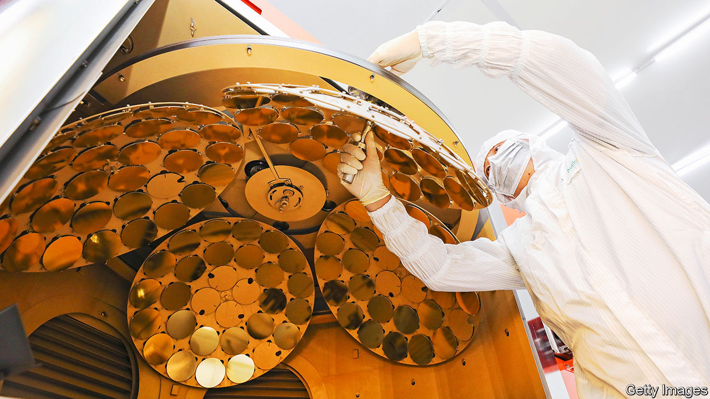

###### Chips and the world

# “Chip War” traces the evolution of the semiconductor industry 

##### The world’s chip industry is critical but worryingly fragile 

 

> Oct 13th 2022 

By Chris Miller. 

Semiconductors are the cornerstone of the modern economy. Everything from emails to guided missiles relies on them. Yet parts of the supply chain, particularly for cutting-edge chips, depend on choke-points dominated by a small number of firms. For decades few people worried much about this—until covid-19 and rising tensions between China and America highlighted the sector’s fragility. In “Chip War”, his elegant new book, Chris Miller of Tufts University shows how economic, geopolitical and technological forces shaped this essential industry.

In 1947 a group of researchers at Bell Labs, a subsidiary of AT&amp;T, a telecoms giant, invented the transistor, a switch that controls electric current and is a building block of modern electronics. Within a decade researchers were placing several transistors on a slab of silicon to make an “integrated circuit”, or chip. A thriving industry grew up around California, outsourcing low-value tasks, such as assembly, to Asia where labour was cheaper.

Innovation came quickly. In 1965 Gordon Moore, who later co-founded Intel, America’s chipmaking giant, correctly predicted that by shrinking transistors, engineers would be able to double the number that fit on a chip every two years or so—and that this enhancement would, in turn, double a chip’s performance. 

As the market grew, so did interest from America’s rivals. First, the Soviet Union tried and failed to replicate Silicon Valley. Later, Japanese firms such as Toshiba and Fujitsu managed to take a share of some chip markets. But the strategic danger comes from China, which today spends more on importing chips than it does on oil. Xi Jinping, the president, has ordered China’s tech titans to reduce its dependence on foreign chips; state funds dole out tens of billions a year to that end. Rather than matching America’s know-how, however, a big priority is to emulate Taiwan, which produces 90% of the world’s premium logic chips, which process data.

Taiwan’s chip dominance can be traced to Morris Chang, founder of the Taiwanese Semiconductor Manufacturing Company (tsmc), who gave Mr Miller a rare interview. Mr Chang was born in China and grew up in Hong Kong. After an education in America he joined Texas Instruments, then a big chipmaker. He was obsessed with eking out efficiencies in the chip-manufacturing process. Passed over for the top job, in 1985 Mr Chang became involved in Taiwan’s bid to gain a foothold in the semiconductor industry.

He duly put into practice a long-held idea for a firm that made chips designed by customers. At that point, virtually all large chipmakers designed and manufactured their silicon in-house. But as chips shrank, the cost of the factories that made them (or “fabs”) grew: today building an advanced fab costs $20bn. At the same time, the economics of the business favoured scale. The more chips a firm produces, the higher the yield—ie, the share of them that actually work. Thus, reasoned Mr Chang, only outfits that manufactured huge amounts of chips would be cost-competitive. With lavish support from Taiwan’s government, TSMC was born.

At first, tsmc’s technology lagged behind its American counterparts’. But, thanks to scale and Mr Chang’s leadership, it soon caught up and overtook. Most American firms stopped making cutting-edge chips and relied on TSMC instead. Its success reshaped the industry, allowing fab-less design companies to flourish, without the financial burden of building pricey new factories every few years. Today tsmc is the biggest chipmaker in the world by market value.

It is also one of the choke-points in the chip supply chain. The result of super-specialisation and high costs, these are huge vulnerabilities in the global economy. Only TSMC and Samsung, a South Korean tech giant, know how to make the world’s most advanced chips. Most of their fabs are uncomfortably close to either China or North Korea. But the bottlenecks can also favour the West, because many are controlled by America or its allies. For instance, TSMC does not build chips for firms on America’s blacklist, such as Huawei. Such obstacles have both slowed China’s chip industry and redoubled its determination to become more self-sufficient. 

America and Europe are pursuing greater self-sufficiency themselves. Thanks to the generous subsidies in America’s recent CHIPS Act, Samsung and TSMC have agreed to build new fabs in Arizona and Texas respectively (albeit not the whizziest type). However, Mr Miller does not expect this to reduce American dependence on Taiwan and South Korea. Both Samsung and TSMC still concentrate their investment at home. 

The author argues that r&amp;d incentives may in the long run prove the most important part of the CHIPS Act: one lesson of history is that leaps in chip technology are often boosted by government research grants. That bodes well for the future of this critical and complex industry. For those seeking to understand it better, “Chip War” is a fine place to start. ■

