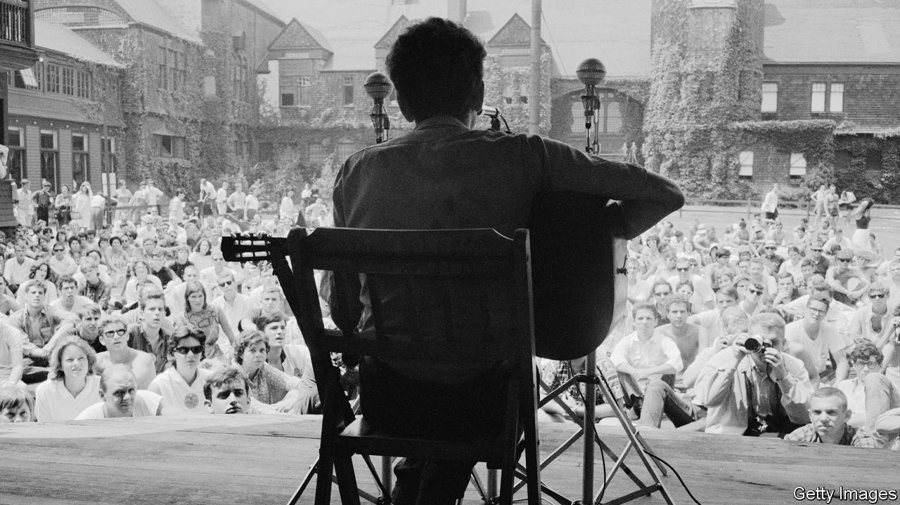

###### American culture

# “Folk Music” traces Bob Dylan’s life through seven songs 

##### Once some thought him an impostor. For Greil Marcus, he is a medium 

 

> Oct 13th 2022 

By Greil Marcus. 

Questions of authenticity dogged him from the start. The young man calling himself Bob Dylan appeared in Greenwich Village in 1961, seemingly “out of nowhere”, and quickly rose to prominence in New York’s folk-music scene. After “Blowin’ in the Wind” made him a national star in 1963, journalists did some digging.

They discovered that the 22-year-old singer who seemed to touch the deepest chords of American history—the mournful accents of black slaves and hardscrabble Okie farmers, the rhythms of cowboy minstrels—was just a middle-class kid from Hibbing, Minnesota. He was a college dropout and, riskily for someone purporting to represent a strand of authentic Americana, a Jew. The subtext of a profile in , according to his girlfriend of the time, Suze Rotolo, was that the artist “whose ‘finger was on the pulse of a generation’ was a fake”.

In “Folk Music”, Greil Marcus doesn’t so much refute the accusation as reclaim it as a virtue. “The engine of his songs is empathy,” he writes in the introduction; “the desire and the ability to enter other lives.” Or, as Mr Dylan himself put it: “I can see myself in others.” From this perspective he is not an impostor but a medium, giving voice to the voiceless and articulating the inchoate yearnings of an age. The Jewish kid from Minnesota—born Robert Zimmerman—merges into one role after another, evolving in response to tremors in the zeitgeist that he seems to sense earlier and more intensely than others. Aptly, “I’m Not There”, a biopic of 2007, used six actors (including Cate Blanchett) to capture his quicksilver character.

“Blowin’ in the Wind”, the anthem that transformed a little-known folk singer into the conscience of a nation, is exhibit A for Mr Marcus’s theory of empathy. Its melody came from “No More Auction Block”, a song originating with African-American soldiers in the civil war. The lyrics captured the earnest striving of the civil-rights movement: “How many roads must a man walk down,/Before you call him a man?” At the same time they undercut this hope for progress: “The answer is blowin’ in the wind.” It was both urgent and timeless.

Mr Marcus is at his best in exploring this rootedness. The seven works his book is built around—the most recent is “Murder Most Foul”, released in 2020—all offer opportunities for extended riffs on assorted aspects of American life. He delights in flitting back and forth in time, disrupting any sense of chronology and threatening to bury the music beneath the weight of its antecedents. In this telling, each track contains multitudes (indeed, one of Mr Dylan’s numbers, not featured here, is called “I Contain Multitudes”). “He wrote songs”, Mr Marcus says, “that as he put them out into the world wrapped their arms around history and then walked into it.”

In the end, though, America’s rich cultural history is the real subject of “Folk Music”; the details of Mr Dylan’s life become incidental, even distracting. Mr Marcus justifies his approach by quoting the bard himself. “I just don’t advertise my life,” Mr Dylan (now 81) said in 2001. “I write songs, I play on stage, and I make records. That’s it. The rest is not anybody’s business.” The result is a book filled with genuine insights but somehow unmoored. As the author tramps along half-forgotten byways listening for ghostly echoes, the distinctive personality of the artist remains obscure.

Which is a pity. For all Mr Dylan’s elusiveness, he is hardly self-effacing; his music distils his nuanced personality. Delivering pyrotechnic lyrics in gravelly tones, combining idealism with world-weary cynicism, the kid from Minnesota turned out to be a true American original. ■

