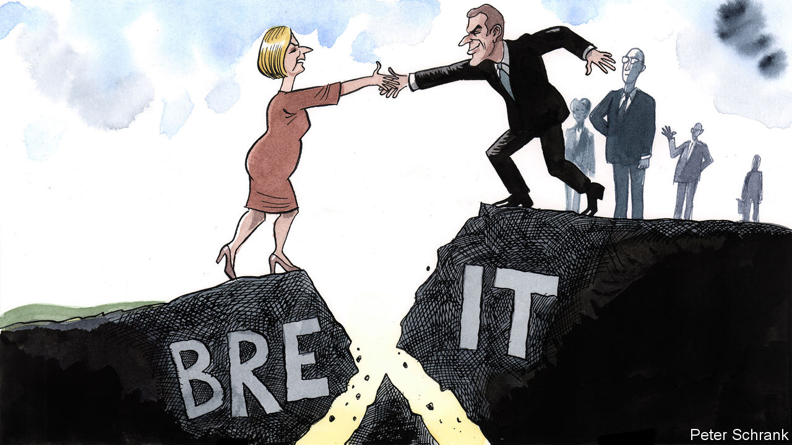

###### Charlemagne

# After years of arguing, are Britain and Europe about to get along? 

##### The mood is much improved of late 

 

> Oct 13th 2022 

In a parallel universe, Britain and the European Union would be gearing up to celebrate the 50th anniversary of its accession to the club in January 1973. Envoys from the EU’s still-28 countries would be steeling themselves for parties at His Majesty’s Brussels embassy flowing with English wines, one of the unspoken hazards of the local diplomatic circuit. The prime minister might have dropped by the European Parliament and tried a few  of mangled French. London tabloids would no doubt have used the occasion to rustle up outrage over an alleged Eurocrat plot to rebrand Cumberland sausages as . Amid all the jollity, a row would have broken out over money.

In the real world nobody is expecting the anniversary to be noted, thanks to the Leave campaign’s victory in the Brexit referendum of June 2016. The relationship between Britain and the EU has offered little to celebrate since. At once overconfident and underprepared going into divorce talks, Brexiteers had assumed they could somehow hoodwink the eu into granting Britain the benefits of membership while jettisoning the costs. But the Europeans fretted that a thriving big rival on its doorstep would provide unwelcome inspiration to others still in the club. Far from the EU being conquered through division it stayed united and gave Britain a rough ride. The upshot has been six years of more or less continuous feuding.

Whisper it, for now, but the mood has improved markedly in recent weeks. On October 6th Liz Truss, Britain’s new prime minister, attended the inaugural meeting of the European Political Community, a new gabfest bringing together the continent’s leaders both in and beyond the EU. It was a rare opportunity since Brexit for a prime minister to chat to all her neighbours in one room. Britain used the occasion to join sensible European initiatives on military transport and energy. In the same week James Cleverly, the foreign secretary, told attendees of the Conservative Party conference—once a high temple of Euroscepticism—that talk of friction with the eu was merely the result of “lazy headlines”. Emmanuel Macron, France’s president and convener of the summit, spoke of EU-British relations being at the “beginning of the day after”.

To those battle-hardened by years of squabbling, that may sound a touch optimistic. For the business of disentangling Britain from the EU is still not complete. The most notable sticking point is Northern Ireland. The province forms part of the United Kingdom. But it must also remain in effect part of the EU single market alongside Ireland, with which it shares an island, because reinstating a border between the two would hobble the local economy and revive sectarian tensions between those in Northern Ireland keen to remain part of the UK and those who seek to join the Republic. In order to clinch a broader trade deal with the EU in 2020, Britain agreed to a “protocol” that treats Northern Ireland as being part of the EU. It has tried to wriggle out of it ever since. 

“The mood music between Britain and Europe is much improved, but we are a long way from a deal [on the protocol],” says Charles Grant of the Centre for European Reform, a think-tank in London. Still, progress looks possible. Steve Baker, a Brexit ultra now serving in Ms Truss’s government as a junior minister for Northern Ireland, apologised for his behaviour during Brexit talks. Leo Varadkar, a former and soon-to-be-again Irish prime minister, said the protocol as it was designed was perhaps “a little too strict” and that ways might be found to make it more palatable for Britain. A working group of British and European Commission officials poring over the details had been suspended in February; it has now quietly reconvened. Ways are being devised to resolve supposedly intractable issues, such as whether an eu court would have a say in any disputes relating to the protocol.

The EU resents having to renegotiate a deal that Britain has already agreed to. But it seems willing to put the imbroglio down to the purposeful inattention of Boris Johnson, the then-prime minister who signed the protocol for the sake of political expediency. Ms Truss became his foreign secretary, and has known how to rile Europe when needed. Still, her appointment has given the opportunity for a reset in relations with the continent. Mr Macron in particular came to distrust Mr Johnson deeply, in part thanks to the AUKUS deal between Britain, America and Australia that kiboshed a big French submarine contract. Even broad agreement in London and eu capitals on the need to help Ukraine had not led to much of a rapprochement between the EU and Britain.

Peace of paper

Europe is now willing to be magnanimous towards Britain because its original fears of what Brexit might wreak have dissipated. Not even the most extreme populists in Italy or Poland talk of leaving the EU: Brexit is less a blueprint than a cautionary tale. Nor has Britain morphed into “Singapore-on-Thames”, a dynamic powerhouse exposing just how stodgy and rule-bound the EU has become. In fact early attempts at deregulation and tax cuts have resulted in a market meltdown. (That the proponents of the doomed economic course are among the most ardent Brexiteers has not gone unnoticed in Europe.) The IMF used to proffer advice on the euro zone; now it is concerned about Britain. There are only so many fronts on which Ms Truss can fight at once. The last thing she needs is to pick a battle with Brussels.

Where does that leave long-term relations between Britain and the EU? Nobody these days is talking of all-encompassing deals that would once again meld the two together. But some smaller worries might find a way of getting ironed out. Perhaps a deal facilitating farming exports might be agreed upon, or a way found to make it easier for students to move between the EU and Britain. That isn’t much, but it is a start. For years, the more Britain and Europe talked, the more they riled each other up. If that indeed has changed, it will be something to celebrate. ■


