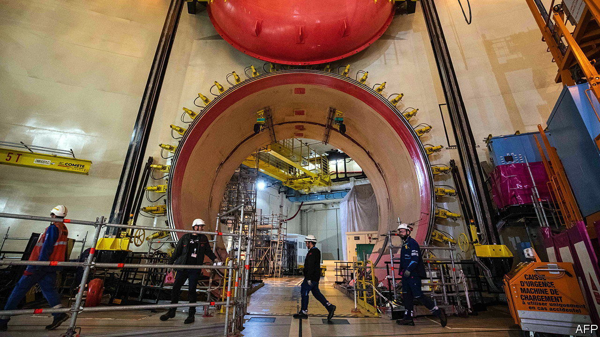

###### Out of order

# France’s nuclear reactors will not work as normal any time soon 

##### The trouble will persist well into next year 

 

> Oct 13th 2022 

When EDF, the French energy giant, warned in May that nuclear-electricity production this year would be lower than previously forecast because half its reactors were out of action, the timing could not have been worse. Thanks to its nuclear industry, France is usually Europe’s biggest net exporter of electricity. The closures turned the country into a net power importer for the first time, just as the continent faced an energy crunch. When in September EDF then announced that even by 2024 output would still be well below normal levels, the problem became a national embarrassment. 

France’s current nuclear troubles are partly due to routine maintenance of the country’s 56 reactors, half of which are about 40 years old. Each ageing reactor needs periodically to be shut down, on a rotating basis, for inspection. During the pandemic, scheduled maintenance was interrupted by lockdowns. The real crunch, though, came after corrosion issues were detected in late 2021 at one pressurised-water reactor. By this September no fewer than 25 reactors were out of action: ten for routine maintenance, the rest for corrosion analysis or repairs. 

The awkward truth, however, is that France’s nuclear woes are also of its own making. Historically the French have been proud of the semi-independence afforded by their nuclear fleet, which generates 69% of the country’s electricity. However, after the nuclear accident in Fukushima in 2011, coupled with lobbying from French anti-nuclear groups and greens, nuclear power went out of fashion. In 2012 François Hollande, a Socialist, campaigned successfully for the presidency on a pledge to reduce the share of nuclear in the country’s mix to 50%. He wrote this into law in 2015. He also promised to close the two reactors at Fessenheim, the country’s oldest, even though the only new reactor under construction at the time, at Flamanville, had yet to be finished (and still hasn’t been). 

It was not until this February that President Emmanuel Macron, Mr Hollande’s successor, swung firmly behind nuclear as part of his plans for a lower-carbon economy. Unveiling an energy strategy based on the revival of nuclear and expansion of renewables, Mr Macron announced that France would build six new-generation reactors, and possibly another eight by 2050. This marked renewed confidence in a demoralised sector. But the new reactors will take many years to come on line. 

Industry bosses and politicians blame each other. In August Jean-Bernard Lévy, EDF’s outgoing boss, blamed France’s decision over the past decade to start closing down reactors for the industry’s difficulty in recruiting and training the nuclear specialists it needs. Mr Macron dismissed the charge as “false and irresponsible”. Either way, “decisions were not made, or taken too late,” says Cécile Maisonneuve, an energy specialist at the French Institute of International Relations, “and this has now put Europe in serious difficulty.”

In the long run France can revive its industry. EDF has notably kept expertise going in Britain, where it is building reactors at Hinkley Point, with plans for another pair at Sizewell. In the short run, though, France faces a winter of “heightened tension”, according to RTE, the electricity-grid authority. EDF has promised that all the reactors that are currently closed will be up and running by February. The government, which is fully nationalising the energy firm, will not tolerate slippage. Even by late February, however, RTE’s central forecast is that nuclear capacity will be about a fifth below its level in February 2021. Which suggests difficulties next year, for France and Europe, not just this one. ■

