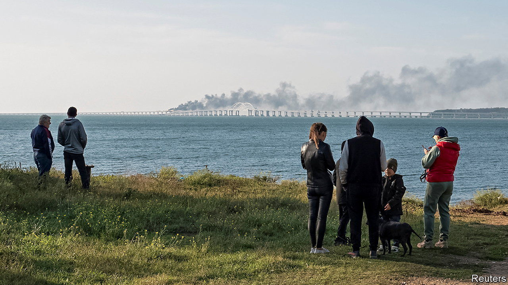
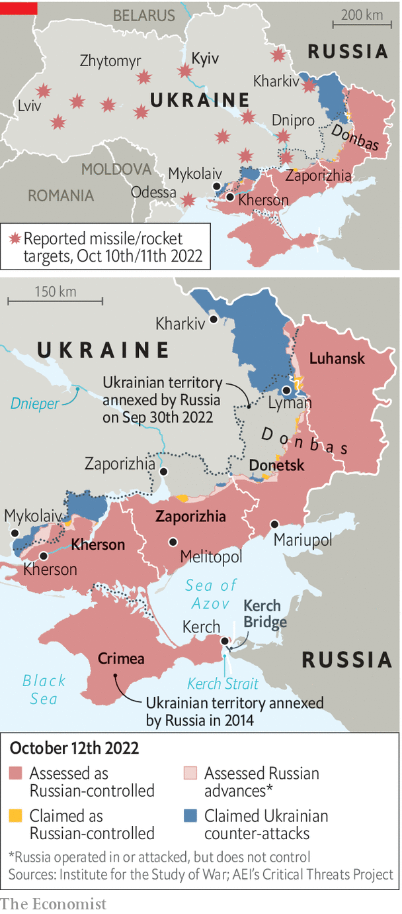

###### Missiles and bridges

# Russia’s terror strikes fail to do much damage to Ukraine 

##### Its retaliation for the bombing of the Kerch bridge falls flat 

 

> Oct 13th 2022 

EVERY BRIDGE stands for something. The 19km (12 mile)-long Kerch Bridge was meant to cement Vladimir Putin’s seizure of Crimea from Ukraine in 2014 by joining the peninsula to Russia. On October 8th a massive explosion blew out one of its carriageways and crippled one of its rail-tracks. Most analysts pinned the bombing on Ukraine’s special forces. The attack will hamper Russian military logistics in occupied Ukraine. But it also struck at a central myth of Mr Putin’s imperial regime: his claim to have made Crimea Russian.

Kyiv’s Glass Bridge is symbolic, too. Built under Vitali Klitschko, the mayor and a former boxing champion, the elegant pedestrian and cycling bridge represents Kyiv’s future as a walkable, liveable, cosmopolitan European city. It stands for Ukraine’s turn towards the EU. On October 10th and 11th Mr Putin unleashed a furious response to the Kerch bridge attack, launching more than 100 missiles at civilian targets. One was the Glass Bridge.

 


Across Ukraine, at least 26 people were killed and over 100 injured. In Kyiv a missile hit a playground; in Lviv missiles knocked out part of the city’s power grid. In Russia hardline social-media channels, which had been calling for bloodier strikes on civilian infrastructure, applauded. “We’ve given them a profound beating,” crowed Vladimir Soloviev, a Kremlin TV propagandist. But the military effects of the Russian strikes were negligible. Ukraine’s cities quickly had the power back on. Its air-defence forces said they shot down an impressive 43 of the 84 missiles Russia launched on October 10th, and 20 of 28 the next day.

Russia is attacking Ukraine with long-range cruise missiles such as the Kalibr and Kh-101, which can skim at low altitudes to avoid radar. It is also using the much bigger and faster Iskander ballistic missile and possibly the Kinzhal hypersonic cruise missile. Until now, Ukraine has relied mainly on Soviet-era air-defence systems such as the Buk and the S-300, and its supplies of those missiles are gradually being exhausted. 

But Russia’s latest strikes have led Western countries to speed up deliveries of modern anti-missile systems, which Ukraine has requested for months. On October 12th Germany said it had completed delivery to Ukraine of the first battery of its new IRIS-T system. It diverted production meant for its own forces to the Ukrainians.

Each IRIS-T battery has three lorry-mounted launchers, carrying eight missiles per launcher with ranges of 40km, controlled by a separate command vehicle up to 20km away. The system’s sensitive radar will help detect low-flying, stealthy missiles such as the Kalibr, according to Denys Smazhnyi, the chief of training for Ukraine’s anti-aircraft missile forces.

Most importantly, the iris-t’s command vehicle integrates radar data from ground stations and aircraft, so that a battery can engage targets even if it cannot yet see them. The Buk and s-300 can only hit objects tracked by their own radar. And whereas those systems track and destroy targets one by one, an IRIS-T battery can launch and track all 24 of its missiles simultaneously, making it much harder to overwhelm with numbers. A second advanced system on its way is the Norwegian nasams. It uses a standard nato missile, the amraam, which will make it easy to resupply. Ukrainian forces have already been trained to operate it. 

Ukraine has been lobbying Washington since the spring to be equipped with the best American air-defence missile, the Patriot. But “for now, we can only dream of getting this technology,” says a spokesman for Ukraine’s Air Force command. Each Patriot battery costs upwards of $1bn, and requires at least 70 soldiers with months of training to operate. And America does not have any to spare at the moment, notes Tom Karako of the Centre for Strategic and International Studies, a think-tank in Washington, dc: “These are the wages of de-emphasising air and cruise-missile defence for the past decade-plus.”

None of the new systems will help against the ballistic Iskander. It is too big, fast and manoeuvrable for them to handle. For now in Ukraine, according to Mr Smazhnyi, “the best protection against ballistic missiles is concrete.” Yet more help is coming for the rest. On October 12th representatives of NATO’s 30 members met in Brussels to discuss further aid. The Netherlands pledged to send Ukraine $14.5m worth of air-defence missiles. 

Russia’s own missile supplies may be running low, and while blasting off dozens of them may please domestic warmongers, it has little effect on Ukraine apart from strengthening resolve. “I am absolutely confident that we will win,” said Mykola, a software designer who was sightseeing on October 12th at Kyiv’s Glass Bridge. Authorities have closed it out of caution, but it seemed to be little damaged, apart from a few missing glass panels and a dark smudge. Mr Putin’s missiles missed. ■


