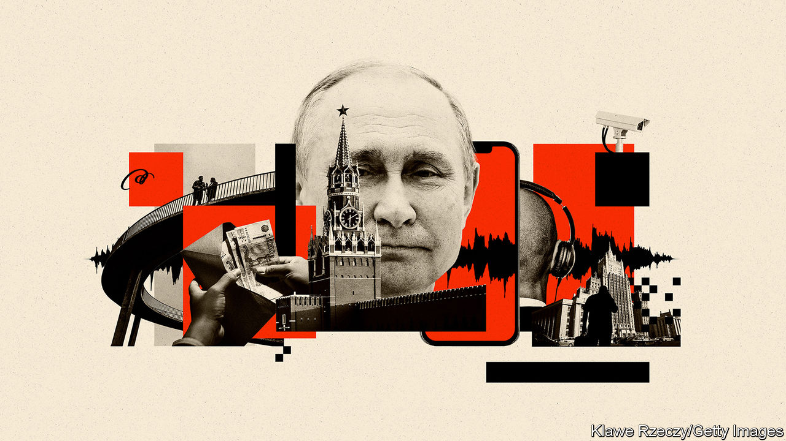

###### Not-so-special services

# The war in Ukraine has battered the reputation of Russian spies 

##### As they take greater risks, they are getting caught 

 

> Oct 9th 2022 

VIKTOR MULLER FERREIRA was a young Brazilian with impressive credentials and a big break. Fresh from the Johns Hopkins School of Advanced International Studies in Washington, DC, an incubator of talent for America’s national-security elite, he had secured an internship at the International Criminal Court in The Hague. But when he landed in Amsterdam in April, he was quickly deported to Brazil. Mr Ferreira was, in fact, Sergey Vladimirovich Cherkasov, an intelligence officer working for the GRU, .

Mr Cherkasov was a so-called illegal, of the sort depicted in the popular television series “The Americans”—an officer dispatched abroad under an elaborate foreign identity, often for life. In a four-page document obtained by , an aide-memoire of sorts, his cover story was laid out in painstaking detail, down to childhood crushes and favoured restaurants. Mr Cherkasov is now languishing in a Brazilian prison, sentenced to 15 years.

When the Soviet KGB was dissolved in 1991, it reappeared as the FSB, a domestic-security service, and the SVR, a foreign-intelligence agency. The GRU has endured in one form or another since 1918. These “special services” bask in the fearsome reputation of their tsarist and Soviet forebears. But they emerge from the war in Ukraine with that reputation, and their networks, . The explosion which damaged the  on October 8th was only the latest security foul-up; Ukrainian operatives are also suspected of having orchestrated a car-bombing in Moscow in August which  of a prominent Russian ultra-nationalist ideologue, according to the . 

Intelligence failure lies at the heart of the war. The FSB, the lead agency for protecting Russian secrets and spying in Ukraine, bungled both tasks in spectacular fashion. It failed to stop America from obtaining, and then publicising, Russian war plans for Ukraine—the most dramatic deployment of intelligence since America’s exposure of Soviet missiles on Cuba in 1962. Worse still, it was the FSB’s own conspicuous preparations for war—including plans to kill dissidents and install a puppet government—that helped convince American and British officials that the Russian military build-up was not a bluff.

Vladimir Putin’s decision to go to war in the first place also owed much to the FSB’s bungling. The agency’s Fifth Service, responsible for ex-Soviet countries, expanded its Ukraine team dramatically in July 2021, according to a report by the Royal United Services Institute, a think-tank in London. Yet its officers largely spoke to those Ukrainians who were sympathetic to Russia and exaggerated the scale of their agent networks in the country, giving the Kremlin the false impression that the Ukrainian government would quickly collapse. 

Confirmation bias was only part of the problem. Intelligence agencies reflect the societies they come from. At their best, Russian spies can be top-notch. “We’ve consistently been surprised by the cleverness and relentlessness of some of the things that they do,” says John Sipher, who served as the CIA’s station chief in Moscow and later ran its Russia operations. “They have really, really smart people.”

But that talent co-exists with venality and dysfunction. Intelligence is embellished as it rises up the chain, with bad news stripped out before it reaches the Kremlin. A Western official describes how, in one GRU unit, officers are thought to have skimmed off 30% of the salaries of the agents they recruited. That figure rose to 50% as the officers gradually had to spend more time padding out reports with information culled from the internet. 

The great strength of Russian intelligence is its sheer scale. Yet only a fraction of its personnel do useful spywork. It was FSB officers who poisoned Alexei Navalny, an opposition leader, with Novichok, a nerve agent, in 2020. Nothing encapsulates the dual ethos of repression and larceny better than the fact that the FSB’s most sought-after position is the chief of the Fourth Service, a division responsible for “economic security”. Its officers are placed in key companies, giving them ample opportunity to enrich themselves.

Infighting within the agencies, and with other government departments, is rife. “The FSB is like the Game of Thrones,” says Maxim (not his real name), a former FSB counterintelligence officer. “You have different clans inside with different political and financial interests.” 

The SVR, a descendant of the First Chief Directorate, the KGB’s foreign-intelligence arm, considers itself a cut above its sister services. But the war has left it battered. Western countries have expelled over 400 suspected Russian intelligence officers since the spring, eliminating nearly half of those operating under diplomatic cover in Europe. Those remaining face heightened scrutiny by local security services.

A recent report by SUPO, Finland’s intelligence service, notes that Russian intelligence officers there have mostly been “severed” from their networks. It warns that Russian spies are resorting to alternative means. One is cyber-espionage. Another is the recruitment of foreigners within Russia. A third, which SUPO does not mention, is to lean more heavily on illegals like Mr Cherkasov. But that comes at a cost. The pressure on illegals is driving them to take greater risks than usual, according to European intelligence officials. 

In March, for instance, Poland arrested Pablo González, a Spanish-Russian journalist also known as Pavel Rubtsov, on suspicion of working for the GRU. A Ukrainian source says he was attempting to enter Ukraine to access a cyber unit in one of the country’s intelligence agencies (Mr Rubtsov denies the charges). Mr Cherkasov might have targeted the ICC because it had opened an investigation into war crimes in Ukraine. Their exposure will be keenly felt. Illegals are hugely expensive to train and deploy. The SVR is thought to have 50 to 100 deployed illegals, and the GRU only between ten and 20, according to sources familiar with those programmes.

In many ways, Russian spies face the same professional challenges as their Western counterparts. It is becoming increasingly difficult to cross borders under multiple names, given the ubiquity of biometric controls, or build a digital backstory that stands up to scrutiny. Paying and communicating with agents is another challenge. But whereas Western spies have learnt how to blend into the noise, Russian ones have been slow to adapt. Illegals still use the dated technique of appropriating the identity of a dead baby (familiar to readers of “The Day of the Jackal”, a novel published in 1971.) Sloppiness abounds. Data leaked from a Russian food-delivery service in March exposed the names of FSB and GRU officers having food sent to their respective headquarters. 

That would not matter so much if Russian intelligence were not under intense scrutiny. Ever since the GRU’s attempted assassination of Sergei Skripal, a former officer, in Salisbury, an English city, in 2018, Western allies have shared increasing amounts of intelligence on Russian spooks. Though it was Dutch intelligence that exposed Mr Ferreira, the operation was a joint endeavour that relied on America, Ireland and others.

There has been little accountability for all this bungling. Western officials say they cannot confirm rumours that Sergei Beseda, the head of the FSB’s Fifth Service, was arrested in Russia in March. There are no proven job losses at senior level. That reflects the privileged status of the (securocrats) in the Russian state. Mr Putin does not trust his spies—he is said to be bypassing Alexander Bortnikov, the FSB’s chief, and talking to department heads—but it would be unwise to pick a fight with them just as his regime is experiencing an upswell of popular discontent over the drafting of hundreds of thousands of young Russian men to fight in Ukraine. On October 8th Mr Putin even placed the FSB in charge of security for the Kerch bridge.

The result is likely to be more of the same bungling and sleaze. “You have a deep tradition of intelligence professionalism,” says Sir John Sawers, a former chief of MI6, “and like a gangrene on top of it is this growing corruption.” Maxim, the former FSB officer, agrees. “Back in the 1990s and 2000s there was a KGB touch to it. We stayed under the radar,” he says. The breaking point for him was when new graduates of the FSB academy were spotted driving a luxury Mercedes around Moscow. “They need to substitute this money world with something bigger. I’m not sure how they are going to do it.” ■


