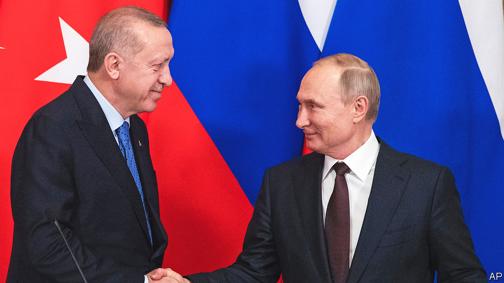

###### Business as usual

# Why Vladimir Putin and Recep Tayyip Erdogan need each other 

##### Turkey’s president is managing to look both east and west 

 

> Oct 12th 2022 

IT WAS a lonely birthday for Vladimir Putin. Few important world leaders bothered to call or post greeting cards, though the president of Belarus did send him a tractor. But at least one man did not disappoint. On October 7th Turkey’s president, Recep Tayyip Erdogan, who continues to refer to Mr Putin as a “dear friend”, congratulated him on turning 70. Mr Putin for his part thanked the Turkish leader for his attempts to mediate between Russia and Ukraine. The pair were due to meet in Kazakhstan on October 13th, only two days after a murderous Russian drone and missile barrage in Ukraine.

The war was expected to test the relationship between Turkey, a NATO member, and Russia, the biggest threat to the alliance. But in fact it has emerged stronger. For years Turkey had been Russia’s most trusted partner inside NATO. Now the war has further increased its importance. For Russia, considered a pariah in much of the West, Turkey has become a safe harbour, the only country in Europe to welcome Russian business, and Russia’s dictator, with open arms. For Turkey Russia has become a more valuable trading partner and a source of cash. Mr Putin needs Turkey’s help to salvage what is left of his legitimacy on the world stage. Mr Erdogan, who faces elections next year, may need Russia’s help to hold on to power. 

Mr Erdogan’s government has done its share to help Ukraine over the course of the war. Turkey has sold the country armed drones, invoked an international treaty to prevent Russia from reinforcing its Black Sea fleet, and condemned Russia’s annexation of four Ukrainian provinces. Turkey is also helping Ukraine build four modern Ada-class corvettes, the first of which was launched earlier this month. Under a deal brokered by Turkey this summer, Ukraine, whose ports had been under a Russian naval blockade, resumed grain exports by sea. 

But Turkey remains close to Russia. Their leaders meet and speak on the phone regularly. The bonhomie between them has endured wars in Syria, the Caucasus and Libya, where Turkey and Russia have managed to co-operate despite backing opposing sides. The dynamic has continued in Ukraine. These days, Mr Erdogan sounds more eager to chastise Western governments for “provoking” Russia than to condemn its atrocities in Ukraine. “Europe is reaping what it sowed,” he remarked last month, after Russia cut off gas supplies to Europe in response to new sanctions. Mr Erdogan “has started to sound like Putin’s lawyer,” says Hakan Aksay, a veteran Turkish Russia-watcher. 

Turkey not only opposes Western sanctions against Russia; it has found ways to benefit from them. Trade between the two countries has already topped $50bn this year, a new record, up from $34.7bn in the whole of 2021. Nearly 20 flights from Moscow alight in Istanbul every day, packed with tourists and men escaping mobilisation. At least some of the Russians are planning to stay. More than 8,000 have bought houses in Turkey since the start of the year, topping the list of foreign buyers for the first time on record. In August alone, Russians reportedly set up 128 new companies in Turkey. 

Russia has also provided Turkey’s banking system with a booster shot. Over the summer Rosatom, a Russian firm, wired about $5bn to Turkey to finance a nuclear power plant it is building on the country’s Mediterranean coast. But the rush of Russians and roubles has attracted American scrutiny. This summer an American Treasury official signalled that Russia was attempting to use Turkey to dodge Western sanctions, and warned Turkish companies against doing business with sanctioned Russians. Turkish banks responded by suspending the use of Russia’s Mir payment system.

With his country’s economy ravaged by inflation, which reached 83% in September, Mr Erdogan faces tough odds ahead of elections next year. He has courted, but largely failed to secure, economic support from the likes of Saudi Arabia and the UAE. He now seems to be looking for favours from Russia. Turkey recently asked Russia to postpone at least some of its gas debts until 2024. But Mr Erdogan sounds upbeat. European leaders are anxious about getting through the winter without Russian gas, he said on October 10th. “I told them we have no such concerns.”

Turkey’s policy toward Russia would not change dramatically were Mr Erdogan to lose power; none of Turkey’s political parties wants confrontation. But Mr Putin knows he will not be able to recreate the relationship he forged with Mr Erdogan over two decades. “He knows his weaknesses and his way of doing politics,” says Mitat Celikpala, an academic at Kadir Has University in Istanbul. Whether with cheap gas, another injection of cash or a green light for a new Turkish offensive against Kurdish insurgents in Syria, Mr Putin may decide to lend his friend a hand. ■


