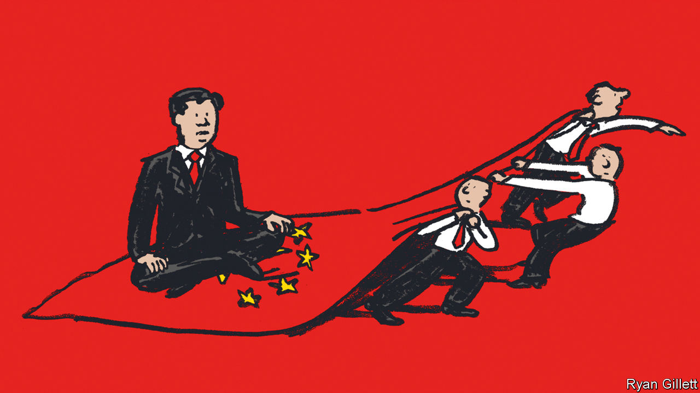

###### The reform club

# After China’s party congress, is there hope of better policymaking? 

##### Lessons from a previous generation of reformers 

 

> Oct 13th 2022 

When china’s communist party reveals the 25 members of its new Politburo later this month, investors will be watching closely. The line-up should offer clues about who will take charge of the country’s economic policymaking. But how useful is this exercise? Suppose investors did discover the names on China’s next economic team sheet. What could they reliably infer about China’s policies and performance from its personnel? 

Looking back can illustrate the pitfalls of looking forward. Over the past ten years Xi Jinping, China’s president, has given big economic roles to a number of respected reformers. The list includes Liu He, the president’s closest economic adviser; Lou Jiwei, his first finance minister; and Zhou Xiaochuan, who stayed on as governor of the central bank until 2018, exceeding the normal retirement age. “Each of the three has reformist views, extensive technical and administrative experience, and a proven willingness to invest effort and political capital in the reform drive,” as Barry Naughton of the University of California, San Diego pointed out in 2013. 

These three were not without company. For the past five years the Politburo’s powerful seven-member Standing Committee has included Wang Yang, known for his market-friendly policies in Guangdong, China’s most liberal province. In 2018 Guo Shuqing, once memorably described as “a reform tornado”, was put in charge of a new financial super-regulator. And in the same year, Mr Zhou was replaced by a trusted deputy, Yi Gang, whom Mr Naughton once called “extremely well qualified, highly intelligent, and with a strong commitment to market-opening reforms”.

If a crystal ball had revealed all of these personnel decisions to investors ten years ago, they would have applauded. It would have been easy to conclude that Mr Xi was truly committed to economic reform and was lining up a formidable-looking team to carry it out.

But that obvious conclusion would have been wrong. China’s economic policies over the past ten years have disappointed legions of once-hopeful observers. These include Mr Naughton. In a recent article, he pointed out that Mr Xi’s reform efforts in the early years of his time in charge were inconsistent and often unsuccessful. And since the summer of 2021, China’s leader has adopted “clumsy and inappropriate instruments” to pursue “vague and sometimes contradictory” goals. These include a ham-fisted crackdown on China’s successful technology firms and the promotion of “common prosperity” by browbeating billionaires.

What explains this paradox of reformers without reform? One answer is that China’s conspicuous failures, not least its ponzi-like property market and damaging “zero-covid” approach, have obscured other areas of progress. The economy is greener than it was. Interest rates and the exchange rate are more flexible. It has become easier for entrepreneurs to start a business and for foreign investors to move their money into China (even as it has become harder for residents to get their money out). China has replaced a clumsy turnover tax with a value-added tax. It has allowed local governments to issue more bonds, diminishing their need to raise money off the books. And the country has successfully cut poverty and broadened its safety net. 

A hard-luck story

The reformers have also been unfortunate. In Mr Xi’s second term, they have had to contend with a trade war against America and the forever war against the covid-19 pandemic. Mr Liu, who led China’s protracted trade negotiations with the Trump administration, was stretched thin. America’s willingness to deny China access to vital technological imports also changed Mr Xi’s economic priorities. He and his team could hardly be blamed for elevating self-reliance as a goal alongside openness.

Even some of the reformers’ successes have had unwelcome side-effects. China’s deleveraging campaign in 2016 is one example. It succeeded in stopping runaway credit growth: the combined debt of China’s government, households and non-financial companies grew little, relative to the size of the country’s gdp, in 2017 and 2018. But by cracking down on shadow banking, China’s reformers made it harder for many private companies to obtain credit. It is perhaps unfortunate that such an impressive cohort of reformers came to power at a time when macroeconomic stabilisation was a more urgent task than microeconomic liberalisation.

Some reforms have also backfired. China’s restrictive limits on borrowing by property developers caused the housing slump, which in turn exacerbated some of the financial risks the limits were designed to prevent. An earlier attempt in 2015 to let the currency float more freely precipitated destabilising capital outflows. These reforms, as well as being clumsily executed, were also poorly sequenced. China eased capital controls before relaxing its grip on the yuan, contrary to economic orthodoxy. And by cracking down on the property market, it has deprived local governments of much-needed income from land sales, without having created an alternative source of revenue, such as a real-estate tax.

In some cases, the sequence of reform was dictated by politics. Introducing a nationwide property tax would be deeply unpopular. Hence it has been repeatedly delayed. Similarly the pacing of China’s currency reform was influenced by a largely symbolic goal: getting the yuan accepted by the imf as a “freely usable” international currency, fit to be included in the organisation’s special-drawing-rights basket. Reformers sometimes feel compelled to seize a window of political opportunity, even if the timing is not economically ideal. 

These compromises illustrate the deeper reason for the reformers’ failure. Their initiatives have always been subordinate to Mr Xi’s broader political aims. When economic development was the party’s overriding task, the goals of the party matched the goals of economic reformers. But under Mr Xi, the party is pursuing another vision of national greatness, in which economic efficiency is one goal among many. Mr Xi wants the economy to be less susceptible to American pressure and more susceptible to party control. It needs to be hardier and redder, not merely bigger and better. He wants qualified, intelligent, experienced cadres to implement this vision, not their own. 

After ten years of Mr Xi, “I don’t think many people harbour the illusion that he’s going to unleash a wave of productivity-enhancing economic reforms with drive and vigour,” says Andrew Batson of Gavekal Dragonomics, a consultancy in Beijing. But some nevertheless hope for a restoration of “pragmatism”, he says. They believe Mr Xi’s economic team can smooth his rougher edges and ensure orderliness in his policymaking. Their job is to stop him “dashing around on campaigns to promote this and crack down on that”. 

No one needs a crystal ball to know that after the party congress this month, Xi Jinping will be the first name on the economic team sheet. From the policymakers that join him, investors expect not reform but restraint. ■


