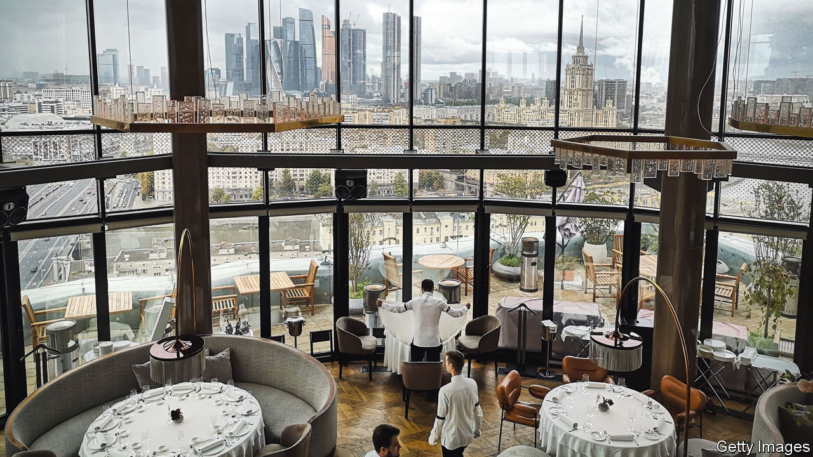
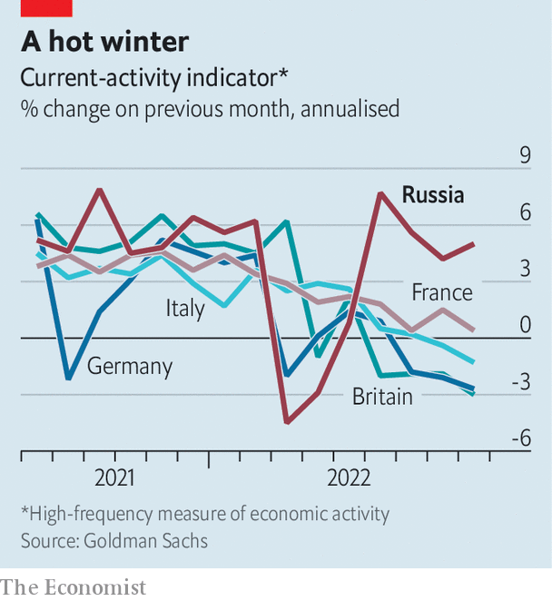

###### Crime, then punishment

# As Europe falls into recession, Russia climbs out 

##### Real-time data show a subdued but strengthening economy 

 

> Oct 13th 2022 

These days Russians do not have much to boast about, so they take what they can get. Social-media trolls are posting videos, intended for European audiences, showing gas stoves left on full blast. What might cost hundreds of euros in Berlin comes to a few roubles in Moscow. The taunting is childish, but it hints at a deeper truth: the economic war between Russia and the West is at a delicate moment. While Europe teeters on the , Russia is emerging from one. 

, launched in response to Vladimir Putin’s invasion of Ukraine, have wounded Russia’s long-term prospects. Blocking the world’s ninth-largest economy from accessing foreign tech and expertise has cut its growth potential by as much as half, forecasts suggest. Output of oil and gas, the lifeblood of Russia’s economy, is about 3% lower than before the invasion and may fall further once European embargoes come into effect at the turn of the year. In the first six months of the war between 250,000 and 500,000 Russians fled the country, reckons Liam Peach of Capital Economics, a consultancy. Lots were highly educated and well paid. 

Mr Putin’s recent decision to launch a  has dealt a further economic blow. It provoked a small bank run as people again worried about the future of the country. By our estimates Russians pulled out $14bn-worth of rouble deposits in September, about a third as much as in February. Another 300,000 or so Russians have probably fled. A further reduction in the labour force is worsening shortages, and thus compounding inflation. Headline inflation is sharply down from its peak, but price pressure in the labour-intensive services sector is worsening.

 


Despite these problems, the recession has probably now come to an end. Many doubt official gdp data, but it is possible to get a sense of activity from a range of sources. Goldman Sachs, a bank, produces a “current-activity indicator”, which follows how economies are doing month to month. The data suggest Russian activity is livelier than in other big European countries (see chart). A spending measure produced by Sberbank, another bank, wobbled following the mobilisation decree but has since edged up. Output in the car industry, which a few months ago had practically fallen to zero, has also bounced back, suggesting producers have obtained supplies from outside the West. In dollar terms Russia’s monthly goods imports now almost certainly exceed last year’s average. 

In its recent forecasts, the imf upgraded Russia’s prospects for 2022. In April it thought that Russian gdp would fall by 8.5%. It now expects a decline of 3.4%. This is nothing to gloat about, but it is manageable. Indeed, the data suggest Russia will be able to maintain its military spending. In September the government put out a draft budget for 2023-25. According to Elina Ribakova of the Institute of International Finance, an industry group, it implies large increases in war-related spending in the coming years, particularly on internal “security”. Having , Mr Putin expects to double down, both abroad and at home. ■


