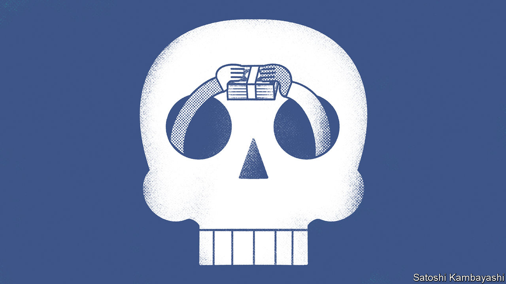

###### Buttonwood

# Credit-default swaps are an unfairly maligned derivative 

##### They are back in the headlines. That is not entirely bad news 

 

> Oct 13th 2022 

Vultures, rats and maggots are often the focus of disgust, less because of anything for which they can be blamed, and more because of the conditions with which they are associated. Death, disease and squalor carry a stigma that is hard to shake. Something similar is true of credit-default swaps, financial instruments that make headlines during market turmoil and economic misery.

When charts of credit-default swap prices begin to crop up in financial research it is invariably a bad sign. Russia’s invasion of Ukraine prompted a burst of activity, with conditions in both Kyiv and Moscow triggering swaps and thus interest in the instruments. More recently, prices for European banks have jumped. The cost of a five-year credit-default swap for Credit Suisse bonds has surged to twice the level reached in the market mayhem at the start of covid-19.

But like the scavenging bird hovering above a weary desert beast, the swaps have an important role to play. They insure the buyer against the default of a bond, or an index of bonds. As with other index products, the inclusion of a range of swaps creates more liquidity. The instruments can protect portfolios and counterparties from volatility and be used to speculate on individual firms’ health and broader market conditions.

The role swaps played in the financial crisis did not help their reputation. Their market more than quadrupled in size from 2005 to 2007. Institutions that had written huge volumes of swaps, including aig, an insurer, were hit with bills they had thought would not all come at once. An inquiry into the crisis’s causes judged that over-the-counter derivatives, particularly credit-default swaps, were a significant contributor. In 2009 Charlie Munger, the venerable second-in-command of Berkshire Hathaway, an investment firm, endorsed a ban. The eu prohibited one way of using swaps. As recently as 2018 the Vatican said credit-default swaps were “less acceptable from the perspective of ethics respectful of the truth and the common good”.

Yet the market today is unrecognisable from the one 15 years ago. Back then it was roughly the same size as the market for foreign-exchange swaps. Today it is not even a tenth as big. Some 60% of the outstanding market now relates to credit-default-swap indices rather than a particular company’s bond. This compares with 43% at the market’s peak. Trading in index products is much more liquid.

Things are safer in other ways, too. The standardisation of credit-default-swap coupons has made it easier for the assets to be traded through clearing houses. More than half of single-firm credit-default swaps and two-thirds of index ones are now cleared, compared with 6% and 16% in mid-2010 (when data collection began). This reduces counterparty risk, where investors fear that a dealer of derivatives might collapse and fail to honour their obligations. This danger loomed large during the financial crisis. 

Trading is now operating as the architects of the system would have hoped. As inflation has surged and interest rates have climbed, market activity has surged, with interest in protection against defaults rising. The trading volume of index credit-default swaps is up by 68% in the year to date, compared with the same period last year. With over two months to go, this year is already the strongest on record for trading volumes since data collection began in 2013. 

A paper by Robert Czech of the Bank of England suggests that credit-default-swap contracts make the underlying corporate bonds more liquid, too, particularly at a time of rating downgrades, when liquidity can otherwise dry up. Research by Martin Oehmke of the London School of Economics and Adam Zawadowski of the Central European University comes to a similar conclusion. They find that credit-default-swap markets provide an alternative venue for speculation and hedging activity to the underlying corporate bond market. This enhances overall liquidity.

There will almost certainly be jitters as more use is made of credit-default swaps. Payouts can lead to protracted legal proceedings. The recent payout on swaps against Russian sovereign debt was surprisingly straightforward given the trickiness caused by sanctions. Holders received 44 cents on the dollar after a special auction to determine the contracts’ value. Yet the significant changes to the market since the financial crisis appear to be bearing fruit. As markets get choppy, credit-default swaps are likely to play a positive role. Pay no attention to the Vatican. 


