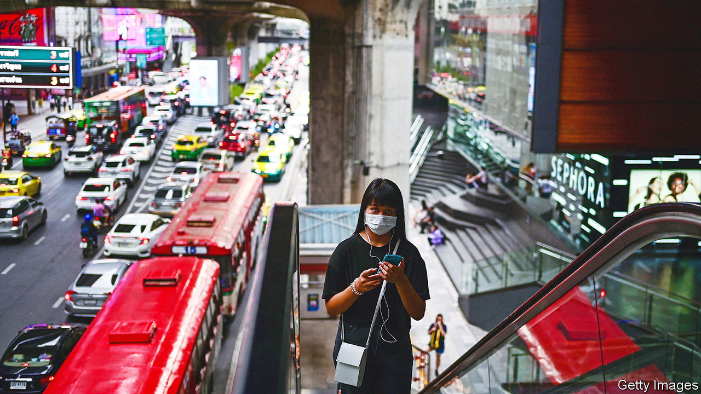
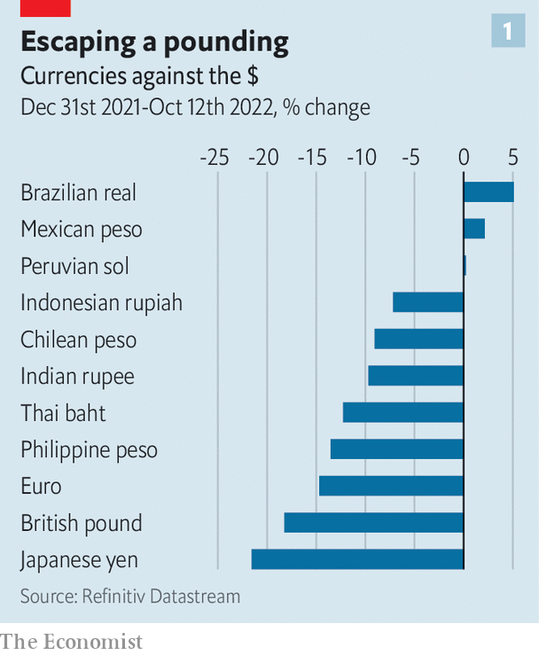
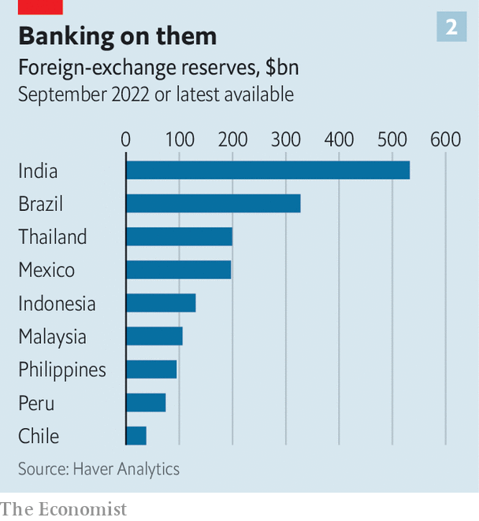
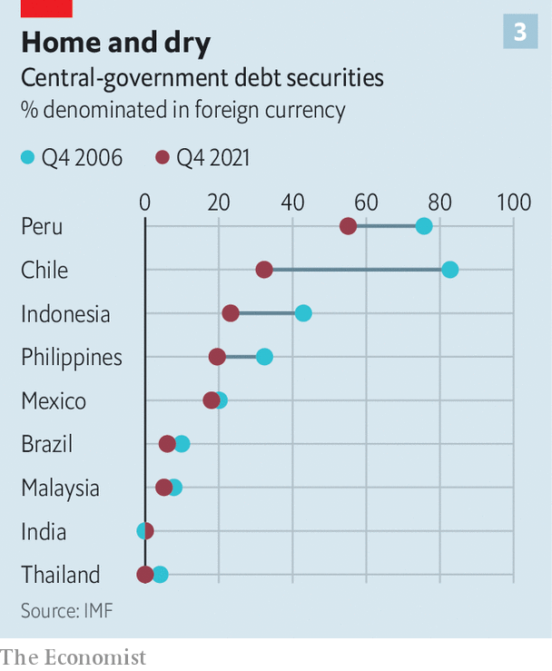

###### Defying gravity

# Emerging markets look unusually resilient 

##### A welcome departure from previous rounds of tightening 

 

> Oct 13th 2022 

The script is familiar. A Federal Reserve bent on taming inflation . The dollar soars, global financial conditions tighten and the world economy falls . But this time, there is a twist. Where writers would normally pencil in an emerging-markets crisis, there is instead an eerie calm.

For decades, fast-growing middle-income countries have been a source of financial trouble. In the early 1980s, the Fed’s crusade against double-digit inflation sparked a Latin American debt crisis; in the 2010s, the normalisation of policy after the global financial crisis rattled the “fragile five” (Brazil, India, Indonesia, South Africa and Turkey). Much the same might have been expected during present tightening, which is the most intense since the early 1980s. In forecasts published on October 11th, the imf again marked down its projections for global growth, and warned that economies accounting for a third of global gdp are heading for downturns. The world’s very poorest countries are on the ropes. More than a billion people live in economies now facing severe distress.

 


And yet most big, middle-income countries are weathering the storm. The imf reckons that emerging economies will substantially outgrow rich ones this year and next, despite a slowdown in China and a contraction in Russia. While the euro, pound and yen are , the Indian rupee and Indonesian rupiah have managed a more graceful decline, and the currencies of Brazil and Mexico have risen (see chart 1). Emergency central-bank intervention is rather than Brasília.

The resilience of the emerging world is in part a story of maturation. Since the crises of the 1980s and 1990s, local financial markets have grown deeper and banks better managed. Policymaking has improved. Officials have learned the hazards of careless budgeting and large current-account deficits. Central banks are more independent, and have adopted the inflation-targeting approaches used in the rich world. 

This sophistication and care has demonstrated its value over the past two years. Many middle-income central banks began raising rates well in advance of rich countries. This prevented rising inflation from slipping out of control, and also stopped destabilising currency declines. Take Brazil, which experienced hyperinflation as recently as the early 1990s, but has worked in recent decades to establish the credibility and independence of its central bank. When inflation leapt and the real wobbled early last year, the central bank responded with aggressive rate rises, amounting to a cumulative increase of almost 12 percentage points. Inflation has fallen from a peak of 12% in April to below 8%; the currency has been among the world’s best performing. Meanwhile, in the rich world, central banks that have fallen behind the Fed’s tightening schedule, like the European Central Bank and the Bank of Japan, have experienced vertiginous currency depreciations, and have yet to see inflation peak.

Emerging-market foreign-exchange regimes have also improved. These economies once relied on exchange-rate pegs to contain inflation and secure cheaper credit. But the years of crisis encouraged a move in the direction of floating-rate regimes, in which markets get more of a say over a currency’s value. Now most governments only occasionally intervene to lean against undesirably fast or big moves. 

 


Many have paired this with deeper foreign-exchange reserves. During good times they purchased assets denominated in reserve currencies, like dollars. This slows the pace of their currencies’ appreciation and builds a pile of safe assets. In 1998 global foreign-exchange reserves amounted to 5% of world gdp. By 2020, that figure had risen to 15%, representing a staggering $13trn. Although Chinese reserves of more than $3trn account for a large chunk, other emerging-market governments have built up formidable piles. India’s totals over $500bn, for instance, and Brazil’s is worth more than $300bn (see chart 2).

These reserves can be deployed to slow a currency’s depreciation when investor risk appetite drops. This year India has sold $40bn-worth to keep the rupee’s decline modest and orderly. Yet reserves are most valuable in the thick of a crisis, when they can be used to pay for critical imports and meet hard-currency debt repayments. Crucially, they help to reassure foreign investors that obligations will be honoured.

And emerging economies have addressed their greatest weakness: an inability to borrow in their own currency. Governments once had no choice but to accept loans denominated in other currencies. This vulnerability—referred to as “original sin”—could turn a drop in investor sentiment into a financial catastrophe. Because a fall in the local currency increased the burden of foreign-currency debt, economic weakness or nervy markets could set in motion a cycle of capital flight, increased pressure to devalue and lost confidence in the creditworthiness of the government, which often ended in chaotic default. 

 


But after the global financial crisis, bond yields in the rich world tumbled, pushing investors to look for returns elsewhere. This hunt, combined with improved economic management in emerging markets, allowed officials to shift borrowing to local-currency bonds (see chart 3). In the mid-2000s, some 46% of Indonesian public debt and 83% of Chilean debt was owed in a foreign currency. By 2021 those figures had fallen to 23% and 32%. 

The safety purchased by these innovations is impressive. But in a forbidding economic climate, emerging markets cannot afford a victory lap. Although governments have borrowed more in their own currencies, many companies have not—and if global woes force large firms to seek bail-outs their foreign obligations could become their governments’ foreign obligations. If worsening financial conditions prompt a flight to safety, a Fed focused squarely on high American inflation may not ride to the world’s rescue with a torrent of emergency lending, as in March 2020.

Stability can also lead to greater risk-taking. The healthier financial position of emerging markets has allowed some to take on debt that would once have seemed too high even for rich countries. India’s debt has risen to 84% of gdp; Brazil’s stands at 88%. In the early 2000s, American and European eminences convinced themselves—to their subsequent sorrow—that financial crises were something that only afflicted poorer countries. Looking back at recent history, the right conclusion to draw is not that emerging markets are safe. It is that nowhere is. ■


