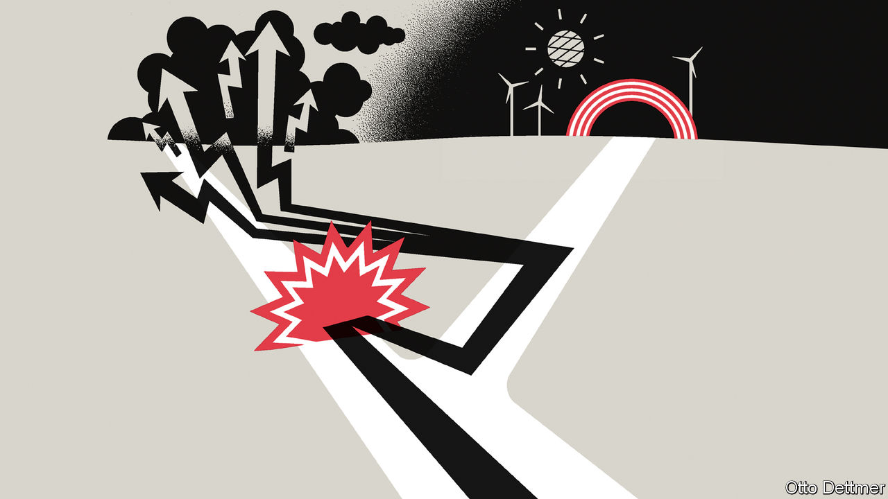

###### Free exchange

# Energy shocks can have perverse consequences 

##### The 1970s offer unhappy lessons for policymakers 

 

> Oct 13th 2022 

The now-dismantled  in suburban Copenhagen offers a vision of a future that never came to pass. Built during the oil shock of 1973 by the Technical University of Denmark, this squat, white building—consisting of two living spaces divided by a glass atrium and topped with a spine of solar panels—was one of the first attempts to create a zero-energy home. 

The  did not quite make it to “zero-energy” but its vital statistics were nevertheless impressive. It only needed 2,300 kilowatt-hours of energy a year, roughly the same as six modern fridges. Its copious insulation and solar-heating system kept it warm even in frigid Danish winters. When a family moved in, things deteriorated a bit, notes Marc Ó Riain, an architecture professor at Munster Technological University. Hair clogged up the filtration system, which recycled heat from wastewater, and occupants had an unfortunate habit of leaving windows open. 

Yet these were problems that could have been overcome. The house was not all that far from being ready for prime time. In the years since, scientists have shown that well-targeted research-and-development spending can rapidly push up quality and bring down costs (see, for example, recent improvements in electric cars and solar panels). So why did a solarpunk future of clean-energy abundance fail to arrive in the 1970s? And as the world faces another energy shock, what lessons can be learnt from its failure?

Economists believe that technological progress is the ultimate driving force of growth. The key question is what determines this progress’s direction. In 1932 John Hicks, an economist, started the debate about “directed technical change” when he theorised in his bookThe Theory of Wages” that raising the price of a certain factor of production—labour, in his example—would spur innovation to bring down its cost. In the century prior to his book’s publication, wages had risen steadily, which meant there was an incentive for employers to invest in labour-saving technologies rather than capital-saving ones. Following this logic, a spike in fossil-fuel prices should help to accelerate decarbonisation. 

Such green growth is not inevitable, however. Daron Acemoglu of the Massachusetts Institute of Technology has pointed out that research spending can be directed either to clean substitutes (such as solar power) or complements to dirty tech (such as more efficient engines). For a firm, the choice of where to direct money depends on the sometimes competing forces of price and market size. An oil shock, which raises the price of the fuel, makes green technologies such as solar power more attractive. But the extremely widespread use of hydrocarbons may make investments in fossil-fuel efficiency, known as grey technologies, more profitable.

That was pretty much what happened in the 1970s. Although some money was spent on projects like the Danish zero-energy house and in the embryonic renewables market, much more went on grey technologies. Research by Valerie Ramey of the University of California, San Diego, and Daniel Vine of the Federal Reserve finds that the main way historical oil shocks have affected the American economy is by encouraging consumers to buy more fuel-efficient vehicles. The economy of a typical American car improved from 13 miles a gallon in 1975 to 20 miles a gallon in 1980. 

Rather than pocketing the savings offered by more fuel-efficient cars, Americans instead bought even bigger ones and in greater numbers. Thus the long-term impact of the oil shock was not to kill the country’s car culture—it was to wedge the combustion engine even deeper into American life. By the mid-1980s oil consumption was higher than a decade before, even though many of the country’s power plants had switched to natural gas. 

Environmental economists call this phenomenon—where fuel-saving measures perversely raise demand—the “rebound effect”. Something similar happened in Danish housing. Better insulation improved its energy efficiency; as a result, houses grew larger and their owners more used to higher temperatures. It became common, for example, to wear t-shirts indoors during winter. According to official statistics, total housing energy consumption has been unchanged for the past three decades. 

Mr Acemoglu argues there is “path dependency” in technological progress. Energy efficiency can make it harder for other technologies to compete. A well-insulated house with a state-of-the-art gas boiler uses less fuel. But that makes the upfront investment of an electric heat pump less appealing. If Europe’s industry successfully maintains output this winter while using less gas it may, in the future, have less incentive to switch to green methods. 

Differences from previous energy shocks offer some room for optimism. Economic modellers point to the “elasticity of substitution” as the critical measure for whether expensive fossil fuels accelerate the adoption of green or grey technologies. Encouragingly, this elasticity has increased since the 1970s. Today a rise in price should encourage more switching away from fossil fuels than in the past, thanks to the wider availability and lower cost of green alternatives. 

Green thumbs

Moreover, carbon prices place government thumbs on the scale. The cost of a permit in the eu’s cap-and-trade scheme is only expected to rise in the future, as the cap on the quantity of emissions falls, meaning firms have an incentive to get ahead of the curve. With luck, this will limit the rebound effect in the years ahead. But America is going down a different road. Subsidising clean technologies rather than taxing dirty ones—the strategy adopted by President Joe Biden’s recent Inflation Reduction Act—does not do nearly as much to displace fossil fuels. A family may buy a subsidised battery-powered vehicle, for instance, but only to complement a fossil-fuel one, which they can continue to drive without penalty. Policy design matters if a zero-carbon world is to become more than just another future that never happened. ■


