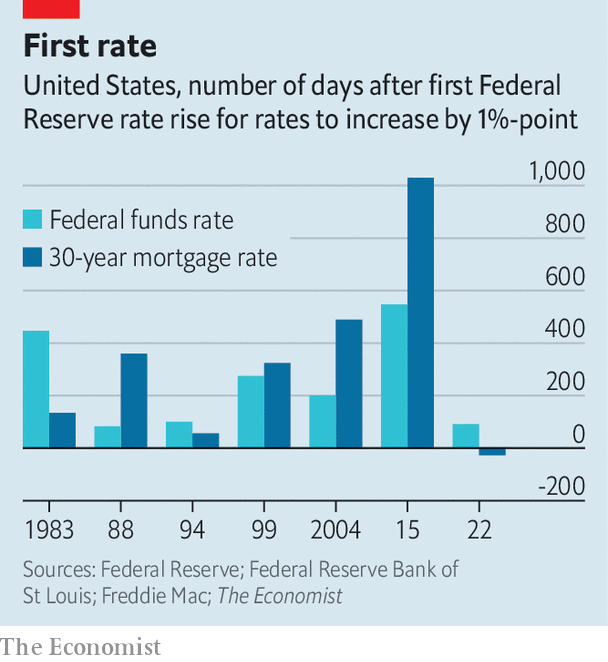

###### Inflation

# Rates are rising at unprecedented speed. When will they bite? 

##### Long lags in monetary policy are no argument for inaction 

 

> Oct 13th 2022 

If you want to impress central bankers, inject “long and variable lags” into a conversation and heave a heavy sigh. The phrase, coined by Milton Friedman, a Nobel-prizewinning economist, is sophisticated shorthand for the delayed and uncertain effects of monetary policy. 

Raising rates, as most central banks are now doing, should lead to slower growth and lower inflation. But it can take time for the full impact to be felt. Hence Friedman’s idea of a long lag. The variability, meanwhile, refers to the lack of a predictable interval between raise and result. 

Lags present an acute challenge at the moment. Tightening in the past few decades has been gradual, helping to mitigate uncertainty. This time central banks are furiously ratcheting up rates. The Federal Reserve is on course to raise them from a floor of 0% to 4% by the end of this year, its steepest tightening in four decades. Economists including Ben Bernanke, a former chairman of the Fed and a new Nobel laureate, estimate lags between monetary policy and inflation can last as long as two years. 

The result is that America may be digesting the jumbo rate rises of the past few months well into 2024, by which time the economic picture will look different. This is one reason why some economists are calling for central banks to switch to smaller rate rises, if any. They want policymakers to survey the impact thus far in order to avoid needlessly adding to future pain. 

Yet the mere existence of lags cannot be an argument for inaction. They are a known unknown. Their precise duration may be uncertain but the fact that there will be a delay is well understood. Any decent model contains assumptions about this. Fed officials expect to shift from raising to cutting rates in 2024 and 2025. But they also expect inflation to continue to recede in both those years—an indication of how lags are baked into their forecasts.

 


Moreover, an increase in central-bank transparency may be compressing lags. In America mortgage rates had increased by a full percentage point even before the Fed had raised short-term rates. This has not happened in previous cycles, and represents the fastest pricing-in of expectations in at least four decades (see chart). As a result, the housing market has had at least half a year to respond to higher mortgage rates. Sure enough, home sales, prices and new construction have all started to fall. In a way, the Fed is lagging the market: its rate increases are, in part, ratifying expectations that are already influencing activity.

None of this is to minimise the risk from lags. Friedman believed they all but doomed counter-cyclical interventions. He viewed such attempts as “disturbances with a peculiarly high potential for mischief”. Central bankers are more confident. But persistent inflation does underscore Friedman’s point about the challenges of getting policy right, whether tightening or easing. Today’s woes stem, in part, from aggressive stimulus in 2020 and 2021.

The mischief, in other words, can cut both ways. Doves worry that excessive tightening will lead to a bad recession. Hawks fear that a premature halt will lead to continued bad inflation. Both worry the Fed will get its timing wrong again, just in diametrically opposite directions. ■


