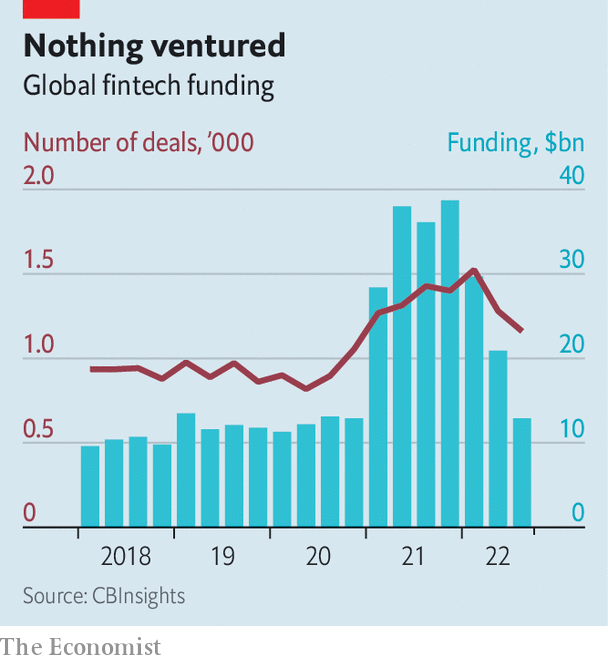

###### Pop dollar

# Who will survive the fintech bloodbath? 

##### Firms prepare for a nasty winter 

 

> Oct 13th 2022 

The annual Sibos conference is the Davos of the payments industry. The latest opus in Amsterdam, attended by 10,000 delegates from October 10th to 13th, seemed stuck between the future and the past. Sessions on the metaverse and the digital euro drew crowds. But so did a barber stall and arcade games lit by 1980s-style neon lights. Next to an exhibitor displaying a “net-zero” countdown to 2050, measured in milliseconds, financial plumbers mulled decade-old issues, from clunky trade finance to costly cross-border payments. Virtual-reality headsets and, later, vodka cocktails made heads a little heavier, even as they lightened the mood. 

 


That there was a whiff of escapism was no surprise, for the here-and-now of fintech is bleak. Spooked by rising interest rates, investors have tightened their pursestrings. As a result, fintech funding has collapsed (see chart). The average deal has fallen from $32m in 2021 to $20m in 2022. Between July and September a mere six firms graduated to unicorn status, achieving a valuation of $1bn or more, compared with 48 in the same period last year. Exits have also stalled. There were 27 public listings in the last quarter of 2021, compared with two in the one just passed.

The speed of the slump has caught many in the industry by surprise. A year ago fintech founders were like “kids in a candy store”, says Jeff Tijssen of Bain, a consultancy. Plentiful venture-capital funding allowed them to launch into foreign markets, make bold acquisitions and hire the best staff. Future revenue was richly valued, and startups chased growth at all costs. Now “a dollar of revenue” is worth considerably less, says Michael Treskow of Eight Roads, a venture-capital firm, and not all revenue is “equal”. As investors demand a path to profitability, founders’ wings are being clipped. Employees, meanwhile, are heading elsewhere. Whizz kids previously up for a gamble are slinking off to consultancies and banks. Many need a new job anyway: fintechs have sacked 7,300 staff since April.

The shift started in the public markets, where the ten largest fintechs have lost $850bn in value in the past year. As the route to initial-public offerings became more difficult, the biggest private firms began to be affected. Some cash-strapped giants, including Klarna, a buy-now-pay-later lender, have seen their valuations slashed by more than 80% in “down” funding rounds. Those still closing “up rounds”, including Acorns, an investing app, are often doing so on tough terms, guaranteeing that new backers will double their money even in the “worst-case” forecasts. 

All of this is common to other tech sectors. But fintechs look especially vulnerable, because many are directly exposed to the risk of recession. Lenders that used cheap funding to provide online mortgages and buy-now-pay-later loans face soaring costs and rising defaults. Neobanks that rely on transaction fees are being starved of revenues. Businesses that banked on the boom in retail investing, from crypto exchanges to online brokers, are suffering as trading volumes collapse. Those catering to small firms may well go under with their wobbly clients. 

Thus many startups will struggle to make it through winter. But those that provide essential services to digitising firms should keep attracting venture-capital funds, many of which have money lying unspent. In America alone their collective “dry powder” hit $290bn in the last quarter, twice the average from 2016 to 2020. With consumer spending set to crash in Europe, American startups are valued at a premium, says Lily Shaw of Omers Ventures, the venture-capital arm of a Canadian pension fund. Beyond this geographic trend, three types of fintech firms look best equipped to attract venture-capital dosh.

First are companies that reduce inefficiencies, from the management of company expenses to the reconciliation of business payments, and thus ought to help companies cut back in more difficult times. Next are firms that create new revenue lines for their clients, such as enabling a travel agent to sell their customers insurance. The final group includes financial plumbers, from firms providing data or ones dabbling in crypto to those that help banks comply with sanctions. 

Only a few fortunate upstarts—such as GoCardless, which facilitates recurring bank-to-bank payments, and Clearbank, which provides cloud-based payments software—tick all three boxes. They run the infrastructure that moves money around at a time when the dominant “rails” remain costly (think of those 3% credit-card fees) and old-fashioned firms want to build their digital storefront—the logic that underpinned the fintech boom. For this lucky group, the Dutch waffles and daïquiris in Amsterdam were perhaps deserved after all. ■


