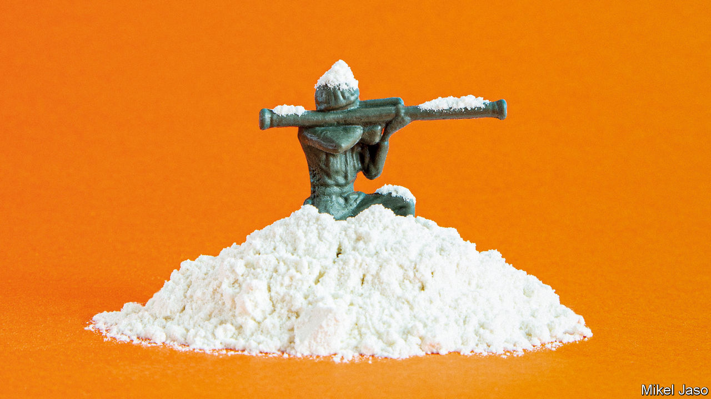
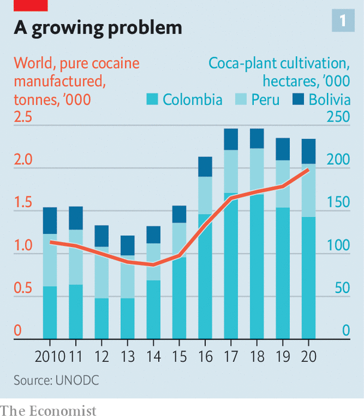
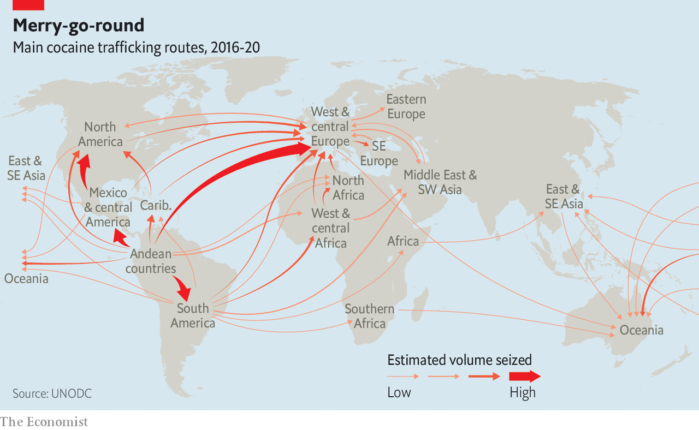
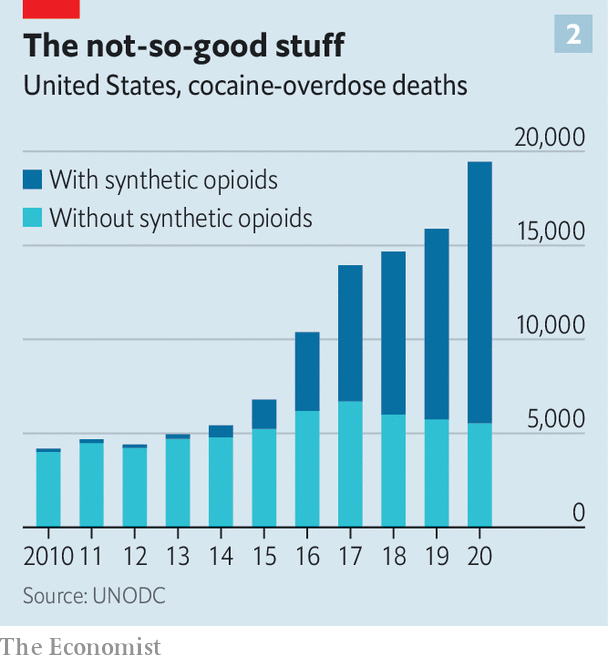
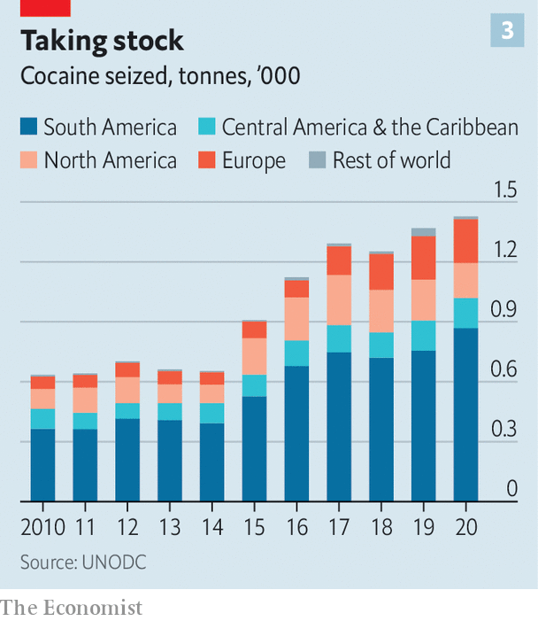

###### Thinking the unthinkable

# Booming cocaine production suggests the war on drugs has failed 

##### Now some politicians in Latin America and Europe are saying so publicly 

 

> Oct 13th 2022 

Coca is ubiquitous in remote rural parts of Colombia. Farmers plant the hardy, high-altitude bush, harvest its foliage and sell it in bulk to the small local laboratories that have made the country into the world’s biggest producer of cocaine. The pickers, known as , are mostly poor migrants from Venezuela or elsewhere in Colombia. Their hands are often shredded and bloodied by their labour, which involves ripping the leaves off the stalk. But it pays more than cultivating most legal crops. And even being on the bottom rung of the drug business confers a certain glamour. “I’m the ,” trills the singer on a jaunty hit from 2015 by Los Bacanes del Sur, a popular folk band. “And I get all the women.”

 


There is no shortage of people willing to plant and harvest coca; and there is no shortage of cocaine. According to the United Nations Office on Drugs and Crime (unodc), global production hit a record 1,982 tonnes in 2020. That number is up by 11% on the year before, and nearly double the amount produced in 2014 (see chart 1). When Richard Nixon, then America’s president, launched his “war on drugs” in 1971, the flow of cocaine into America was a trickle. Despite billions of dollars spent every year on arrests, asset seizures and destroying coca bushes, it has become a flood. About 2% of Americans—roughly 6m people—are thought to use the stuff. New shipping routes are bringing the drug to consumers in Africa, Asia and Europe (see map).

 


Plenty of Latin American presidents have said the war is not working—though as Jonathan Caulkins, a drug expert at Carnegie Mellon University, points out, they tend to do so only once they have safely left office. Now some of those in power are beginning to speak up, too. In an interview with , Gustavo Petro, Colombia’s new president, talked of leniency for repentant gang members, decriminalising coca-leaf production and creating places where Colombians could consume cocaine in a supervised environment. Felipe Tascón, a member of Mr Petro’s campaign team who had been tipped for a role as his drug “tsar”, has flirted with the possibility of outright legalisation, and has talked of collaborating with other Andean countries which produce the drug. 

One of those countries is Peru, the world’s second-biggest cocaine producer. Its president, Pedro Castillo, has appointed Ricardo Soberón, a longtime critic of coca-eradication schemes, to head Peru’s anti-drug agency. “After working with coca farmers for 30 years, I know that what they most want is to be treated as citizens,” says Mr Soberón. “They’ve always been treated as narco terrorists, or narco farmers.” 

The realities of international politics will limit Mr Petro’s room for manoeuvre. But such public scepticism from a serving head of state marks a big change in the discussion around drugs.

When you’re in a hole, stop digging

Mr Petro and Mr Soberón are right to say that the war on cocaine has failed. The main reason is the vast profits to be made from the drug, which is cheap to produce but expensive to buy. According to Jeremy McDermott of InSight Crime, a website that analyses organised crime, Mexican gangs can buy a kilo of cocaine for $3,000 in Colombia. He estimates that a kilo is worth between $8,000 and $12,000 in Central America, $20,000 in the United States, $35,000 in Europe, $50,000 in China and $100,000 in Australia. Gangs can boost profits even more by cutting coke with cheaper drugs. These days much of the cocaine that is shipped north to the United States comes mixed with fentanyl, a powerful and addictive opioid painkiller. The unodc reckons that toxic combination is the main reason why cocaine-related deaths in America have risen fivefold since 2010 (see chart 2). 

 


Huge profits give gangs both the incentive and the resources to adapt to whatever law enforcement can throw at them. In Colombia, decades of eradication attempts beginning in the early years of this century led, at first, to a fall in production. But it has since roared back, as plantations have moved into more remote and lawless places. At the same time, gangs have been boosting the productivity of their crops. 

The unodc reckons that the amount of land dedicated to coca cultivation fell by 9% in Colombia in 2020 compared with the year before. But estimated production of cocaine rose by 8% to 1,228 tonnes, thanks to higher-yielding plants and more efficient processes in the labs that turn leaves into coca paste and then cocaine powder. Indeed, the gangs have achieved efficiency gains that would make a management consultant envious. The unodc calculates that the amount of cocaine obtained from one hectare of coca-bush cultivation rose by a whopping 18% in a single year, from 6.7kg in 2019 to 7.9kg in 2020. 

All this means that, although gangs have diversified their businesses over the past few decades—into areas such as human trafficking, illegal gold mining, extortion and producing other drugs such as fentanyl—cocaine remains a core part of their business. Peter Reuter, a criminologist at the University of Maryland (who has contributed to  in the past) reckons that coke still provides most of the revenues for gangs in Mexico. 

Gangs fight viciously to control the cocaine trade. That helps make Latin America one of the most violent regions on Earth. With less than a tenth of the world’s population, Latin America is the scene of roughly a third of murders. 

In places the gangs are so rich, powerful and well-armed that they outgun the forces of law and order. This has long been the case in remote parts of Colombia and in areas near the Mexican border with the United States. On September 2nd eight police officers were killed in the south of Colombia by unknown assailants. Even Uruguay, Paraguay and Ecuador, countries that have in the past been free of much gang violence, have seen lurid murders in their prisons in the past few years.

Innocent bystanders are often terrorised. In Flor de Ucayali, in Peru, 76 indigenous families live around a clearing of forest near the edge of the Utuquinia river. For years their land has been encroached upon by illegal coca plantations. Last year the police inspected some of the coca fields and destroyed a few maceration ponds, in which harvested coca leaves are soaked with water, lime and kerosene as part of the cocaine-production process. 

According to Saul Martinez, a local leader, the coca planting has not stopped, and the state’s intervention has merely left residents more exposed to violence. Villagers have been sent gory videos of dismembered corpses; and last year two men turned up and threatened to kill a young woman. “We have a few rifles, once used for hunting, but they have guns used in war,” says Mr Martinez.

Sometimes the gangs infiltrate the state, and public servants abuse their power to protect or assist the drugs trade. A Colombian report has suggested that, during the country’s decades-long struggle against the farc, a left-wing guerrilla group, “some groups in the army, the police, air force, navy and das [a security agency] enriched themselves from narcotrafficking.” Earlier this year Juan Orlando Hernández, a former president of Honduras, was extradited to New York to face charges (which he denies) of conspiring to import cocaine into the United States. His critics accuse him of turning the country into a “narco-state”. Tony Hernández, his brother, was given a life sentence for drug trafficking in the United States last year. “The cocaine trade essentially built the criminal infrastructure of Latin America,” says Mr McDermott.

Going straight

As cocaine spreads around the world (see chart 3), that criminal infrastructure travels with it. Guinea-Bissau has become an important route for South American cocaine bound for Europe. An attempted coup earlier this year, in which gunmen attacked the presidential palace, was blamed on drug gangs. Much European cocaine is imported through Rotterdam in the Netherlands. Dutch journalists and lawyers investigating the cocaine trade have been murdered. Earlier this year police discovered a sound-proofed torture chamber built into a shipping crate. The head of a Dutch police union has warned, hyperbolically, that the country is at risk of becoming a “narco-state”. 

 


It is this violence and corruption that advocates of decriminalisation hope to stem. That may seem like a pipe-dream. In most countries, cocaine is, alongside heroin, one of the most tightly controlled drugs. Yet there are exceptions which Mr Petro and like-minded politicians could build upon. Coca leaf has long been legal in Peru and Bolivia, so long as it is not used to make cocaine. Andean farmers have for centuries chewed its leaves as a mild stimulant (the effects are closer to caffeine than doing a line of cocaine). Coca-leaf tea is used to relieve altitude sickness.

Peru has therefore long permitted the growing of 22,000 hectares of coca by around 34,000 farmers who are registered with the government. They sell their crop to the only authorised buyer, Enaco, a state-owned firm. It is a similar story in Bolivia. In 2012 the country’s government, then headed by Evo Morales, withdrew from the Single Convention on Narcotic Drugs, a treaty from 1961 which aims to harmonise its signatories’ drug policies. Bolivia rejoined a year later with a carve-out allowing the decriminalisation of coca-leaf chewing. The idea was to give legal protection to a small domestic market supplying coca-related products, such as drinks and toothpaste. 

The star product is coca liquor. In La Paz, the capital of Bolivia, sits the distillery for El Viejo Roble, which has been making liquors from coca leaf for years. Adrian, the manager, extols the supposed health benefits of coca so enthusiastically that the orange-tinted goggles on his forehead keep falling over the round glasses that give him the air of a Bolivian John Lennon. “Look at the teeth of old  (peasants),” he says. “They’re green, but they’re perfect.” His firm makes around 500 bottles a month. Drinking the stuff provides a mild buzz. The government buys bottles to give to foreign diplomats. 

Bolivia’s trade unions are in charge of how much coca is grown. Encouragingly, violence in Bolivia is low, and seems to have fallen further since this model of “community control” came into force. According to Joaquin Chacin, a Bolivian coca researcher at the Universidad Mayor de San Simón in Cochabamba, between 2004 and 2021 there were 15 deaths from coca-related conflicts. Between 1982 and 2003 there were 120.

But creating a legal coca-leaf market is not without its problems. For a start, having legal coca growers does not seem to put off the illegal ones. After a change of government in Bolivia in 2019, the area under coca cultivation rose by 15% in 2020, to just under 30,000 hectares, of which only 22,000 were legal. 

It is a similar tale in Peru, where the area under cultivation rose by 30% in 2021 to just under 81,000 hectares. Once again, that is far in excess of the government-mandated limit. And the state-sponsored system is leaky. The official registry of farms has not been significantly updated since it was first created in 1979, making it hard to keep track of what is being grown where. Enaco also tends to offer low prices. The amount of coca leaf it has managed to buy has halved in the past 20 years. At least some of the missing coca is diverted into the illegal cocaine trade, where the prices offered are much higher. Mr Soberón, for his part, wants to abolish Enaco’s monopoly, and allow other buyers that might offer something closer to the market rate.

Ivan Muralanda, a liberal Colombian senator, has floated a more radical idea. In 2020 he introduced a bill to the Senate that proposes that Colombia buy up all the coca produced in the country at market prices. Mr Muralanda reckons that would cost around 2.6trn pesos ($560m), less than the 4trn pesos spent on eradication each year. More controversially, the bill—which passed its first reading before being shelved in the run-up to the presidential election this year—would also legalise cocaine for domestic use. Few Colombians indulge, at least at the moment. Mr Muralanda estimates that around 260,000 use the drug. Under his proposal, it would become available for over-18s who pass a medical exam. Steve Rolles, of Transform, a British drug advocacy group, thinks that even such a small-scale experiment could “open up the debate.”

However, there is not much about tackling illegal groups in the bill, admits Lorenzo Uribe, a researcher who helped draft it. And legalisation would probably come with serious drawbacks. In a paper in 2016 Dr Caulkins, the Carnegie Mellon professor, examined what might happen were cocaine to be legalised in Latin America. He concluded that, although it might generate a legal cocaine market worth “somewhere between hundreds of millions and low single-digit billions per year,” the price would be that the country in question would become an “international pariah”. Dr Caulkins reckons America and others would impose sanctions in retaliation. 

Nor would it stop international crime. Legalising cocaine in places where consumption is low would do little to dent the profits over which the gangs fight, which mostly come from countries where consumption is high. And weak law enforcement could allow gangs to dominate newly legal markets just as they have dominated illegal ones. Several American states have legalised cannabis in the past few years. But Vanda Felbab-Brown of the Brookings Institution, an American think-tank, points out that Mexican gangs have started to move into those legalised markets too. 

And legalisation in a Latin American country could even, perversely, end up increasing violence in the region. Another paper, also published in 2016, this time by Daniel Mejia, an economist at the University of the Andes, and his colleagues found a link between coca eradication policies in Colombia and increased violence in parts of Mexico where several drug gangs compete against one another. If cocaine were to become harder for Mexican gangs to get their hands on—because the government was buying up all of the crops, as in Senator Muralanda’s bill—the extra competition could lead to even more bloodshed. 

A problem of demand

“The problem is in consumption, not production,” says Mr Petro. His view is that “the competitive society…the ideology of the last few decades…is the one that generates addiction. And it is what generates widespread drug use.” Mr Petro’s explanation is dubious. But his diagnosis is surely correct. So long as cocaine remains illegal in the rich countries that consume it, then legalising it in the poorer places that produce it will have only a small effect. 

Full-on decriminalisation, let alone legalisation, is not about to happen in the West. But attitudes have shifted notably in the past few years. In 2020 the state of Oregon decriminalised the possession of all drugs, cocaine included. Portugal has had a similar policy since 2001. On October 7th Femke Halsema, Amsterdam’s mayor, told a meeting of European justice ministers that she thought that the war on drugs had failed, and that cocaine should be decriminalised. If decriminalisation happens in Latin America, it could put more momentum behind such ideas.

And even America’s government is not as hostile as it once was. At a meeting with Mr Petro on October 3rd Antony Blinken, America’s secretary of state, said diplomatically that President Joe Biden’s administration supported the Colombian president’s more “holistic approach” to tackling drugs. Coming from the country that began the drug war five decades ago, that feels like a significant concession. ■


