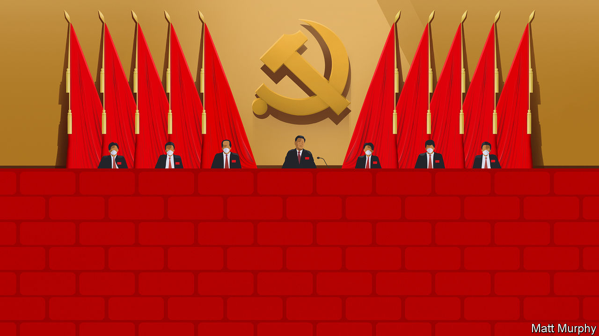

###### China’s next chapter

# An obsession with control is making China weaker but more dangerous 

##### The Communist Party’s five-yearly congress will further tighten one man’s grip 

 

> Oct 13th 2022 

It will be an orderly affair. From October 16th the grandees of China’s Communist Party will gather in the Great Hall of the People in Beijing for their five-yearly congress. Not a teacup will be out of place; not a whisper of protest will be audible. The Communist Party has always been obsessed with control. But under President Xi Jinping that obsession has deepened. After three decades of opening and reform under previous leaders, China has in many ways become more closed and autocratic under Mr Xi. Surveillance has broadened. Censorship has stiffened. Party cells flex their muscles in private firms. Preserving the party’s grip on power trumps any other consideration. 

This is evident in Mr Xi’s response to covid-19. China’s initial lockdown saved many lives. However, long after the rest of the world has learned to live with the virus, China still treats every case as a . When infections crop up, districts and cities are locked down. Compulsory movement-tracking apps detect when citizens have been near an infected person, and then bar them from public spaces. It goes without saying that no one thus tagged may enter Beijing, lest they start an outbreak at a politically sensitive time. 

Some hope that, once the congress is over, a plan for relaxing the zero-covid policy may be unveiled. But there is no sign yet of the essential first steps to avoid mass deaths, such as many more vaccinations, especially of the old. Party propaganda suggests that any loosening is a long way off, regardless of the misery and economic mayhem that lockdowns cause. The policy has failed to adapt because no one can say that Mr Xi is wrong, and Mr Xi does not want China to be dependent on foreign vaccines, even though they are better than domestic ones.

Such control-freakery has wider implications for China and the world. At home Mr Xi makes all the big calls, and a fierce machinery of repression enforces his will. Abroad, he seeks to fashion a global order more congenial for autocrats. To this end, China takes a twin-track approach. It works to co-opt international bodies and redefine the principles that underpin them. Bilaterally, it recruits countries as supporters. Its economic heft helps turn poorer ones into clients; its unsqueamishness about abuses lets it woo despots; and its own rise is an example to countries discontented with the American-led status quo. Mr Xi’s aim is not to make other countries more like China, but to protect China’s interests and establish a norm that no sovereign government need bow to anyone else’s definition of human rights. As our, Mr Xi wants the global order to do less, and he may succeed.

Rightly, the West finds this alarming. No despotic regime in history has had resources to match modern China’s. And unlike the leader of a democracy, Mr Xi can snap his fingers and deploy them. If he wants China to dominate technologies such as artificial intelligence or drugs, public and private funds pour into research. Size and single-mindedness can produce results: China is probably ahead of the West in such fields as 5G and . The more powerful its economy grows, the greater its geopolitical muscle is likely to be. This is especially so if it can dominate certain key technologies, make other countries depend on it and set standards that lock them in.

This is why Western governments now treat Chinese innovation as a national-security issue. Many are boosting subsidies for industries such as chipmaking. President Joe Biden’s administration has gone much further, seeking openly to cripple the Chinese tech industry. On October 7th it  of high-end chips to China, both by American firms and by foreign ones that use American kit. This will slow China’s advances in fields America considers threatening, such as ai and supercomputers. It will also harm Chinese consumers and foreign firms, which may ultimately find ways around the new rules. In short, it is too blunt a tool. 

It also suggests that Mr Biden overestimates the strengths of China’s top-down model and underestimates the democratic world’s more freewheeling one. Mr Xi’s obsession with control may make the Communist Party stronger, but it also makes China weaker than it would otherwise be. Throwing resources at national goals can work but is often inefficient: American firms produce roughly twice as much innovation for the same outlay as their Chinese peers, by some estimates. Having a leader who hates to admit mistakes makes it harder to correct them.

Even as Mr Xi strives to make China a superpower, his and the party’s authoritarian urges have. The great firewall slows the inflow of foreign ideas. Zero-covid has curbed movement in and out of the country: Chinese scholars have all but stopped attending conferences abroad; Chinese executives barely travel; the number of European expats in China has halved. A less connected China will be less dynamic and creative. And the government is aggravating China’s isolation by making it less hospitable for foreigners to live or work in. For example, foreign firms must make sensitive data they send abroad accessible to the state, which often owns their main competitors. This is an incentive to do research and development outside China. Finally, China’s dire human-rights record ensures that it has few real friends, and limits co-operation with countries at the cutting edge of technology.

Know your rival and yourself

That China is weaker than it appears is scant comfort. Even much weaker powers can be dangerous, as Russia has shown under President Vladimir Putin. A more isolated, inward-looking China could become even more belligerently nationalistic.

The West’s best course is to stand up to China where necessary, but otherwise allow collaboration. Restrict exports of the most sensitive technology, but keep the list short. Resist China’s attempts to make the global order more autocrat-friendly, but avoid overheated martial rhetoric. Welcome Chinese students, executives and scientists, rather than treat them all as potential spies. Remember, always, that the beef should be with tyranny, not with the Chinese people. It will be a hard balance to strike. But handling the most powerful dictatorship in history was always going to require both strength and wisdom. ■


