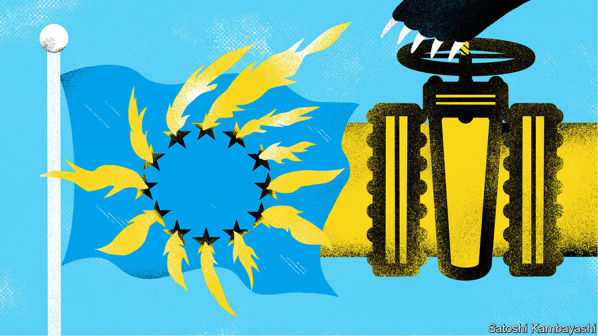

###### Less is more

# Europe is growing complacent about its energy crisis 

##### More measures are needed to curtail demand and boost supply 

 

> Oct 13th 2022 

UKRAINE CANNOT repel Russia’s invasion without the  and strength of its allies. The recent rapid advance of the Ukrainian army has shown the huge pay-off it reaps from Western arms shipments and intelligence-sharing. Russia’s missile attacks on  this week are a sign of its desperation in the face of military defeats). 

Unfortunately, away from the battlefield there is a growing and under-acknowledged threat to the Western resolve on which Ukraine relies. Europe is mishandling the energy crisis Russia has inflicted on it. Its failures could not , but also sap public support for the war effort.

On the surface Europe’s predicament seems less perilous than it did. Despite Russia this year reducing flows of gas into Europe to half their normal levels, the EU’s gas-storage facilities are over 90% full, having been topped up with abundant imports of liquefied natural gas (LNG). October looks likely to be unseasonably warm, reducing energy demand. The price of European gas for delivery in December is down about 33% from mid-September and 50% from its highs during a panic this summer.

Yet this balmy picture is fuelling complacency. Long-range weather forecasts suggest November and December could be cold. And gas storage is not enough to replace lost Russian inflows. If these fall to zero, normal energy consumption would leave storage perilously low by March, which can be chilly. Cold weather in Asia or a rebound in China’s economy may make LNG dearer. And a huge challenge looms in preparing for the winter of 2023-24. Europe needs to refill its storage all over again, but this time possibly without any Russian gas. Every unit of stored gas that Europe burns now is one it must replace next year. 

Curbing demand is an urgent task. Yet governments have so far focused on subsidising energy prices and protecting households and businesses from the shock. Italy did not cut its consumption at all in the first six months of 2022. At the end of September, cold weather in Germany briefly took gas consumption to 14.5% above the 2018-21 average. Britain is capping energy prices and is onlycampaign on conserving energy—while lobbying neighbours to keep sending electricity. An incipient plan for the eu to buy gas jointly could lower prices, but will not solve the shortage.

Some countries have unveiled energy-saving plans. On October 6th France lined up ministers for a long presentation advising cooler swimming pools and slower driving. Spain’s cabinet approved a set of measures on October 11th. Germany has unveiled a clever scheme to reduce bills while preserving incentives to conserve energy. But the overall effort is piecemeal, and is unlikely to meet the EU’s target of a 15% reduction in demand. Achieving that goal will be essential if Russian supplies are cut off fully, even if LNG remains plentiful. Yet the target is voluntary and littered with exemptions. 

The alternative to cutting demand is boosting supply, but governments have been dragging their feet here, too. Germany is reluctantly extending the life of two of its nuclear plants, but only until April 2023. France objects to a new gas pipeline from Spain to Germany, which would enable more of Spain’s LNG imports to flow to the rest of the continent. The French government says the pipeline clashes with Europe’s climate goals, but cynics suggest its real aim is to protect its nuclear-power industry.

Most short-sighted is Europe’s failure to take advantage of its own gas reserves. The Netherlands boasts a gasfield in Groningen which could, without any new infrastructure, provide about half as much gas as Russia used to supply to Germany. Yet production is minimal and the field is scheduled to close by 2024. The Dutch government fears the wrath of local homeowners who have suffered in the past when pumping gas has triggered earthquakes.

Only about 22,000 houses that are yet to be reinforced are assessed as being at risk of damage should Groningen produce at full capacity. The costs of compensating those homeowners, or indeed all residents of Groningen, for their losses are only a fraction of the revenues that could be earned from the field’s gas. And those revenues do not account for the knock-on economic and strategic benefits of replacing Russian gas. Given the stakes of the conflict in Ukraine, closing the Groningen field as scheduled would be astonishingly blinkered.

Europe’s politicians must stop acting as if the energy shortage is a one-winter affair that can be weathered by handing out subsidies. Unless they redouble their efforts to bring supply and demand into balance, they risk a worse and  or beyond—one for which Ukraine could end up paying a big share of the price. ■

