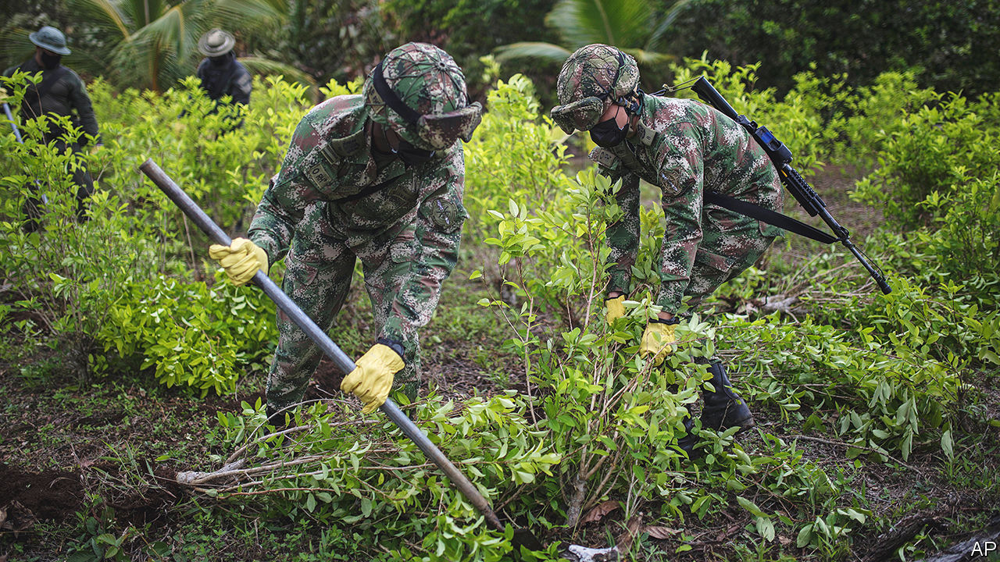

###### Soften the blow

# Joe Biden is too timid. It is time to legalise cocaine 

##### The costs of prohibition outweigh the benefits 

 

> Oct 12th 2022 

“It makes no sense,” said Joe Biden on October 6th, as he  the 6,000 or so Americans convicted of possessing a small amount of marijuana. Although cannabis is fully legal in 19 American states, at the federal level it is still deemed to be as dangerous as heroin and more so than fentanyl, two drugs that contributed to more than 100,000 Americans dying of  last year. But the president’s admission applies to drug policy more broadly. Prohibition is not working—and that can be seen most strikingly with cocaine, not cannabis. 

Since Richard Nixon launched the  half a century ago, the flow of . Global production hit a record of 1,982 tonnes in 2020, according to the latest data, though that is likely to be an underestimate. That record high is despite decades of strenuous and costly efforts to cut off the supply. Between 2000 and 2020 the United States ploughed $10bn into Colombia to suppress production, paying the local armed forces to spray coca plantations with herbicide from the air or to yank up bushes by hand. To no avail: when coca is eradicated on one hillside, it shifts to another. 

The worst harm falls on producing and trafficking countries, where drug profits fuel violence. Murder in Colombia is three times more common than in the United States; in Mexico, four times. In some areas, drug gangs are so wealthy and well-armed that they rival the state, giving cops and officials the choice of  (silver or lead): be corrupted or be killed. Prohibition also sucks children out of school, as drug gangs favour recruits who are  . 

Two presidents, Gustavo Petro of Colombia and Pedro Castillo of Peru, are clamouring for change. Mr Petro has suggested steering the police away from coca farmers by decriminalising coca-leaf production and allowing Colombians to consume cocaine safely. These are good ideas, but the cocaine gangs will remain powerful so long as their product is illegal in the rich countries that consume most of it, such as the United States. 

Half-measures, such as not prosecuting cocaine users, are not enough. If producing the stuff is still illegal, it will be criminals who produce it, and decriminalisation of consumption will probably increase demand and boost their profits. The real answer is full legalisation, allowing non-criminals to supply a strictly regulated, highly taxed product, just as whisky- and cigarette-makers do. (Advertising it should be banned.)

Legal cocaine would be less dangerous, since legitimate producers would not adulterate it with other white powders and dosage would be clearly labelled, as it is on whisky bottles. Cocaine-related deaths have risen fivefold in America since 2010, mostly because gangs are cutting it with fentanyl, a cheaper and more lethal drug.

Legalisation would defang the gangs. Obviously, some would find other revenues but the loss of cocaine profits would help curb their power to recruit, buy top-end weapons and corrupt officials. This would reduce drug-related violence everywhere, but most of all in the worst-affected region, Latin America.

If cocaine were legal, more people would take it. For some, this will be a choice: snorting a substance they know is unhealthy because it gives them pleasure. But cocaine is addictive. A paucity of research makes it hard to know how it compares with alcohol or tobacco on this score. More study is needed, as are greater efforts to treat addiction. This could be funded (and then some) by the money saved if the “war” were wound down.

In private, many officials understand that prohibition is not working any better than it did in Al Capone’s day. Just now full legalisation seems politically impossible: few politicians want to be called “soft on drugs”. But proponents must keep pressing their case. The benefits—safer cocaine, safer streets and greater political stability in the Americas—far outweigh the costs. ■


