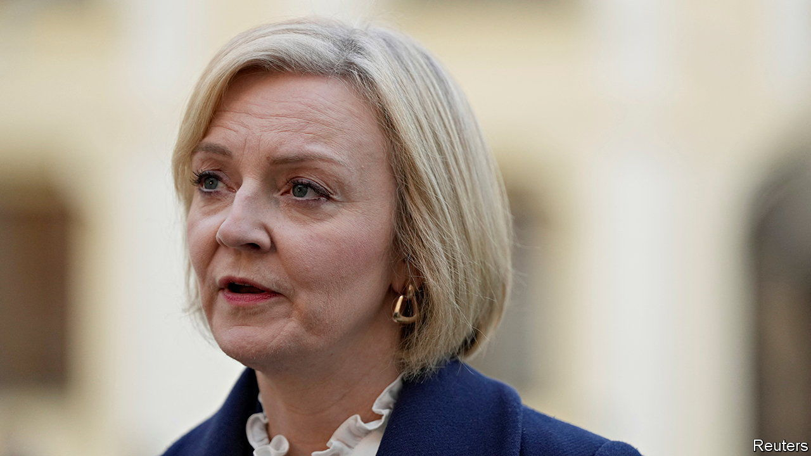
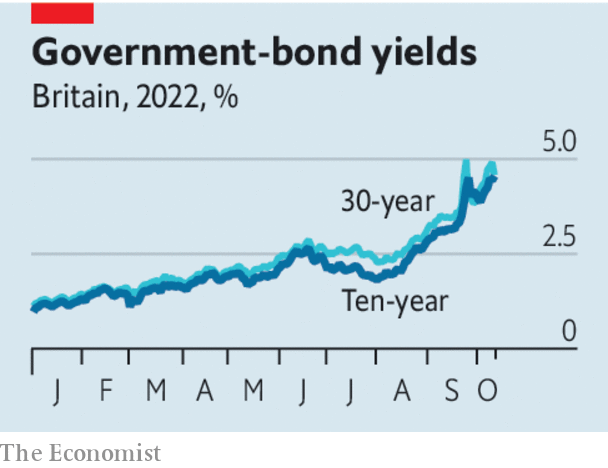

###### The Iceberg Lady

# Liz Truss has made Britain a riskier bet for bond investors 

##### There is no way for her to go back to the way things were before 

 

> Oct 11th 2022 

Liz Truss has already secured her place in British political history. However long she now lasts in office, she is set to be remembered as the prime minister whose grip on power was the shortest. Ms Truss entered Downing Street on September 6th. She  with a package of unfunded tax cuts and energy-price guarantees on September 23rd. Take away the ten days of mourning after the death of Queen Elizabeth II, and she had seven days in control. That is roughly the shelf-life of a lettuce.

If this judgment sounds severe, look at gilt yields, which have this week been . One problem is financial stability. The Bank of England has twice widened its emergency  to try to prevent a spiral of forced selling of assets by pension funds. As a sign of markets’ continuing unease, sterling slid when Andrew Bailey, the bank’s governor, said on October 11th that purchases would end as planned three days later. Officials had reportedly been briefing bankers that they might be extended after all.

 


It is tempting to conclude from rising gilt yields, the falling pound and Mr Bailey’s ham-fistedness that the bank’s interventions are failing. Tempting, but wrong. The combination of a cheap currency and high bond yields reflects the second problem, which is that investors have decided Britain has become riskier. The central bank cannot solve this by itself, however much Ms Truss and her hapless chancellor, , may wish otherwise. 

The steps that this pair have taken thus far to reassure markets have been the easy ones: a U-turn on a small part of the tax-cutting package; an accelerated timetable for Mr Kwarteng to unveil a fiscal plan on October 31st; and belated shows of deference to institutions, like the Treasury, that they initially disparaged. The Iceberg Lady will find that the remaining choices are hard.

One is to undertake massive spending cuts. The Institute for Fiscal Studies, a think-tank, reckons that the government needs annual savings worth around £60bn ($67bn) to fill in the holes created by the tax cuts, rising debt-interest costs and a deteriorating economic outlook. Cutting departmental spending across the board by 15% would get you only a little more than halfway to the necessary savings. Conservative MPs will not wear cuts on such a scale; neither will voters. 

The second hard choice is to reverse more of Ms Truss’s tax cuts. The sensible course for the government would include measures to unwind the income-tax cut for basic-rate taxpayers and to focus on encouraging investment incentives instead of cutting headline rates of corporation tax. Ms Truss shows no sign of abandoning her flagship policy—if only because to do so would destroy her administration. 

So Ms Truss and Mr Kwarteng will probably try to pass the October 31st milestone with a great dollop of fudge: sticking to tax cuts; promising implausible growth dividends and unspecified spending cuts; claiming that government-bond yields are rising everywhere. If so, they will confirm the verdict of the markets that Britain is now a more dangerous place to lend to. The damage done by the “” on September 23rd will be embedded in needlessly higher borrowing costs for the government, homeowners and businesses.

The prime minister is trapped. Right now her choices are to slash the state, reverse course on tax cuts or carry on as though nothing is really wrong. In the end, though, either financial markets or Westminster politics will force her to stop pretending that she has any prospect of toughing it out. That is why Ms Truss’s premiership is already fatally spoiled. ■

