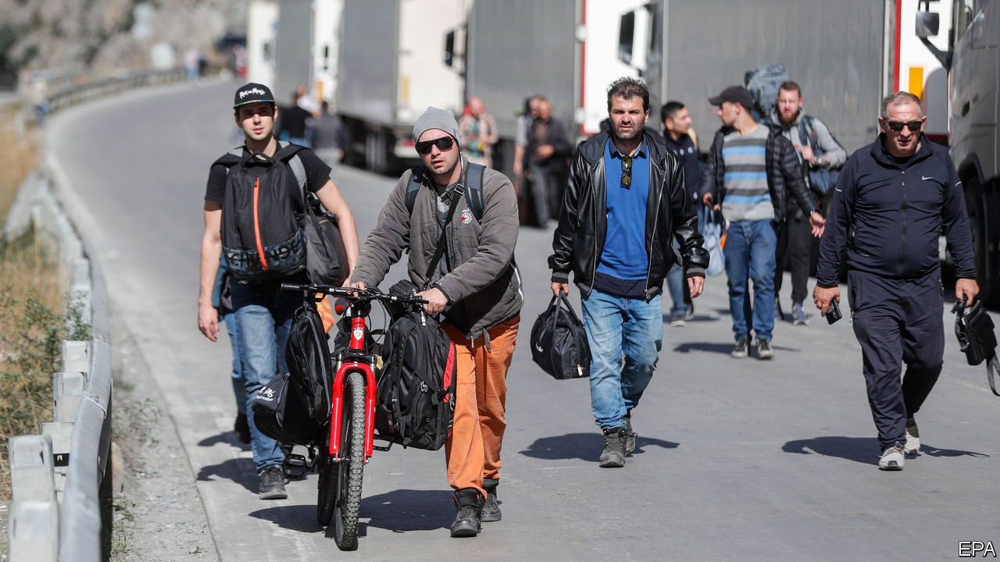
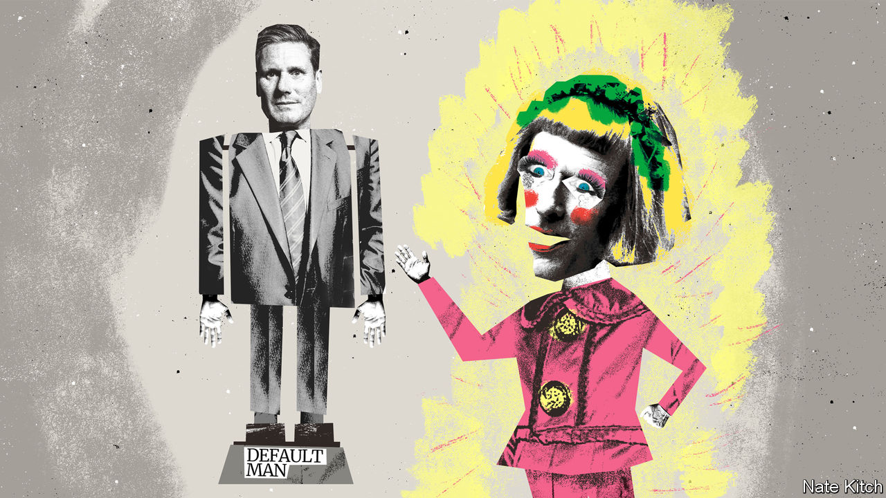
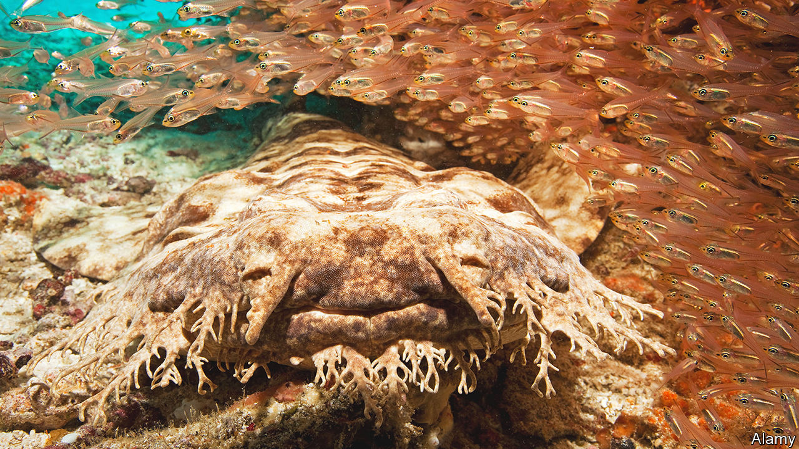

###### On Russian draft-dodgers, peer review, Sir Keir Starmer, moths, John F. Kennedy

# Letters to the editor 

##### A selection of correspondence 

 

> Oct 13th 2022 

Keep Russians out

You recommended that European countries accept Russian deserters (“”, September 30th, digital editions). Letting in such a large group of young men would pose a serious threat to the security of the European Union. Vladimir Putin’s regime has repeatedly demonstrated that it will use every opportunity to sow confusion and chaos. It is naive to think that opening the EU’s borders to tens of thousands of young Russian men would help weaken Russia. 

It is all too easy to conceal pro-Kremlin provocateurs within an uncontrolled mass migration flow. During the annexation of Crimea, Russian “green men” without identifying insignia entered the region. And let us recall the migration crisis of 2015, when European countries were unable to protect their borders. At last it was understood that external borders must be brought under control. In this context, the decisions of Estonia, Latvia, Lithuania and Poland to impose a ban on Russian entry, since mid-September, is the only correct approach. Finland has now also joined that approach.

There has been a cardinal change in the situation in Europe. As a result of the war started by the Putin regime, the Ukrainian people have had to endure incredible suffering. Yet the majority of Russian people approve of these crimes. It does not matter whether this approval is expressed in clear support for Mr Putin or by inaction. Being a “draft-dodger” does not mean being against the regime. Saving your own skin does not equate to opposing the war.

Any progress for Ukraine weakens Mr Putin’s grip. A clear message must be sent to those who want real change in Russia: you must fight at home to make Russia a democratic country that respects international law.

Riho Terras

Member of the Isamaa party in the European Parliament


 


Academic prestige

I read your article on “status bias” in peer-reviewed science papers (“”, September 17th). The research described in the article has little relevance for social-science journals, where double-blind reviewing is the norm. The identity of authors is not disclosed to peer reviewers, and the identity of reviewers is not disclosed to authors. Although reviewers may sometimes think they can guess the identities of the authors, especially when the topic is one which has been researched by only a handful of scholars, in my experience this is not habitual (I am a former editor of a social-science journal). 

The most common source of bias in social-science journals is not the reviewers, but the editors, who may have a particular, and sometimes too limited, view of the discipline covered by the journal, and who are in a position to select reviewers who they think are most likely to share their views. To avoid, or at least limit, this source of bias, journal publishers can adopt two practices. First, be very careful in choosing journal editors, and second, insist that their editors have an advisory editorial board, the members of which represent different perspectives on the research from which the journal draws its authors.

Philip Stenning


Open peer review is “the worst system except for all the others”? No. It is the worst system. And better systems exist. A randomised trial has demonstrably shown that double-blind peer review reduces biases and is fairer and more effective. 

The rise of the pre-print format is not the only barrier to implementing better systems. Having to focus on content in the absence of reputation increases review times and disagreements between reviewers. Open review makes it more difficult to find reviewers who are prepared to take on the job in the first place. All of these factors make the editor’s life more difficult and discourages editorial reform.

Perhaps it is time for academics to challenge their habits and take responsibility for collectively improving the quality of new scientific contributions.

Katharina Schleicher

Dun Jack Fu

Artificial Intelligence Hub

Moorfields Eye Hospital


An interesting insight into status bias came from James Crow in 2006. The theoretical geneticist noted that, some decades earlier, , a leading journal, had received two manuscripts, one by Theodosius Dobzhansky, who was a well known contributor to the modern synthesis of evolutionary theory, and one by a young geneticist. 

Crow quoted the editor at the time as saying: “The first paper is careful work by a serious, deserving young scientist, but it does not quite measure up to  standards. I say, reject with regret. The Dobzhansky paper must surely be published. But it is too long for its content and generally overstated. I say, accept with regret.”

DAVID INNES


 


Defending Sir Keir Starmer

I feel compelled to defend Sir Keir Starmer from the criticism that he is the “Default Man” in British politics (, October 1st). Sir Keir has made his background central to his character; raised in a pebble-dashed semi-detached house with his father, a toolmaker, and disabled mother, a nurse. And yet for some his career as a lawyer and politician does not quite scream “working-class hero”. 

He is “middle class”, but not in the way that the Eton-educated Boris Johnson, David Cameron or Kwasi Kwarteng are middle class. To look at Sir Keir solely through his party political career is to miss the point that his story comfortably fits the tale of an industrious and ambitious young man of modest means, working his way to the very top. 

A better candidate for Default Man is Jeremy Corbyn, Sir Keir’s predecessor as Labour Party leader. Here is a man who was privately educated to no great academic success, leading a largely undistinguished career in politics before accidentally leading Labour into two elections, and apparently against his own wishes.

Perry Hewitt


Bagehot supports his thesis by pointing to Anthony Albanese, Australia’s new prime minister, as another example of default man. In six short months the Albanese government has already passed the climate target legislation it promised and has introduced a bill to create a Federal Integrity Commission with real teeth. This in itself is more than the previous government achieved in ten years. On the diplomatic front the government has made great strides repairing and reasserting Australia’s bonds with the Pacific Island nations and has begun to defrost relations with China.

Mr Albanese has proved to be an effective and collegiate leader with a frontbench team of competent people. He has also shown great skill in reaching out across the political spectrum to achieve consensus. If Bagehot’s proposition is correct and Mr Albanese is a default prime minister leading a default government we can be very pleased indeed.

Alan Phillips


 


Covert insects

“” (September 17th) mentioned certain moths that have evolved a “stealth coat” to reduce their detection through echolocation by bats. Even more impressive is the  moth. It produces ultrasound that blocks the bats’ sonar. 

The RAF 360 Squadron, tasked with developing equipment and tactics to jam enemy radars during the cold war, had the moth on its insignia.

Pendexter Macdonald

Instructor in psychiatry

Tufts University School of Medicine


 


Political self interest

The title “” (October 1st) of an article on governments underwriting the entire economy reminded me in a contradictory way of John F. Kennedy’s exhortation, “Ask not what your country can do for you, ask what you can do for your country.” 

Espousing such a noble sentiment today, JFK wouldn’t be elected dog-catcher, let alone president.

David Perry


