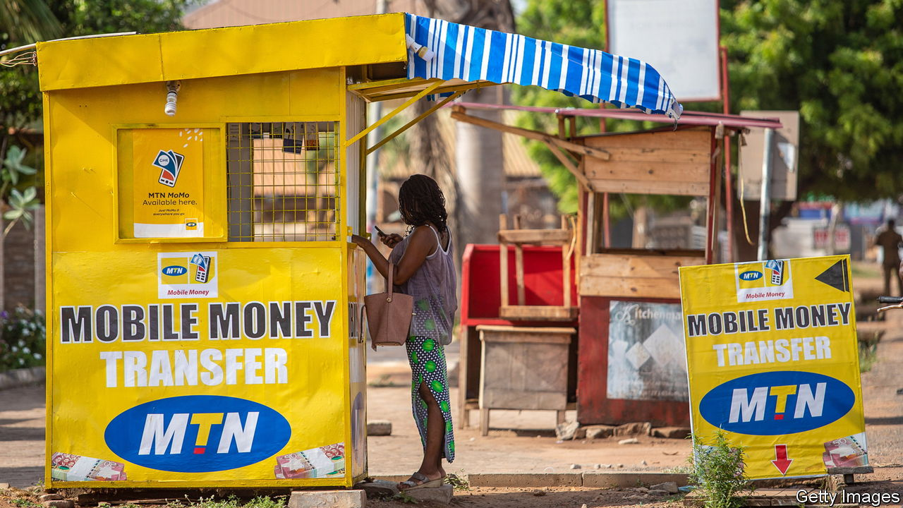
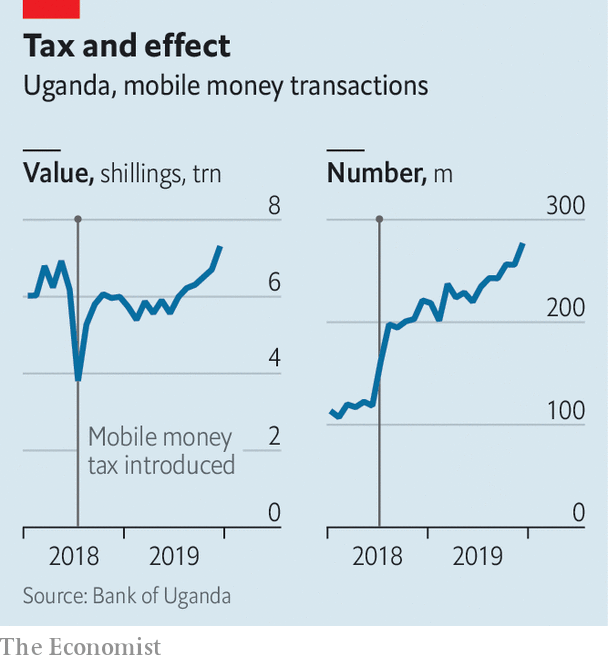

###### Tax them digitally

# African governments hope digital taxes will fill a budget hole 

##### Putting levies on mobile money is easier than taxing profits of multinationals 

 

> Oct 13th 2022 

The digital economy is bringing Africans together. The same cannot be said for attempts to tax it. Levies on mobile and internet services have sparked street protests in Uganda, cabinet squabbles in Nigeria and a parliamentary brawl in Ghana. In August Congolese officials even confiscated the passports of telecoms executives to try to make them cough up.

African governments are willing to take unpopular measures because they need to fill a hole in their coffers. In the worst months of the pandemic their tax take fell by an average of 15%, even as spending rose. They have long struggled to collect income taxes, relying instead on taxes on goods and services for about half of their revenues. Now they see untapped potential in new sectors which barely existed 20 years ago, including social media, e-commerce, mobile internet and mobile money.

One priority of governments everywhere is to ensure that non-resident businesses pay their share: if the likes of Netflix and Amazon have customers in Africa, they should be taxed there too. A global tax deal was agreed to by 130 countries last year with the aim of forcing multinational companies to pay more tax in the places where they make their sales, irrespective of where they register their assets. 

But many African countries worry it is too complex and would be difficult to implement in countries with low administrative capacity, says Thulani Shongwe of the African Tax Administration Forum, a network of tax officials. The revenue gained may barely be worth the effort. The biggest sceptics are Kenya and Nigeria, which have imposed their own taxes on digital services—exactly the kind of unilateral measures that a global deal is designed to avoid. African countries have proposed that a tax convention be developed at the un, where they hope to have more of a say.

 


Another focus is how to tax telecoms firms, which are big players in often uncompetitive markets. “There is a high likelihood that sector is undertaxed, even if they say they’re not,” says Adrienne Lees of the International Centre for Tax and Development, a research institution based in Britain. Rather than go after corporate profits, which can be massaged by accountants, many governments have taken the simpler step of taxing individual transactions. Ghana’s e-levy, in force since May, imposes a 1.5% tax on most electronic money transfers, such as those that citizens zap through their phones. Cameroon brought in a similar charge in January. Nigeria is considering a 5% levy on calls, messages and mobile internet.

Even small taxes can lead to big changes in behaviour. In Uganda the total value of mobile-money transactions dropped by a quarter when the state imposed a 1% tax on them in 2018, taking 18 months to recover. One effect was that wealthier users switched to traditional banking services. Some poorer ones turned to cash. Opponents of new taxes argue that they drive activity back into the shadows. Juliet Anammah of Jumia, a pan-African e-commerce firm launched in Nigeria, points out that many governments are trying to encourage traceable transactions at the same time as they are trying to tax them.

These levies are new and very visible, and taxpayers are pushing back. Last month the Tanzanian government scrapped levies on some types of electronic transactions after a public outcry, including a legal challenge from activist lawyers. In Malawi the government gave up its plans for a mobile-money tax in 2019 after business and civil-society groups criticised the idea. This kind of messy bargaining could eventually strengthen the contract between citizens and states.

An obvious worry is that these processes could be short-circuited if autocratic governments use internet taxes to stifle dissent. In 2018 Uganda slapped a daily levy of 200 shillings ($0.05) on social-media use. The number of Twitter users dropped by 13% as a result, according to a study by Levi Boxell of Stanford University and Zachary Steinert-Threlkeld of University of California Los Angeles. But there was a twist: the number of tweets about protests and rallies increased. Like death, taxes are certain. Their effects are not. ■

