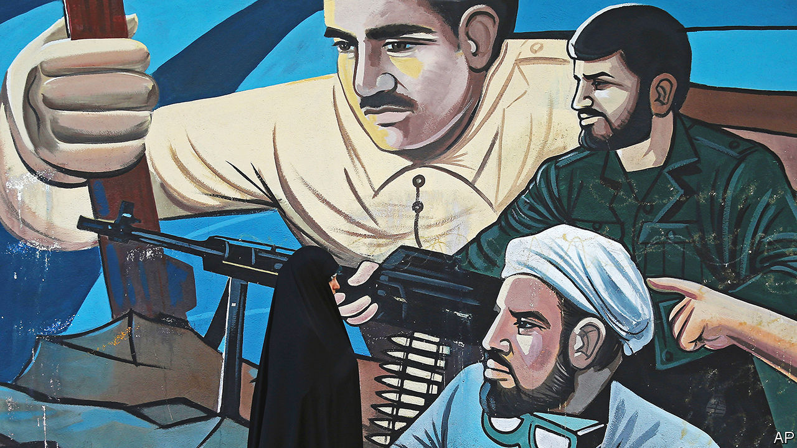

###### All the mullahs’ bullets

# Despite lethal repression, Iran’s protests continue 

##### The loyalty of the army has yet to be tested 

 

> Oct 12th 2022 

Every evening at 10pm Mahvash, a university student, opens the window of her fifth-floor flat and starts yelling. Neighbours take up her refrain of “Women, Life, Freedom!”. Soon her chants against Iran’s theocracy echo from block to block above the riot police below—and across Tehran, the capital. Some protesters wear masks to avoid identification. Many switch off the lights. Almost all the voices are women’s. “Blood that is spilled unfairly will boil until the end of time,” runs an old Persian saying, now back in fashion.

Almost a month after  at the death of Mahsa Amini, a 22-year-old woman detained by the  for showing too much hair, Iran’s ayatollahs are still struggling to keep order. Unrest has spread across the country, prompting strikes in some bazaars and oil installations. State news bulletins that had ignored the protests now denounce them as foreign plots. And in an effort to regain full control the ayatollahs have reinforced the police with units of ideological paramilitaries known as the  The loyalty of the army, which has stayed on the sidelines, has yet to be tested.

When the protests began on September 16th, the regime pulled back its morality squads and let the police take over. Some clubbed unveiled female heads. As more headscarves came off, they resorted first to tasers and then water cannon, tear gas and sometimes air rifles. But that only brought out men to defend the women. Some protesters dragged policemen from their ranks and kicked them. In several towns the police fled under a hail of stones.

With the interior ministry’s forces humiliated, the ayatollahs have increasingly turned to the . Unlike the police, they answer to the  (IRGC), the ayatollahs’ praetorian guard. Some are plain-clothed. Others wear black or battle dress and patrol on motorbikes. Many carry pistols and, increasingly often, machineguns. The IRGC is also using its intelligence agencies to raid homes of suspected activists, seize their phones and make arrests. It has circulated text messages urging informers to report dissident activity.

Fear has punctured the protesters’ initial euphoria. In the first days of protest, many security people wore masks to hide their identities. Now the protesters do. The have smashed and closed cafés where activists used to congregate. Revolutionary courts run by clerics pass summary sentences. Mohsen Amiryousefi, the head of the cinema directors’ association, was jailed for two years after signing a petition that appealed for three members to be freed. So full are the prisons that warehouses have been requisitioned as detention centres. Passers-by report hearing screams from them. Many activists in Tehran admit to being paralysed by fear. Some have fled to the mountains. 

But though large gatherings have subsided, protests continue. After weeks without leaders, groups with names like Youth of Tehran Neighbourhoods have emerged, announcing the timing of protests. Schools and college campuses remain hives of dissent. Students waving headscarves chanted against Ebrahim Raisi, Iran’s ruthless president, when he visited Tehran’s al-Zahra university on October 8th. Schoolgirls in Tehran chased away visiting officials. Anti-regime graffiti adorn the side streets. The average age of the protesters, according to an IRGC commander, is 15. A human-rights group in Norway reckons that 23 of the 200-plus protesters so far killed were children.

Provincial cities that were quiet in previous bouts of unrest have joined in. Witnesses have described battle scenes in areas where unrest has been most intense: in Ms Amini’s Kurdish homeland in the west and in Sistan and Baluchistan in the east. Videos taken in Sanandaj, a Kurdish town, showed gaping holes in houses that could have been made by machineguns.

But if this series of revolts is to grow into a full-scale revolution, new ingredients will have to be poured into the cauldron. Most businessmen remain cautious. “No one wants another Syria,” says one, referring to an uprising that became a civil war. Many employers say they face mounting pressure from their staff to tweet support for the protesters. Tehran’s two main bazaars, instrumental in the revolution that overthrew the shah in 1979, have both staged intermittent strikes in the past week. On October 10th oil workers demonstrated in Abadan and Asaluyeh, two southern towns that are crucial to Iran’s oil and gas production. Officials played it down as a dispute over pay, but the workers chanted “Death to the dictator”. 

After weeks of studious silence, some senior clerics are breaking ranks and urging their supreme leader, Ayatollah Ali Khamenei, to heed the voices of the people. So far, the main institutions of the Islamic state, underpinned by the IRGC and the , have stood firm. But if the students keep going, if businessmen start to wobble and if cracks were to appear in the army, the revolt could enter a new phase. ■

