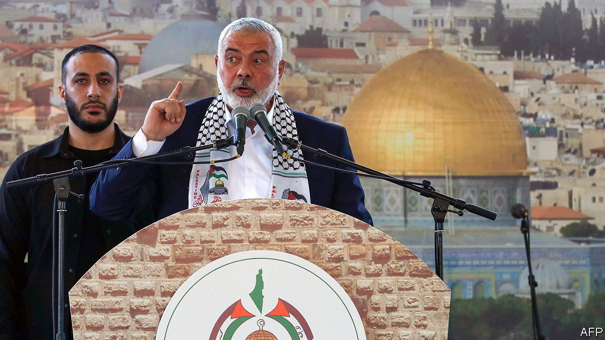
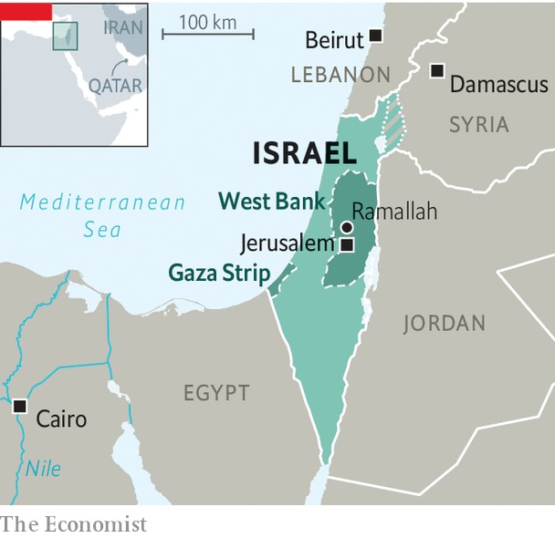

###### Slouching towards Damascus

# Hamas ponders whether to cosy up to Syria’s brutal despot 

##### Bashar al-Assad’s regime has murdered a lot of Sunnis, but an alliance might be convenient, some say 

 

> Oct 13th 2022 

As Syria’s bloodstained regime seeks to return to the Arab fold after a decade of civil war that isolated it from most of its counterparts in the region, Hamas, the Palestinians’ Islamist movement, is arguing bitterly with itself. One faction wants to re-engage with President Bashar al-Assad and re-establish Hamas’s former main external base in Damascus, Syria’s capital. The other faction, mindful of Mr Assad’s brutal suppression of Hamas’s local allies during the civil war, wants to keep on steering clear of his regime. This reflects Hamas’s perennial attitude towards Israel. Should it stick to its long-standing official aim of expunging the Jewish state from the region, or explore some form of coexistence, perhaps under a truce of negotiable length?

Hamas left Syria in 2012, closing its Damascus office in protest against Mr Assad’s massacres of its fellow Sunni Muslims, particularly members of the Muslim Brotherhood, with which Hamas is closely aligned. The idea of reopening Hamas’s office and re-establishing formal ties has caused uproar in the movement.

Two of its bosses, Yahya Sinwar, who was elected to lead the government of the Gaza Strip, and Ismail Haniyeh, who heads Hamas’s politburo, have backed the impending visit of a high-level Hamas delegation to Damascus. But its former political leader, Khaled Meshal, who is trying to rebuild ties with the main Sunni Arab countries, is against it.

 


Such discussions are usually conducted in secret but have burst into the open. On September 16th Nawaf Takruri, a member of Hamas’s founding generation, used social media to attack any move towards a regime that “continues to practise all forms of crime and murder against the Syrian and Palestinian peoples”.

Hamas’s position is shaky. Within the Palestinian territories it still vies for primacy with the secular Fatah movement, which runs the West Bank under Israel’s say-so from its administrative headquarters in Ramallah, close to Jerusalem. Since bloodily wresting control of Gaza from Fatah in 2007 after winning an election two years earlier, Hamas has been isolated within its fief under a blockade imposed by both Israel and Egypt. So it has been vital for Hamas to have a headquarters outside. 

Few Arab countries are willing to host it. Hamas is banned in the West as a terrorist organisation. Its ideological roots in the Muslim Brotherhood, which helped inspire the revolutions that swept across the region over a decade ago, damn it in the eyes of most of the regimes of the Gulf and north Africa. To appease Egypt’s regime, Hamas agreed to renounce its allegiance to the Brotherhood, but it has struggled to regain support elsewhere in the Arab world.

Since leaving Damascus, the group’s leaders have drifted mainly between Turkey and Qatar. But Turkey is mending fences with Israel, Qatar with its anti-Islamist Gulf neighbours. So Damascus may be a safer haven again. Mr Sinwar stays mostly in Gaza, with occasional sorties to Cairo. Messrs Haniyeh and Meshal are often in Qatar, sometimes in Lebanon. Before the civil war Syria allowed a degree of freedom for proclaimed “resistance” groups like Hamas and provided a hub where both radical Sunni and Shia movements got military and financial aid, often from Iran. 

Moving away from Syria meant that Hamas depended less on Iran, which remained Mr Assad’s chief backer until Russia came to his rescue in 2015. A senior Sunni cleric who died last month, Yusuf al-Qaradawi, an Egyptian Islamist based in Qatar, published a telling Sunni Muslims to fight a holy war against Mr Assad and his Iranian-backed fighters in Syria. But as Mr Assad emerged victorious from the war, some Hamas leaders have been seeking a rapprochement with him.

Although Hamas on paper still seeks to win back all of Israel by arms, its followers are wary of embarking on another , or uprising. Some Hamas leaders have floated the possibility of a , or long-term truce with Israel, in return for lifting the blockade of Gaza. This is at the heart of the tension within Hamas over its attitude to Syria and Iran. Can it operate effectively within a region that is increasingly coming to terms with Israel, while it sticks to its radical Islamist roots? ■

