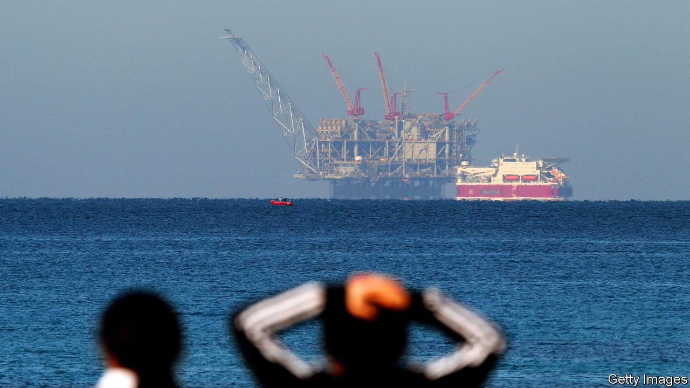
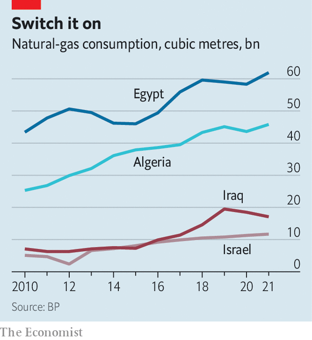

###### An untapped reservoir

# Middle Eastern countries are sitting on an ocean of natural gas 

##### But they cannot ship much to Europe, where demand is ravenous 

 

> Oct 13th 2022 

It is rare for the Israeli government to agree with Hizbullah, the Lebanese Shia militia and political party. But in effect it did on October 11th, after months of American-led talks. As was published, a deal with Lebanon was awaiting review in Israel’s parliament.

This is not peace in our time: although the deal demarcates Israel’s maritime border with Lebanon it will not end the long state of war between them. But it is striking, and timely for the West, because it may unlock new gas resources that Europe desperately needs to replace supplies from Russia that have been disrupted since its invasion of Ukraine. 

 Nine of the 20 countries with the largest proven gas reserves are in the wider region. Qatar, the world’s biggest exporter of liquefied natural gas (LNG), plans to increase its production by 43% by 2026. Israel and Lebanon hope their maritime deal will mean new discoveries in the once-disputed waters. Hours after it was clinched, bigwigs from TotalEnergies, a French giant, met Lebanese officials. Earlier this month Energean, a British firm, started running tests at Israel’s Karish field near the border. 

Yet a mix of geopolitics and poor governance makes it hard to exploit those resources. Simply getting the stuff to market can be tricky. There is little capacity to transport it from the eastern Mediterranean to Europe. A pipeline has been mooted for years. It could take a short route north to Turkey and link up with existing conduits to the European Union. But to do so it would have to cross Cypriot territory, which is politically fraught. Or it could stretch all the way to Greece, and perhaps onwards to Italy. But that would require the world’s longest undersea pipeline and take the better part of a decade to finish.

For now, that leaves liquefaction. Egypt has two LNG plants on its Mediterranean coast. Israel and Lebanon have none; Egypt has been importing gas from Israel in order to re-export it. Even running at full tilt its LNG plants can supply only 2% of Europe’s total demand (and 6% of what it used to import from Russia). Expanding capacity will take years.

Other countries are struggling to boost production. Algeria, Europe’s third-largest gas supplier, will enjoy record revenue this year. Sonatrach, the state-owned oil-and-gas giant, expects to earn $50bn from energy exports, up from $35bn last year. The windfall comes from higher prices, not higher production. Sonatrach has signed some big deals with Eni, an Italian oil major, to boost capacity. But many of its big projects will not come online before 2024. 

Iraqi oil wells produce lots of natural gas but lack the infrastructure to process it. Around half is flared. In 2020 the country burned almost 18bn cubic metres of natural gas, equivalent to about 5% of Europe’s annual consumption. Researchers at Columbia University estimate that flared gas in north Africa alone could replace 15% of Europe’s imports from Russia—if it can be captured. 

 


Perhaps the biggest challenge to exports, though, is soaring domestic demand for gas (see chart). In Egypt, for example, it has risen by 35% since 2015. A fast-growing population—which hit 104m in September and adds 1m people every seven months—needs ever more electricity from gas-fired plants. The government has also urged motorists to switch fuels: many of Cairo’s ubiquitous white taxis now run on compressed natural gas rather than petrol.

Here, too, governments are belatedly taking action. Algeria is installing new combined-cycle gas-power stations, which can produce about 50% more electricity from the same amount of fuel. The national regulator reckons they will account for 55% of installed capacity by 2028, up from 23% in 2018.

Egypt, meanwhile, is urging businesses to cut consumption to free up gas for export. Such measures have rankled some Egyptians, who grumble about being told to turn off their lights so that Europeans can turn up the heat. 

