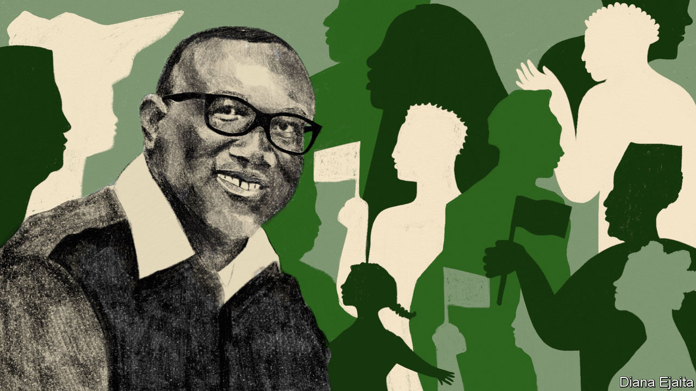
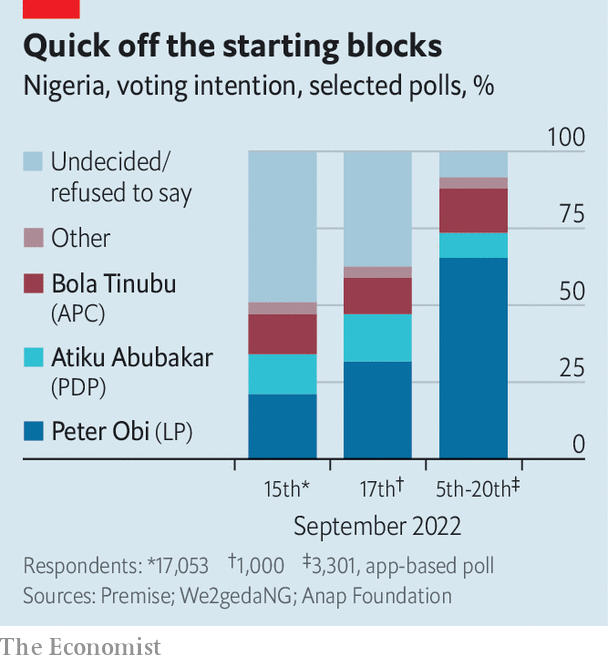

###### A new hope

# Peter Obi, a man who carries his own suitcases, could be Nigeria’s next president 

##### An interview with an outsider who says he will actually do something about corruption 

 

> Oct 10th 2022 

“This is a case of Goliath and David,” says Peter Obi, a long-shot candidate who has unexpectedly taken the lead in the race to become president of Africa’s most populous country. “The big people are there, but allow this small person to do it. And I know I can do it.”

As public campaigning was about to begin in late September, Nigeria was rocked by the release of three polls showing Mr Obi well ahead of the two candidates for the main parties that have misruled Nigeria since the restoration of its democracy in 1999. In two of the polls Mr Obi has a lead of more than 15 percentage points over Bola Tinubu of the incumbent All Progressives Congress (APC) and Atiku Abubakar of the People’s Democratic Party (PDP), the main opposition. What makes this even more extraordinary is that Mr Obi is standing for the Labour Party, whose candidate at the previous presidential election in 2019 won just 5,074 votes out of 28m cast. 

Mr Obi’s sudden ascent represents a rare chance for Nigeria. The country ought to be rich: it has huge reserves of oil, gas and other minerals, plenty of fertile land and a young population of go-getters. Yet Nigerians are  than they were ten years ago and 40% of them survive on less than $1.90 a day. 

Nigeria is poor because of rotten politics and bad governance. Its politicians have long stirred up ethnic and religious divisions by promising to direct state resources to members of their own group. Once in power they have pursued contorted economic policies such as a fixed exchange rate and . Some policies seem to make sense only as a way of allowing cronies to siphon off cash. 

 


Neither of the two main candidates in the presidential election scheduled for February offers much hope for change. Mr Abubakar, a former customs official turned tycoon, was accused alongside his wife in 2010 by a US Senate committee report of being linked to the transfer of $40m in “suspect funds” to America. (He denies wrongdoing.) Mr Tinubu, an ex-governor of Lagos state, had his assets frozen in the 1990s by the American government, which said it had probable cause to believe the money was linked to drugs. Mr Tinubu, who has also denied wrongdoing, reached a settlement with the Americans whereby he agreed to forfeit $460,000.

There are, of course, no guarantees that Mr Obi would break the kleptocracy that is throttling Nigeria: the country’s political system has a habit of corrupting even those who start out with the best of intentions. But if he were to sustain his lead until the election in February, he would be the first politician in decades to show that a new sort of politics is possible in Nigeria. If he is able to keep energising young, urban voters across the country’s main divisions of religion, geography and ethnicity, he may well redraw Nigeria’s electoral map. And by making this election about competence, character and perhaps even ideas, Mr Obi promises to upset the old electoral calculus, which was based on horse-trading to form majorities between politicians who gathered votes mainly among their coreligionists or ethnic groups. 

Mr Obi seems an unlikely revolutionary. He is rich, like many of Nigeria’s political elite. (Unlike many other wealthy Nigerian politicians, Mr Obi seems to have made his money before taking office.) He is also no political outsider, having served two terms as governor of Anambra state until 2014. He then stood as Mr Abubakar’s vice-presidential candidate in 2019. 

Here the similarities end. As an energetic 61-year-old, Mr Obi stands in sharp contrast to the 75-year-old Mr Abubakar and to Mr Tinubu, who though only 70 was recently forced to respond to widespread rumours of ill health by posting a video on Twitter of himself pedalling an exercise bicycle. “Many have said I have died,” he posted. “Others claim I have withdrawn from the presidential campaign. Well... Nope.” Mr Obi has a vigorous social-media operation with a vast, passionate following, and is strikingly open to interviews. 

His surging popularity is due, above all, to perceptions of his character. In a country cursed by politicians of extraordinary ego and entourage, his supporters marvel that as governor Mr Obi queued at airports holding his own luggage. He also slashed the size of his motorcade when he found that 13 of the cars were empty, he says. This not only plays well with young voters, but also annoys his rivals. Kashim Shettima, Mr Tinubu’s running-mate, grumbles that Mr Obi “tends to glamorise poverty” by claiming to own only one watch. 

Frugality is relative in Nigerian politics.  interviewed Mr Obi in his suite in the plushest hotel in Abuja, the capital. (It is also one of the most secure.) Mr Obi was, however, free of the hordes of hangers-on who typically surround Nigerian bigwigs. His running-mate, Yusuf Datti Baba-Ahmed, is also far from poor. 

Matters of trust

When asked what distinguishes him most from the other two major candidates Mr Obi replies: “Who can people trust?” He promises to deliver and not to steal. Yet he too has faced some questions over his financial affairs. The Pandora Papers, a large set of leaks to the press of records from financial companies, revealed that Mr Obi owned an undeclared offshore company in the British Virgin Islands, a tax haven. He also reportedly failed to declare all his assets or immediately relinquish control of all his companies, as required by the law, upon becoming governor. Mr Obi claimed at the time that he did not know he had to declare assets held jointly with his family and that he did relinquish control of the company in question, but that an error meant it was not enacted for 14 months. 

To try to show that the money in those companies was earned before he entered politics, Mr Obi pulls out stacks of letters from his bank in London showing the extent of his lines of business credit in the 1990s. In any case, he argues, his rivals are very rich, too. “What is their source of wealth?” he asks. Context matters. “Relative to the field…he is a saint, more or less,” says Ebenezer Obadare of the Council on Foreign Relations, a think-tank in New York. Though that does not necessarily make him “clean”, he adds. 

Mr Obi also wants to run on competence. He emphasises that he left a fiscal surplus to his successor as governor—a rarity. Anambra’s score on the Human Development Index, a measure of income, education and life expectancy, was falling when Mr Obi entered office in 2006. It bottomed out by 2008, with Anambra ranked eighth among Nigeria’s states. By the time he left office in 2014, Anambra had leapt to third place, trailing only Abuja and Lagos, Nigeria’s commercial capital. Between 2006 and 2012, Onitsha, the biggest city in the state, was in the top 50 of 750 cities worldwide for the rate of private-sector job growth, according to the World Bank. 

Mr Obi is disappointingly less keen to emphasise his proposed policies as president. Still, improving security is his “number one priority”. It ought to be. Over the past eight years under President Muhammadu Buhari, jihadists have . Violence in the south-east, often attributed to Igbo separatists, has surged, as has crime. Last year some 3,400 people were kidnapped across Nigeria, many of them for ransom, according to Jose Luengo-Cabrera of the UN.

To restore order Mr Obi promises to expand the security forces and equip them better. He proposes giving states and local governments the power to have their own police officers, rather than rely solely on federal forces. He is willing to talk to armed groups with political demands, such as the Indigenous People of Biafra, a  in his own south-eastern region. 

When it comes to the economy, his instincts appear liberal. “There is a lot of government involved where the private sector should be,” he says. Nigeria’s petrol subsidies will eat up more than federal spending on health, education and welfare combined. Mr Obi promises to get rid of these handouts. Yet the Labour Party has close ties with unions, many of which have repeatedly opposed subsidy reform. “I’m not going to make promises I’m not going to fulfil,” he insists. When it comes to the currency Mr Obi’s liberalism wears thin. He would not let the naira float freely, though he says he would allow the official rate to move closer to the black-market one. He at least wants to give the central bank more independence after this was eroded under Mr Buhari. He also promises to ease trade restrictions and support the African Continental Free Trade Area.

Frugality also shapes his attitude to debt. “We want to borrow strictly for investment, if need be—if at all!” he says, criticising Nigeria’s rising debts to China. Yet thrift alone is unlikely to solve Nigeria’s many problems. Federal-government spending is just 6% of GDP. Even with more efficient spending, there will not be enough cash to tackle the country’s enormous infrastructure needs. Increasing Nigeria’s paltry tax take is crucial, but goes largely unmentioned by Mr Obi.

March of the Obidients

Can Mr Obi pull it off? His supporters think so. “I am an Obi-dient man,” laughs Kingsley Onwe, a trader selling tomato paste at a street market outside Abuja. Mr Onwe is not advertising general deference to authority. “Obi-dients” is the nickname for Mr Obi’s supporters. 

His rivals are, however, dismissive. “We’re not bothered about him,” says Dino Melaye, Mr Abubakar’s campaign spokesman. The vituperative attack that the former senator launches suggests otherwise. In his telling, Mr Obi is a “deceptive character” who has a “plethora of allegations against him”. He adds that Mr Obi “knows himself that he cannot win it but he sees it as an avenue to make money.” Should your correspondent want to talk more about this topic, Mr Melaye (who enjoys posing with his collection of Ferraris and Lamborghinis) leaves his business card: a metallic-gold one that looks like a credit card.

Even if the polls are accurate—the large share of undecided voters suggests the outcome is still in flux—Mr Obi will have to clear several hurdles on the path to becoming president. The first relates to the rules. To avoid a run-off, the winning candidate must not only have the most votes, but also win more than 25% in each of at least two-thirds of the country’s 36 states (plus the capital). Doing so, admits Mr Baba-Ahmed, may be challenging, particularly in ten northern states that tend to swing for northern and Muslim candidates. (Mr Obi is a Christian from the south.)

Mr Shettima, the ruling party’s vice-presidential candidate, is also dismissive of Mr Obi’s chances in the north. A former senator and the previous governor of Borno state, he suggests asking northerners about Mr Obi, saying they will think “he is either a musician or a footballer”. 

In fact, many northerners your correspondent spoke to knew who Mr Obi was, despite his lack of local muscle. On the streets of Kano, the biggest city in the north, enormous billboards of Mr Tinubu and Mr Abubakar loom large and Mr Obi’s image is all but absent. At his Kano headquarters a broken billboard was leaning against a fence, and no one but a toothy guard was present. Yet some polls show him running second in the north. 

Even so, Kano illustrates a second risk for Mr Obi’s campaign. The Labour Party he represents will not have candidates on dozens of ballots for seats in the Senate or for 130 seats in the House of Representatives. This means it will have to persuade voters to break with habit and cast their votes “skirt and blouse”: backing one party for president and another for the other races. Moreover, the party has few members, no state governors and just one senator. Usually governors and senators help funnel cash (both legitimately donated and less so) to campaigns and rustle up the tens of thousands of party lackeys who go out to persuade, bully or bribe people to vote for their candidate. 

Mr Melaye of the PDP explains with disarming frankness why these structures matter. “In every catchment area you have people who are the owners of the voters,” he says. Mr Baba-Ahmed puts a brave face on the Labour Party’s weakness, saying that it will allow him and Mr Obi to govern cleanly because they will not be beholden to bigwigs. Even so, they have to win first.

In a bid to do so, Mr Obi is trying to tackle vote-buying head on. “I tell people every day, the money people are sharing is just stolen money, it is not their money,” he says. “That’s why people are dying in hospitals. That’s why there are no roads.” This election will be a test of whether the old way of doing politics has been superseded by one based on individual choice and direct appeals to the public. 

The third risk to Mr Obi’s campaign is outright rigging. Mr Obi himself plays down such fears. Recent reforms to the vote-counting process should make ballot-stuffing harder this time. Yet Mr Baba-Ahmed is “not confident” the vote will be free and fair. Some activists share these concerns. Ayisha Osori of the Open Society Foundations, an ngo, thinks the ruling APC will try to depress turnout in areas where Mr Obi is strong. Doing so could spark conflict. “If they decide to humiliate [Obi] and have a blatantly rigged, violent election, I’m really worried about what people will do,” she says. Mr Obi himself brushes off the idea that his supporters might react angrily to a defeat. He is simply focused on winning. “I’m saying I’m better, I’m saying I can do it better,” he insists. “Trust me.” Right now at least, many do. ■

