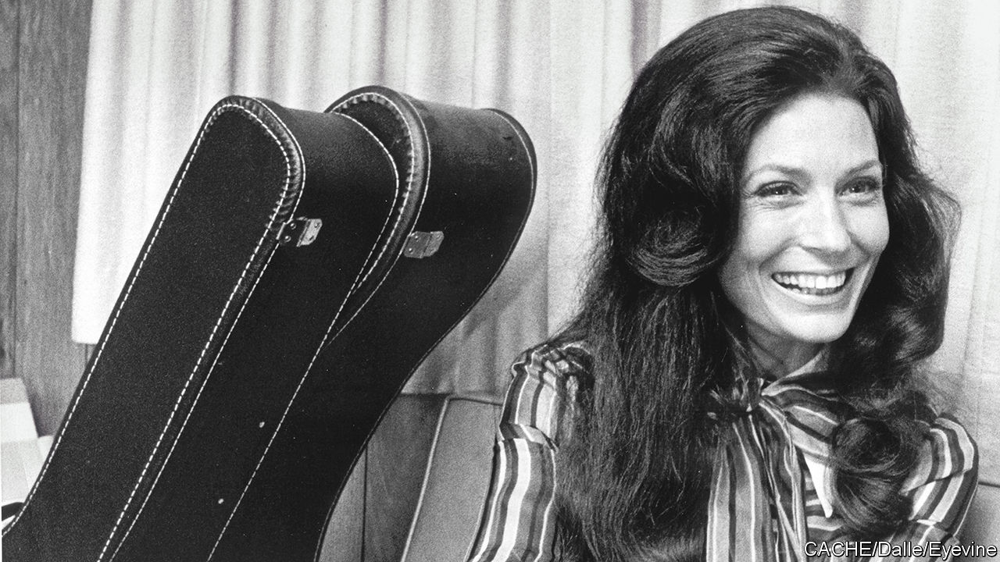

###### From coal to gold

# Loretta Lynn gave all struggling women a voice 

##### America’s biggest female country-music star died on October 4th, aged 90 

 

> Oct 13th 2022 

Lordy, that little girl could sing. When she sat on the porch swing of that cabin in Butcher Holler (“Hollow” on the map, if there was a map), and rocked her baby brothers and sisters asleep, she’d sing loud enough to bust their eardrums. But it was such a clear, bright sound that the man who ran the still on the opposite slope would come out to sit and listen while the moonshine was running off. He once asked her to sing a bit louder, just for him.

 Eventually Loretta Lynn’s voice spread far beyond those Kentucky pine hills and hollers, to radio stations, to Nashville and the stage-cum-shrine of the Grand Ole Opry, to the whole nation and across the seas. In 1972 the Country Music Association named her Entertainer of the Year, and she was the Academy of Country Music’s Artist of the Decade for the 1970s. Through the 1960s and 1970s she produced three albums more or less every year. She became the most-successful-ever female country-music star, with 16 No. 1s in America’s country-music chart and 45m albums sold worldwide. Well into her 70s, she was still touring. You were liable to hear that voice anywhere, perky, true-toned and as twangy as the day she was born. 

 For her, popularity came as a surprise. As her signature song declared (as well as her backing group, the Coal Miners, and the gold miner painted on her tour bus), she was only a coal miner’s daughter. Daddy worked all night in the Van Lear mine, crawling through a three-foot-high seam that left his knees cut and sore. By day he hoed corn. And money, or scrip, was still scarce. They lived on pinto beans and bacon, and the cracks in the cabin walls were patched over with pictures of film stars from glossy magazines (including Loretta Young, hence her name). The children shared shoes until they got bunions. She went to a one-room school, and nothing she did there suggested that she would ever move away.

 She also didn’t think she was any big deal. As far as looks went, she had fine blue eyes and good cheekbones from her part-Cherokee mother, but buck teeth, which she hated. She wore long gowns with high necks and long sleeves, hair hanging to her shoulders. Musically, she played simple acoustic guitar and wanted to sing like Kitty Wells, the top female country singer of her teenage years. As for lyrics, she just scratched a phrase on any scrap of paper, hotel bill or whatever, and then hummed it to herself until she got a song. The themes were mostly the usual, two people falling in love, one party cheating or both, someone left hurting or both. Because that was life, wasn’t it? That was the truth. 

But it wasn’t a truth heard often from the woman’s point of view. Most country women she knew—and no doubt city women, too—were trapped indoors with housework and babies, domestic drudgery day after day, as in “One’s on the Way”: 

...here in Topeka the screen door’s a bangin’

The coffee’s boiling over and the wash needs a hangin’`

One wants a cookie and one wants a changin’

And one’s on the way

She sang for every woman then, not least herself. Around 90% of the lines came out of her marriage to Oliver “Doolittle” Lynn, a union that lasted decades of hard fighting and hard loving. She met him at a pie social (he being the boy who bought her awful pie), married him at 15, and by 19 had four babies, in the end six. He was a good bit older and had travelled, as she never had. So she went from Daddy to Doolittle, always with a man telling her what to do—this time, one who beat her and sold bootleg whiskey on the side. She in turn could be mean as a snake, and once knocked three of his teeth out, clackety-clack on the hardwood floor. That was an accident, but she still meant to hit him. And hard. 

 In that time of women’s lib she was no feminist, and didn’t want to be. Still she sang about equality (“Second class don’t turn me on at all”), about the hardship of women’s divorce (“The women all look at you like you’re bad/And the men all hope you are”) and the joy of the Pill:

There’s a gonna be some changes made

Right here on nursery hill

You’ve set this chicken your last time

‘Cause now I’ve got the pill 

Doo’s nocturnal habits came in for a thrashing, too (“So, don’t come home a’drinkin’ with lovin’ on your mind”). All this she sang with such a broad defiant grin that she always said she was just clowning around, up on that stage.

 And she clung to Doolittle all the same, threatening “fist city” if any hussy came near him, because he’d made her what she was. She owed him everything. When she married him she gave up public singing, but he bought her a $17 Harmony guitar for her 21st birthday and said he liked to hear her sing around the house. (He also called her a stupid hillbilly, way too bashful about herself.) So she began to perform in clubs and honky tonks, realising people liked her. In 1960 she recorded “I’m A Honky Tonk Girl” on a small label, and they took a three-month road trip, sleeping in the car and living on baloney sandwiches, to hand-deliver the single to radio stations. It reached the country Top 20, she signed a deal with Decca, and she was not a housewife any more, thanks to Doo. With him by her side, she also never lacked material for her songs. 

Becoming a star meant moving to a splendid plantation house and ranch in 1,450 acres at Hurricane Mills, Tennessee. There she built a modern mansion and a museum for her stage outfits, as well as for the hundreds of gifts and cards she had been sent by fans. A girl from Butcher Holler knew how to hold on to things. But Butcher Holler was there too, in a replica cabin that had been built in 1980 for the film of her autobiography, “Coal Miner’s Daughter”. It had antimacassars on the armchairs, lace cloths on the tables and Momma’s cup of fortune-telling tea on the kitchen table. There was also a replica pithead coal-chute, “Loretta Lynn’s Coal Mine No. 5”. It sounded like a perfume—the perfume of her life. ■

