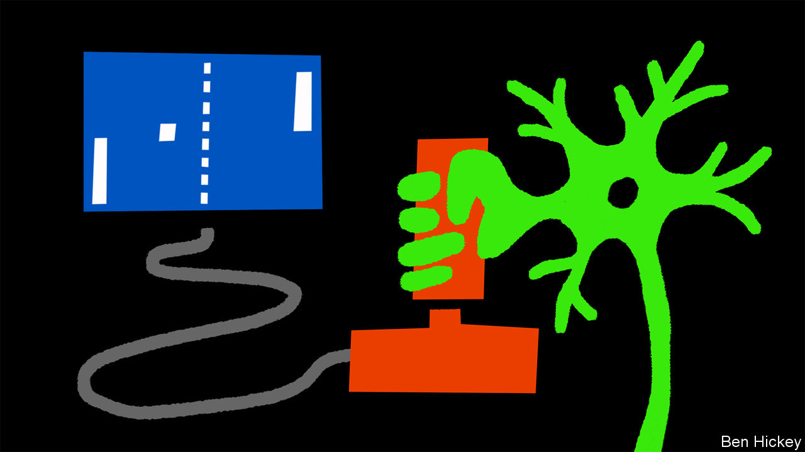

###### Biological neural networks

# Nerve cells in a dish can learn to play Pong 

##### That may help design better information-processing techniques 

 

> Oct 12th 2022 

Something new is on the menu of neuroscience. It is called “DishBrain”. This is not a recently discovered regional delicacy, but rather a network of nerve cells, grown on a computer chip, which is capable of interacting with the outside world via that chip. As a proof of principle, Brett Kagan, chief scientific officer of Cortical Labs, a small firm in Melbourne, Australia, and his collaborators, have taught the cells to play Pong, an early video game that resembles an electronic form of table tennis. 

DishBrain is smaller than a human being’s little-finger nail and contains fewer nerve cells than a bee. Those cells are grown from pluripotent stem cells, which are, in turn, derived from ordinary body cells, and can differentiate into more or less any sort of tissue. Dr Kagan experimented with cells from both mice and humans. 

Growing the network on the chip was only part of the story, though. Getting it to perceive and interact with the world was, as he describes in a paper in , quite another. The chip had predefined “sensory” (input) and “motor” (output) regions. In the sensory region, eight electrodes gave the cells tiny zaps that communicated the positions of the paddle (there was only one; the network was playing against a “wall”) and the ball with respect to one another. The neurons’ firings in the motor region determined the movement of the paddle.

By randomly zapping the sensory neurons for four seconds every time the network missed the ball, the software running the chip wiped out the pattern that led to the loss. Conversely, winning plays, which did not lead to random zapping, were retained.

The result was that the nerve cells first learned the rules of Pong, and then learned to play it better. For both species’ cells the average rally time increased noticeably over the course of 20 minutes—though gratifyingly for humanity’s , the human cells slightly, but consistently, outperformed those from mice.

Natural neural networks (the brains of human beings) and artificial ones (software models of how people once thought networks of nerve cells behave) have long been able to play Pong. Yet both have limitations. It is technically difficult, and often ethically impossible, to study in detail how brains work (though this is ). And, neuroscience having moved on, it is now known that artificial neural networks are fundamentally different from their biological counterparts. Dr Kagan hopes, therefore, that the benefits of DishBrain will go beyond Pong, by giving researchers a better understanding of how nerve cells learn—and therefore opening a new avenue for biologically inspired information processing.


