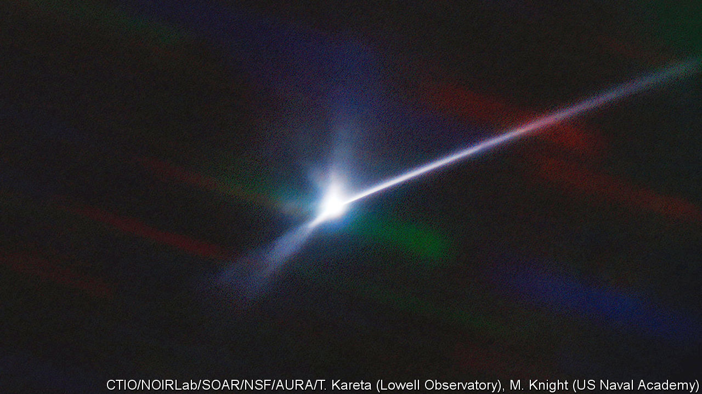

###### The Double Asteroid Redirection Test

# The DART planetary defence test worked 25 times better than hoped 

##### A step has been taken towards protecting Earth from space rocks 

 

> Oct 12th 2022 

It worked! The Double Asteroid Redirection Test (DART) exceeded its minimum specification twentyfivefold. This picture, taken by the Southern Astrophysical Research telescope, in Chile, shows the plume of debris ejected when that probe, which weighed 600kg, hit Dimorphos, the asteroidal moonlet of a somewhat larger asteroid, Didymos, on September 26th. The hope was to change the time it took for Dimorphos to orbit, to demonstrate how something similar might be done to the trajectory of a space rock threatening Earth. The mission would have been deemed successful if the moonlet’s orbit had changed by as little as 73 seconds. In fact, observations by telescopes on Earth, announced on October 11th, show that it changed by just over half an hour, from 11 hours 55 minutes to 11 hours 23 minutes, probably assisted by Dimorphos’s recoil from the plume’s release. The idea that an actual threat from space might thus be pushed away, is vindicated.


