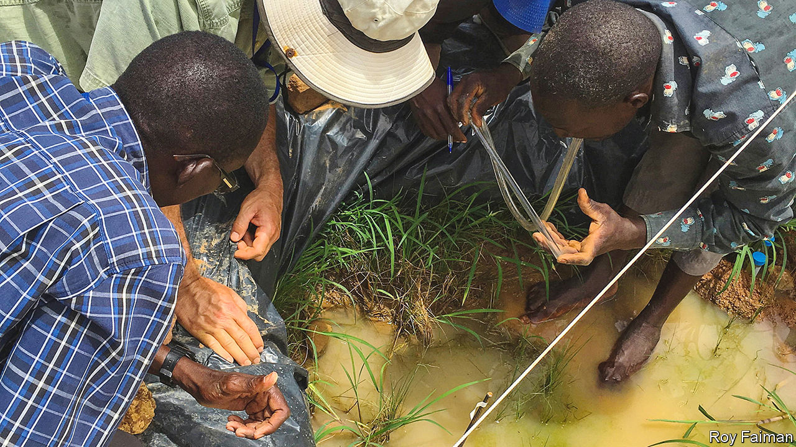

###### Malaria

# The dry-season malaria paradox, a bar to eradication, is solved 

##### The mosquitoes hide, and enter a state of torpor 

 

> Oct 12th 2022 

The mosquitoes that transmit malaria in Africa have short and merry lives. Six or seven weeks is as much as their adults can manage. To maintain their populations they must lay eggs in water, in which their larvae then grow and pupate. 

This means such mozzies fly all year round in wet places, but in those that experience pronounced dry seasons, they vanish. In theory, malarial mosquitoes should die out entirely during dry spells that go on for months, for their eggs are insufficiently drought-resistant to last that long. Nevertheless, days after rains return, so too do the mosquitoes. 

This state of affairs, known as the “dry-season malaria paradox”, has confused mosquito researchers for decades. Some entomologists propose that these early insects are long-distance migrants from places where standing water remains for them to breed in. But a report in  by Roy Faiman of the National Institutes of Health, in Maryland, and Alpha Yaro at the Malaria Research and Training Centre, in Mali, suggests they are actually locals that have endured the dry season by aestivating—the hot-weather equivalent of hibernating.

As with hibernation, aestivation means an animal enters a state of torpor, devoting its energies merely to surviving tough conditions rather than being up, about, and, well, animated. Entomologists sceptical of the migration theory have speculated that mosquitoes use this trick to survive in places with prolonged dry seasons—for example the Sahel, a band of semi-desert that stretches across Africa just south of the Sahara, traversing Mali as it does so. But evidence has been elusive. This is not because of a lack of interest in tracking mosquitoes through the seasons. Quite the contrary. Their role as carriers of one of the world’s most deadly diseases means there is a lot of curiosity about the matter. What has been lacking is a suitable tool to investigate.

Mosquitoes are tiny. Following them any distance by eye is impossible, and, unlike larger animals, they cannot be fitted with radio collars or similar tracking devices. Instead, Dr Faiman and Dr Yaro borrowed an idea from ornithology. If you want to be able to find out in the future whether you have seen a particular bird before, one way is to mark it with a ring. You cannot literally ring a mosquito, of course, any more than you can collar it. But the two researchers came up with an alternative marker: deuterium.

Deuterium is a heavy but non-radioactive isotope of hydrogen. (It has a neutron in its nucleus as well as the hydrogen-defining singleton proton.) Like ordinary hydrogen, deuterium can react with oxygen to yield water, known in this case as “heavy” water. Natural water does contain a small proportion of the heavy variety, but water enriched with the stuff is distinctive and detectable.

During the final weeks of the wet season (which lasts from May to October), Dr Faiman and Dr Yaro therefore poured heavy water at intervals into 27 mosquito breeding sites in two Malian villages. They made sure, in particular, that they topped up each site every time it rained, to stop the heavy water getting too diluted. They also checked that mosquitoes from these sites were, indeed, deuterium rich, and that those from comparable control sites were not. Sampled at random in the villages, a third of the insects were, by the end of the procedure, deuterium-positive.

Then they waited.

At the end of the wet season, the breeding sites duly dried up. 

They waited some more.

In May, the rains returned, and so did the mosquitoes. And, lo, a fifth of them were full of deuterium. They had, in other words, been aestivating.

The next step is therefore to find out just where the insects were holing up while the rains were gone. If these shelters can be identified, they can be attacked. Alternatively, special efforts might be made to ambush the aestivators as they wake up, by extensive insecticide-spraying campaigns at the beginning of the rainy season. Either or both of these could put a significant dent in local mosquito populations—which would, in turn, make malaria less of a problem. ■

