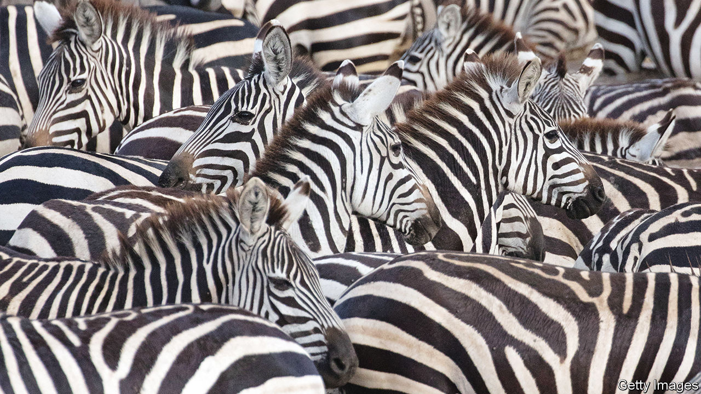

###### Human diet

# The “palaeo” diet bears little resemblance to the real thing 

##### But refined food is bad for your waistline 

 

> Oct 12th 2022 

Herman Pontzer is eating a muffin. Over Zoom it looks delicious. A warm, brown, undulous exterior gives way to fluffy but squidgy, pale innards. It is a perfect example of all that modern capitalism has to offer in ways of processing food to sate primeval appetites. 

Dr Pontzer is a professor of evolutionary anthropology and global health. He is an expert on what human beings consumed tens of thousands of years ago when they were hunter-gatherers. He knows they would never have eaten such things. But he knows, too, that there are many myths about what people did eat before agriculture was invented. And at a meeting at the Royal Society in London later this month he will explain that their diet was far more diverse than advocates of “palaeo” eating imagine. 

For a long time, it was thought that humanity’s stone-age ancestors majored on meat and eschewed carbs. Yet modern hunter-gatherers have an exceptionally diverse diet, often containing a lot of plants. Dr Pontzer has worked closely with the Hadza, a group of them in Tanzania. He has access to four decades-worth of detailed dietary data about them. The amount of meat they eat depends on what sort of year it is (and varies from month to month over the course of a year). But overall, the ratio of animals to plants is about 50:50. 

Another bias in assessing true palaeo diets is the archaeological record. Stone tools and bones that indicate carnivory persist. Evidence of plant eating is more fragile. But, says Dr Pontzer, you can find it. For example, in the “nooks and crannies” of teeth at fossil sites it is possible to discover starchy grains, along with plaque. This suggests early humans ate plenty of starch-rich plants. 

The best piece of evidence about the ancestral human diet, however, is the human body. Human teeth, for example, look neither like carnivores’ teeth nor herbivores’ teeth, but, instead, like omnivores’ teeth. Not only that, says Dr Pontzer, but their highly acidic (and so pathogen-destroying) stomachs resemble those of scavengers such as hyenas and buzzards. 

If that is so, perhaps there is no optimal human diet, and all the official guidance about what proportions of meat, vegetables, grains and dairy constitute one matters less than people think. Dr Pontzer certainly believes so. But this does not quite answer the question of why hunter-gatherers are generally thin while a growing fraction of other people are fat? 

A crucial insight came in 2019, when Kevin Hall and his team at the National Institutes of Health, in America, showed in a four-week trial that people on a diet of processed food (of which muffins are an example) eat 500 calories more per day than those on an unprocessed diet. If evolutionarily novel, highly processed foods are what ails modern humans then what do hunter-gatherers’ diets have to say about what a real palaeo diet should include? 

Here the news is less good. It is not . One Hadza staple is a tuber called the ekwa, a sort of “woody carrot”. To make this edible, you have to peel off the rind, roast the rest, and then chew it to extract its nutritional value, before spitting out the fibrous residue. 

Dr Pontzer, who has spent time living and eating with the Hadza, describes the ekwa as “really bland”. He has also eaten boiled warthog, which he says is “OK” but is also tasteless. Berries are entirely unlike the plump, watery, sugary things found in supermarkets. Rather, they are dry, with many seeds inside. Most alarming, though, was week-old zebra. 

When the Hadza kill a zebra there is too much to eat in one sitting. Once delicacies like testicles and other organs have been consumed, the rest is sliced and hung in the open. It is cooked by being thrown into a fire, but certainly not cooked through. “It tastes likes ashes and it is bubblegum pink on the inside,” Dr Pontzer says. 

The only foods he would actually recommend are the local honey and the fruit of the baobab tree. Baobab fruit has a crusty dry interior that is a bit like expanded polystyrene, but tangy. Not quite a chocolate-chip muffin, though. ■


