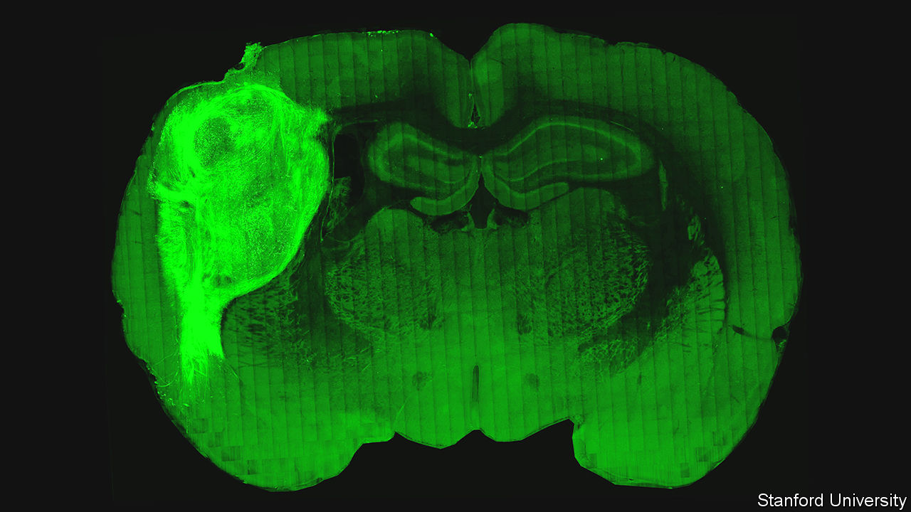

###### Cortical organoids

# What happens when human brain tissue is implanted into rats 

##### It can feel things, direct the animal’s behaviour, and also shed light on disease 

 

> Oct 12th 2022 

Simplify, simplify. Henry David Thoreau’s maxim is one which scientists generally take to heart when investigating complex natural phenomena. And there is no known natural phenomenon more complex than the human brain. Since 2011, therefore, Sergiu Pasca of Stanford University, who studies it, has been doing just that. His simplified models are structures called cortical organoids. They are spheres a few millimetres across, composed of specially grown human nerve cells, which act as simulacra of brain tissue. 

Now, however, he is ready for a bit more complexity. As he and his colleagues report this week in , they are wiring their organoids into rats’ brains (see picture above). And not only that. They have also found that their implanted organoids can perceive the outside world in a limited way, by tapping into a rat’s senses, and can affect that world by controlling the animal’s behaviour. On a more practical note, when grown from cells taken from patients with a particular genetic illness, implanted cortical organoids can yield information on the cellular abnormalities underlying that illness in a way which conventional approaches have not been able to.

Playing the organoid

Organoids (which can be grown to mimic many organs besides the brain) are derived from what are known as induced pluripotent stem cells. These are created by applying four particular gene-regulating transcription-factor proteins to ordinary body cells, generally taken from the dermis of the skin. Further factors then encourage pluripotent cell lines to specialise and generate particular tissue types—such as cerebral-cortex cells—which, if handled correctly, can be grown into organoids.

The rats involved were between three and seven days old when implanted. The site of the implant was a part of the brain called the somatosensory cortex, which monitors the sense of touch. To make sure the implants were not rejected as the foreign tissue they were, the rats had had their immune systems partially disabled.

A young rat’s brain is still a work in progress, with new connections between its nerve cells forming all the time. Dr Pasca and his colleagues therefore hoped that the cells in their implants would join the party, by connecting with their murine neighbours. Monitoring suggested that they did. Magnetic-resonance imaging of the rats showed that 70% of the implants had lodged successfully in the animals’ somatosensory cortices and were growing and thriving. Once an animal was mature, such an implant occupied about a third of the brain-hemisphere it was lodged in.

On top of this, experiments with defanged rabies viruses, which can cross the synaptic junctions between nerve cells, showed that human and rat cells had, indeed, connected up. And the insertion into the grafts of tiny electrodes, capable of recording signals from a single nerve cell, demonstrated that the cells themselves were working normally. 

Having established all this, the next step was to find out whether the connections between human and rat cells were live. One reason why Dr Pasca picked the somatosensory cortex as the site of the implant was to be able to do just this, for it offered the possibility of activating the transplanted cells by stimulating an animal’s sense of touch—specifically, by blowing air on its whiskers.

To find out how his implanted cells would respond to this, Dr Pasca smuggled into some of the implants the gene for a protein that flashed when they were active. This flagged up human-derived, as opposed to rat-derived cells, so that these could be monitored by electrode. And, on a gratifying number of occasions, the cells under study did indeed respond electrically when the whiskers were displaced. 

Emboldened by this result, Dr Pasca then asked whether the implanted human cells could direct a rat’s behaviour. To do this, he appealed to optogenetics, a method which permits a cell’s activity to be manipulated by light.

Dr Pasca’s particular technique, invented in 2005 by Karl Deisseroth, one of his colleagues at Stanford and a co-author of the paper, also uses a smuggled-in protein. In this case, though, it is light-sensitive rather than light-generating. 

Channels of communication

Channelrhodopsin-2 comes originally from an alga called . It floats in a cell’s membrane and, when illuminated by a particular frequency of blue light, changes shape in a way that permits the passage through that membrane of positively charged ions—including sodium and potassium, the two ions that are the basis of the action potentials by means of which nerve cells talk to each other.

Dr Pasca combined his manipulation of the implants’ cells with an experimental technique called operant conditioning. This rewards a particular action performed in response to a particular stimulus, and thus trains an animal to react to that stimulus with that action. In the case of the implanted rats, the reward was a drink of water if they responded to blue light shone at the implant through a skull-penetrating optical fibre by licking the spout that delivered the reward. (As a control, the experimenters used red light of a frequency undetectable by channelrhodopsin-2.) 

Those rats hosting channelrhodopsin-2-bearing organoids learned to respond appropriately to blue light within 15 days. Controls hosting unmodified organoids did not. Since the light signals controlling this behaviour were received by the transplanted organoids, those organoids were, in effect, directing and controlling the rats’ behaviour.

All of which is of great scientific interest. But the underlying purpose of this sort of work is medical—and Dr Pasca did not neglect that side of things, either.

Timothy syndrome is a rare and dangerous condition which causes a form of autism. It also results in seizures, anatomical abnormalities such as fused fingers and toes, and life-threatening cardiac arrhythmia. It is the consequence of a mutation in a calcium-ion-channel gene. 

Ion-specific channels, of which calcium channels are a subclass, belong to a different group of transmembrane proteins from the channelrhodopsins, but the fundamentals are the same. Both types move ions around in ways that affect a cell’s signalling. In the case of Timothy syndrome, the channels’ signals affect a range of developmental pathways. Dr Pasca and his team therefore grew and implanted into rats, cortical organoids derived from the skin cells of three people with Timothy syndrome, and followed the progress of the nerve cells involved.

Nerve cells grown as cultures in a laboratory remain far smaller and less developed than they would be in a real brain. In particular, cells cultured in this way from people with Timothy syndrome are physically indistinguishable from those cultured from healthy individuals. That is not true of the implanted cells. They were six times as large as their cultured kin—more or less the size they would be in nature. And those derived from people with Timothy syndrome were clearly distinctive. 

In particular, the mutation had caused them to develop twice as many dendrites (the thin fibres of cytoplasm through which, via synaptic connections with other cells, a nerve cell receives incoming signals) as were seen in implants grown from people without the condition, and the dendrites in question had a higher density of the spines at which synapses form. They were, however, on average, shorter than the control cells’ dendrites’ length. 

Those differences, which suggest the cells involved are receiving too much information from too many other cells, would have a huge effect on their behaviour. That miscommunication is presumably the underlying explanation for Timothy syndrome’s symptoms. Any part of the body where this mutated calcium channel is active is likely to go wrong.

The book of Timothy

Whether this result points the way to anything clinically useful remains to be seen. But it does offer hope that using organoids in this way could illuminate the mechanisms of this and other neurological diseases, to the eventual benefit of patients. Dr Pasca and his colleagues are now doing similar work on organoids derived from the cells of people with several such illnesses, and in a couple of cases are using them to test possible drugs. They are also implanting “assembloids”—neurological constructs composed of more than one organoid, each of which brings a different set of tissues to the party.

As to the ethics of all this, Dr Pasca and his team are acutely aware of the questions raised by their work. Besides having had it approved by Stanford’s usual procedures, they have also specifically involved several bioethicists, including Hank Greely, a doyen of the field. Dr Pasca points out that the implants are tiny (adding 2m-3m nerve cells to the 31m native to the rat itself). A human brain is reckoned to have about 86bn of them. And a rat’s short life does not give the full developmental pathway of a human nerve cell time to play out. The chances that any ethically worrying manifestations of humanity could emerge, given these constraints, seem negligible. Implants into larger, longer-lived animals, such as monkeys, might be a different matter. But that is a path down which he has no plans to tread. ■


