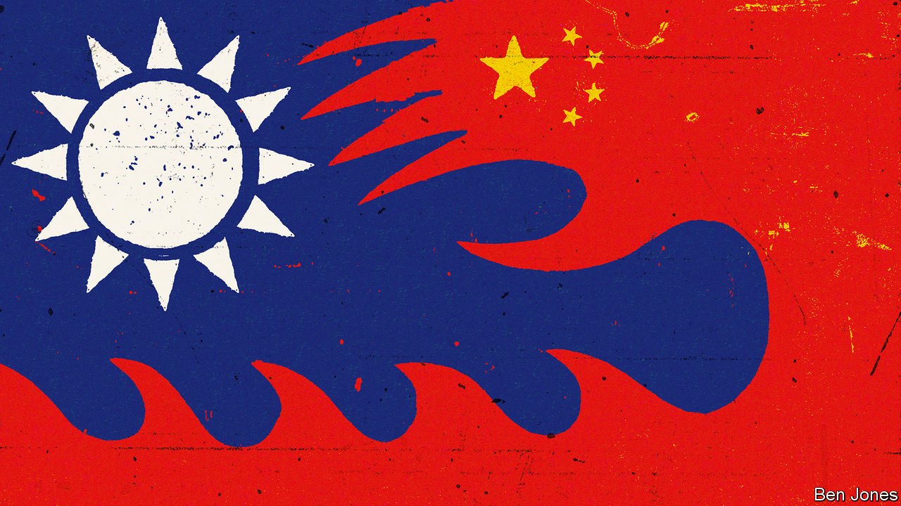
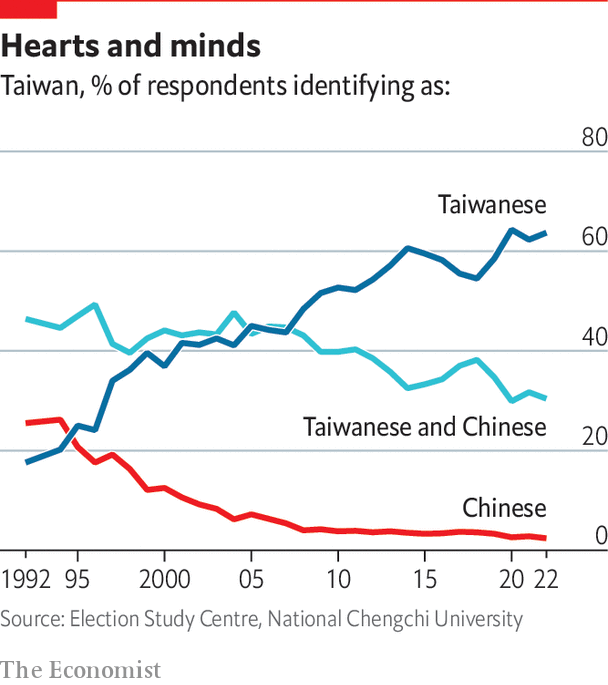

###### An island complication

# China has chilling plans for governing Taiwan 

##### There may be few painless options left 

 

> Oct 10th 2022 

WHEN EXPLAINING why they must control the island of Taiwan, China’s communist rulers tell a story of past shame and future vindication. “The Taiwan question arose as a result of weakness and chaos in our nation, and it will be resolved as national rejuvenation becomes a reality,” declares a State Council white paper on Taiwan policy that was issued in August.

As party bosses tell it, recovering Taiwan will erase 19th-century humiliations, when a decaying Chinese empire lost tracts of territory to foreign powers. It will heal scars left by Japan’s occupation of the island from 1895 to 1945. Above all, it will mark a final victory in the civil war left unfinished since 1949, when Chiang Kai-shek, leader of the defeated, American-backed Nationalist regime, led millions of troops and refugees into exile on Taiwan. Though this is not said aloud, if Xi Jinping as boss of the People’s Republic ever leads a victory parade through Taiwan’s capital, Taipei, it will mark his ascension into China’s pantheon of immortal rulers, alongside Mao Zedong and the great unifying emperors.

For all that focus on China’s resurgence, the conquest of Taiwan would be a civil conflict with world-altering consequences. That is because Chinese victory would involve defeat for America, Taiwan’s superpower protector. For seven decades America has deterred an invasion of Taiwan by the mainland, even though since 1979 no formal defence treaty has obliged it to come to the island’s aid. Instead, American presidents have offered ambiguous commitments to Taiwan, to keep all sides from provocations (though President Biden has said American troops would intervene after an “unprecedented attack”, which is not very ambiguous).

 


The humbling of America would reshape the security order that has kept peace in the Asia-Pacific for the past half-century. In a worst case, Taiwan’s fall would follow armed conflict between China and America, potentially dragging in neighbours like Japan, as Chinese missiles pounded American air bases on Japanese soil. In China’s preferred scenarios Taiwanese elites would cut a deal or have given in before America even had time to send in the Seventh Fleet. Either way, China’s aim is to push American armed forces out of the “first island chain”, as naval planners call the China-encircling arc that runs through Japan, Taiwan and the Philippines.

America’s humiliations would not end with the island’s submission. In recent times China’s plans for securing Taiwan have become grimmer and more explicit. Chinese leaders have drawn a bleak lesson from anti-government protests in Hong Kong in 2019, namely that to secure a territory exposed to years of Western freedoms, half-measures will not do. They stand ready to crush Taiwan’s thriving, raucous multiparty democracy and “re-educate” the island’s 23m people. In such a scenario, if Western leaders merely wring their hands, senior Asia-Pacific diplomats are clear about what would follow: countries across the region would start to accommodate China in once-unthinkable ways.

China has another goal: to ensure that America is blamed for the turmoil of a Taiwan crisis. The 170km-wide Taiwan Strait is the main route for container ships from China, Japan, South Korea and Taiwan to the world. A single Taiwanese company, TSMC, makes over 80% of the world’s most advanced semiconductors. China has been polishing anti-American talking points. A Western diplomat reports that around Asia, Chinese envoys call America a provocateur that once accepted Taiwan’s status as a part of China, but now encourages its separatist fantasies. China is succeeding, the diplomat says. In a crisis, many Asian neighbours would blame America and its ally Japan for stirring tensions.

A second diplomat adds that China does not need to win every argument: sowing confusion will do. He suggests that China’s influence networks, and its willingness to use economic coercion, have divided Asia’s political, business and media elites. As a result, many governments would struggle to craft coherent responses to a Chinese attack on Taiwan.

In foreign capitals, discussions of China’s ambitions for Taiwan often turn on the military balance of power—assuming, in effect, that once the People’s Liberation Army (PLA) thinks it can prevail, China will strike. A senior Western official calls tensions over Taiwan “more and more dangerous” as every new warship rolls out of Chinese dockyards, suggesting: “It is almost a question of physics: when enough force builds up, it explodes.” In Washington, there is talk of intelligence that the PLA has been told to be in a position to take Taiwan by 2027 (when Mr Xi will probably be ending a third five-year term as party chief).

Chinese debates about the urgency of resolving the Taiwan question typically examine all options facing their leaders, whether political, economic or military. Full-scale war is called a bad outcome. An anti-secession law passed in 2005 states that China’s rulers must not let Taiwan drift away until it becomes irrecoverable. Hawks call for early military action. But as long as other scenarios look possible, some mainland experts argue that time is on China’s side.

The bad news is that Chinese scholars sound increasingly convinced that island politics are reducing the mainland’s options. A generation ago, Chinese leaders worked to bind Taiwanese business elites with commercial ties. They dangled offers of trade and tourism as they urged islanders to shun pro-independence parties. In this endeavour China’s natural partner was the nationalist Kuomintang (KMT) party, once led by Chiang Kai-shek. Though old foes, the KMT and Communist Party agreed, at least in theory, that Taiwan is part of China—though even the KMT stopped short of welcoming mainland promises of autonomy, under a “one country, two systems” model.


In contrast, China refuses to talk to the pro-independence Democratic Progressive Party now in power, treating its leader, President Tsai Ing-wen, as a dangerous radical, though in truth she is a moderate and pragmatic former trade lawyer. Alas for China, even the KMT now sounds more sceptical of mainland promises. The KMT has little choice. Taiwanese voters watched as China trampled Hong Kong’s version of one country, two systems after months of anti-government protests in 2019. They saw China impose a new national security law on the territory and stage local elections open only to vetted patriots, before jailing opposition politicians, journalists and professors. Hong Kong’s woes left a mark. In polls by the National Chengchi University, only 6.4% of Taiwanese say they want to move towards rule by Beijing, either now or in the future. That is down from 18.2% two decades ago.

In 1993 and 2000, State Council white papers included pledges that PLA troops and mainland administrators would not be stationed on a Chinese-run Taiwan. Those guarantees are missing from the latest white paper. Instead, it suggests that those Taiwanese “who support the reunification of the country and the rejuvenation of the nation” may help run the island. The echoes of “patriots governing Hong Kong” are loud.

Hard line gets harder

China’s formal stance on Taiwan may be hardened at the 20th Party Congress. China’s ambassador to France, Lu Shaye, declared in August that Taiwan’s population had been indoctrinated, intoxicated and “de sinicised” by pro-independence politicians on the island, and needed “re-education”. Adding his own note of chauvinism, China’s foreign minister, Wang Yi, said that Ms Tsai was an “unworthy descendant” who had betrayed her ancestors.

There is no reason to think that Chinese officials are bluffing about crushing Taiwan’s freedoms. True, many Western governments would impose sanctions. But Chinese scholars are bullish that their country is too big to punish for long. Well-connected analysts tell diplomats in Beijing that Russia has yet to be broken by sanctions imposed after the invasion of Ukraine. They murmur: you have already lost Russia, can you afford to lose China, too?

Some fatalistic Western officials agree, noting that China has not paid a lasting price for repression in Hong Kong. A few wonder, privately, whether Taiwan should be pressed to take the best deal it can get, to avoid war and accommodate China’s rise with the minimum of disruption. Such foreign-policy realists are surely underestimating how brutal a Chinese takeover would be, and the collapse in Western credibility that would follow.

Hong Kong was only ever a partial democracy, even as British rule ended in 1997, and never independent. In contrast Taiwan’s people have freely chosen their president and parliament for a generation: a rebuke to those who call democracy unsuited to polities with Chinese roots. When asked about their identity, 63.7% of islanders call themselves Taiwanese, up from 17.6% in 1992.

China’s people are not being prepared for international opprobrium, should the world see Taiwanese politicians jailed and fleeing into exile, or watch student protesters being tear gassed, or worse. Instead, they are told that controlling the island will give China “greater international influence and appeal”. In a speech celebrating China’s tighter grip on Hong Kong, Mr Xi talked of “the universal rule that a government must be in the hands of patriots”.

Such boasts reflect a dangerous contempt for Taiwanese freedoms. Chinese officials call foreign praise for the island’s democracy a mere “smokescreen”. In reality, democratisation has transformed the Taiwan question. China is correct that Americans once sounded happy to sell out Taiwan. Years after President Richard Nixon shook the world by visiting Maoist China in 1972, declassified transcripts showed the American leader and his then national security adviser, Henry Kissinger, privately hinting to their Chinese hosts that Taiwan’s fate was for China to decide, though public communiqués were more ambiguous.

In the 1970s, as America moved to recognise the People’s Republic and abandon the fiction that Chiang Kai-shek’s regime was the rightful government of all China, the main political constraint in Washington was the wrath of anticommunists in Congress. But Chiang, a stubborn old despot, weakened his case with calls for America to invade or bomb China, and by using martial law to crush dissent. A White House tape from 1971 records Mr Kissinger pondering the abandonment of Chiang, telling Nixon: “We have to be cold about it.”

Were Taiwan still a military dictatorship full of political prisoners, it would be a niche cause in Washington, for all today’s hawkishness on China. As it is, bipartisan support for Taiwan is at its strongest in years. Chinese officials cast the recent visit to Taiwan by the Speaker of the House of Representatives, Nancy Pelosi, as part of a plot to contain China, and the PLA staged war games that resembled a rehearsal for a blockade of the island. In fact, Taiwan represents something simpler and more potent in today’s Washington: a faraway beacon of liberty, besieged by a bully.

War over Taiwan would be a catastrophe. But China’s obsession with control is eliminating many painless routes to peace. For over 70 years Taiwan’s fate has been integral to the Asian security order. The liberal political order is at stake, too. ■

