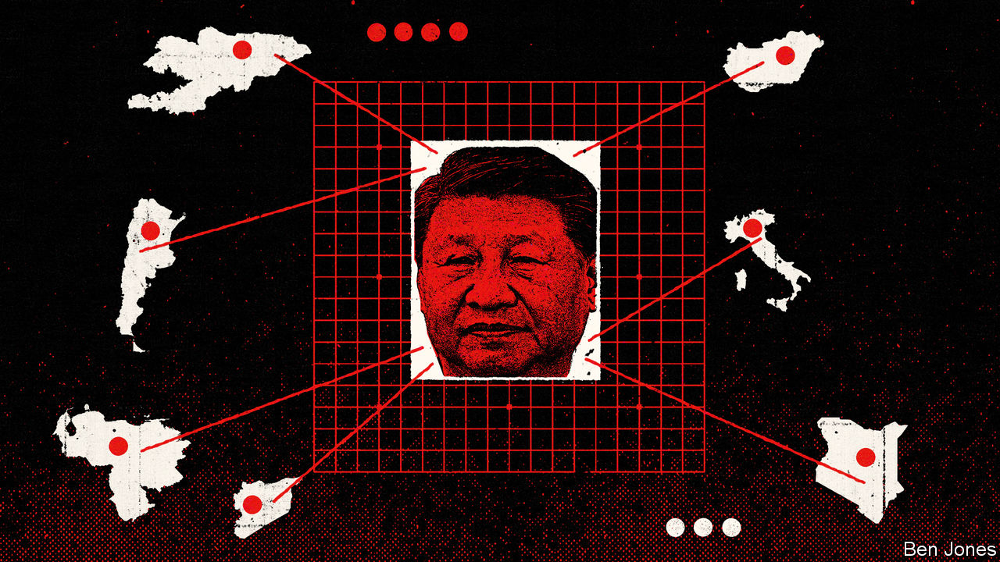
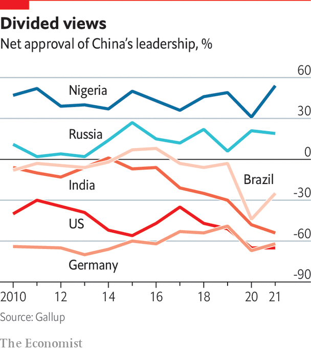

###### A stronger actor

# China is exerting greater power across Asia—and beyond 

##### It has become a master of political and economic leverage 

 

> Oct 10th 2022 

“I HAVE NEVER heard the Chinese say that they want to overthrow the international order,” observes a senior Western official who has spent hours with the country’s leaders. “On the other hand, they are putting their pieces all over the board.” The question of the age, he ventures, is whether China will play by rules that other powers can accept.

Chinese leaders have made welcome commitments to tackle global challenges, from climate change to biodiversity, the official says. Often, though, they offer a minimum of concrete assistance, and always on their own terms. It is impressive to watch how China applies many levers of statecraft and economic power as it patiently piles up economic and political capital, he concludes. To what precise end is unknown.

The Biden administration says China wants a sphere of influence in Asia, at least, and perhaps to become the world’s leading power. A sobering book widely read in policy circles, “The Long Game—China’s Grand Strategy to Displace American Order”, was written by Rush Doshi before his appointment as China director at the National Security Council. It draws on Communist Party texts and speeches to argue that America has been seen as China’s “main adversary” since three events: anti-government protests in Tiananmen Square in June 1989, America’s crushing victory in the Gulf war in early 1991 and the Soviet collapse at the end of that year. Mr Doshi describes China working for decades to blunt American power, even as it sought Western capital and know-how. As China’s strength grew, it extended its writ in its neighbourhood, then as far afield as Latin America and the Arctic. More recently, the book suggests, Donald Trump’s election and the West’s initially bungling response to covid-19 left Chinese leaders convinced that “great changes unseen in a century” were at hand, creating chances to reshape the world.

Some hear echoes of history. A European diplomat asserts that Mr Xi is guided by a : an ancient world view with China at the centre, and the influence of Chinese civilisation radiating out to all compass points. In this telling, Mr Xi’s “great rejuvenation” of China reflects the tributary system that saw Asian kingdoms and tribal states pay obeisance to Chinese emperors in return for trading rights and other benefits.

Wu Xinbo, dean of the Institute of International Studies and head of American studies at Fudan University, cautions against overly literal lessons from history. “The tributary system was a Sino centric, hierarchical structure. In today’s world it would be very difficult to revive,” he says. Rather, he sees China as guided by another ancient principle, , or a quest for harmonious relations with countries that do not share the same culture. China wants to offer countries mutually beneficial trade, investments and exchanges. In return they must not challenge China’s core interests, such as its stance on Taiwan or its one-party political system. That differs from America’s missionary zeal to convert others to its own values, suggests Mr Wu.

China is not a fomenter of revolutions: gone are the days of sponsoring Maoist insurgencies. Foreign governments need not distribute volumes of Xi Jinping Thought to secure loans from Beijing. It is true that since 2007 China has lent $62bn to Venezuela, home to the loudest anti-American regime in Latin America, much of which it may never see back. Chinese surveillance technology has helped autocrats from Ecuador to Ethiopia to track and harass political opponents. But China is capable of keeping business and ideology apart. Chinese investment flows into Argentina, including a satellite-tracking base in Patagonia controlled by the People’s Liberation Army (PLA), did not slow after 2015 when the left-wing Kirchner political dynasty was defeated by Mauricio Macri, a pro-business conservative.

 


Still, it does not take a revolutionary power to disrupt the existing order. The party talks of a global struggle for “discourse power”. That makes foreign admirers useful. The Communist Party’s International Department has maintained links with foreign political parties since the 1950s, inviting young high-flyers to China for study tours, to build influence and spot future leaders. In the 1990s and 2000s the department talked of learning from other countries. In the Xi era its tone is more boosterish, with teams promoting the legitimacy of China’s political model. In June a first cohort of 120 young cadres from six ruling parties in southern Africa attended a “leadership school” in Tanzania, opened with $40m in Chinese funding.

China’s overseas propaganda has expanded. Across the world, local reporters have been hired by such outlets as China Global Television News, or offered Chinese training. Chinese media distribute content free via partnership deals from Tanzania to Italy to the Philippines. In the Central Asian republic of Kyrgyzstan, the Chinese embassy oversees and funds effusive local media coverage of life across the border in Xinjiang, according to a report by the OSCE Academy in Bishkek.


Ignoring the independence of parliaments and media outlets in the free world, Chinese diplomats tirelessly lodge protests with foreign governments about parliamentary resolutions or newspaper editorials that challenge the Communist Party’s line on Xinjiang, Hong Kong or Taiwan. China’s embassies are accused of working with Chinese student groups at foreign universities to police what academics say in their own classrooms. Unfairly, this casts a pall of suspicion on all Chinese students. But each complaint raises the costs of criticising China. That is the whole point.

A common Western complaint is of “debt-trap diplomacy”, the allegation that China lures poor countries into taking on unpayable debts. The evidence for deliberate entrapment is scant, though a loss-making Sri Lankan port, Hambantota, has passed into Chinese hands. Although China is self-interested to the point of ruthlessness, “they like to get paid back,” says an international official. China prefers to extend the terms of loans rather than write them off, often securing promises to give Chinese lenders a priority claim to revenues (as well as clauses to keep loan terms secret). The international official sees a link with Mr Xi’s hostility at home to “welfarism”, meaning income-support policies that could undermine people’s work ethic. Chinese delegates talk about debt “like 1950s neoclassical economists in Germany”, the official reports, worrying about moral hazard if countries have loans written off too easily.

Bilateral deals, global consequences

Hubris explains wild Chinese lending to high-risk places in the past, says another international official. China thought it understood risk better than others, he says: “They’re losing their shirt in the process.” As China recalibrates, some see a chance that it will find self-interest in following international rules more often, because those offer more legitimacy and political cover than murky deals with local elites. China has begun working with the IMF, the G20 and the Paris Club of creditors to help some low-income countries restructure crippling debts, among them Zambia. It has also recently struck a restructuring deal with Ecuador.

China’s bilateral influence-building is disruptive to the world order in two main ways. First, China has a genius for spotting countries unhappy with the international status quo, and looking for an alternative. Such balancing does not always undermine norms: when Central Asian countries consider a Chinese-built cargo railway to offset dependence on Russia, they are swapping one autocracy for another. But in other cases, Chinese support is a lifeline for leaders accused of defying the rule of law or worse, from Viktor Orban in Hungary to Bashar al-Assad in Syria.

When Western powers neglect countries that boast a strategic location, China takes note. In April senior American officials paid a rare visit to the Solomon Islands, 2,000km from Australia in the South Pacific, following leaks of a draft security pact with China allowing the government to ask for Chinese troops and police to help maintain order. The Americans were too late: the prime minister, Manasseh Sogavare, signed the Chinese pact before they arrived. In August the islands announced a $66m Chinese loan to pay for Huawei, the Chinese telecoms giant, to build mobile-phone towers. In September Mr Sogavare defied public appeals from Australia, previously its closest partner, and delayed elections for a year, saying they clashed with a sports tournament.

Both China and the Sogavare government deny that one outcome may be a PLA base on the islands. Zhou Bo of Tsinghua University’s Centre for International Security and Strategy suggests that if the Solomon Islands asked faraway China for help, Australia must have fallen short. “These small countries are not stupid. They just want to make a balance, too, because China’s strength is growing,” says Mr Zhou, a former PLA senior colonel.

Perhaps no leader has more need of a Chinese lifeline than Russia’s Vladimir Putin. A European diplomat reports that, after their initial surprise over Russia’s invasion of Ukraine, Chinese leaders “decided that the war is a fantastic opportunity”. If Russia achieves even some of its war aims, or merely survives crushing international sanctions, that is a defeat for the West, which suits China. Meanwhile, an isolated Russia is selling China cheap oil and gas, and taking payment for some of it in non-convertible Chinese yuan. A truly desperate Russia might stop selling advanced arms to India and Vietnam, both rivals of China’s, and forget its previous disquiet about China playing a larger role in the Arctic.

China’s approach to bilateral relations undercuts established norms in a second way. To the dismay of Western governments, China demands concessions as its price for co-operating on global issues from pandemics to disarmament, shrugging off appeals to its conscience as a great power. China suspended talks with America on climate change and people-smuggling after the Speaker of the House of Representatives, Nancy Pelosi, visited Taiwan.

Even when China’s self-interest is in play, its officials are reluctant to come to the negotiating table if they think the balance of power lies with America or another foreign rival. Zhao Tong, an expert on Chinese nuclear strategy and arms control at the Carnegie Endowment for International Peace, a global research institute, summarises China’s bleak understanding of international negotiations: “When you are the weaker party, you cannot get a fair deal.” He notes that China is resisting calls from America and allies to discuss rules of warfare for new weapons not covered by existing treaties, such as anti-satellite systems or autonomous lethal weapons. As it happens, China agrees that such arms, if misused, pose grave risks. But so long as America enjoys a lead in advanced weaponry, China fears rule-making as a plot to stop it catching up.

Leading Western countries let China rack up some wins by default. The pandemic provides many examples. Chinese leaders boast of “providing” almost 3.8bn doses of covid vaccines to the world. Most went to middle-income countries with diplomatic or commercial ties to China. Dozens of Chinese embassies lobbied recipient countries to hold airport arrival ceremonies for crates of Sinopharm and Sinovac jabs. Some were attended by heads of state, who thanked China as news cameras whirred. What Chinese leaders do not mention is that 96% of those doses were sold, and only 148m of them donated. In contrast, America has donated and shipped 623m covid vaccines to date—and its MRNA shots are more effective than China’s jabs.

Yet China can fairly claim to have delivered doses early on in the pandemic, when the rich world was still guilty of “the selfish mass hoarding of vaccines”, in the words of Wang Yi, the Chinese foreign minister. China denies having plans to overturn the world order. But every time an established power falters, it carefully places another piece on the board.■

