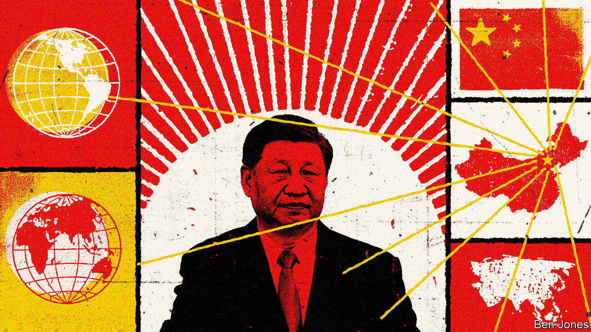

###### A new order

# China wants to change, or break, a world order set by others 

##### It may yet succeed, says David Rennie 

 

> Oct 10th 2022 

FOR MOST of human history, great powers and strong men have been free to inflict horrors on the weak with impunity. For almost eight decades, however, all but a few rogue states have aspired, or paid lip service, to a different world order.

This order was founded in revulsion at the industrialised, racially justified savagery of the second world war. Guided by the ambition “Never Again”, the winners, led by America, drafted conventions that defined unpardonable crimes against humanity, and sought to impose costs on those committing them. Recalling the economic disasters and human miseries that paved the way to world war, the framers of this order built the UN and other international institutions to promote co-operation and development.

Some arguments were left unresolved after 1945. For decades tensions between national sovereignty and the protection of individuals lurked in the founding documents of this new order, from the UN Charter to the Universal Declaration of Human Rights. For years, access was also unequal. Too many people languished, powerlessly, under totalitarian regimes or in colonial empires.

Yet this system was an advance on anything before. Although hobbled by politics, the UN and other international bodies follow agreed rules when they monitor ceasefires and register refugees, feed the hungry or fight pandemics. Largely in response to pressure from liberal democracies, more help from multilateral bodies—whether World Bank loans or missions by UN peacekeepers—now comes with conditions attached. Recipient governments are pushed into higher environmental standards or to protect the rights of vulnerable minorities.

This order has been tested since 1945. The most alarming challenges often involved large powers defying international law. Russia offered a shameless example in February, when it used its veto power as one of five permanent members of the UN Security Council to block condemnation of its invasion of Ukraine.

This special report will examine China’s challenge to the post-war order. It is more subtle than Russia’s brazen defiance, yet more disruptive. Under Xi Jinping, whose supreme leadership will be extended this month for a third term by the 20th Party Congress, China is working to reshape the world order from within. When its efforts meet resistance, it pushes for vaguer rules whose enforcement becomes a question of political bargaining. All too often, it seeks to revive old, discredited ways of running the world that put states first, at the expense of individual freedoms.

Some Chinese points sound reasonable. Mr Xi’s China opposes a “cold-war mentality” and those who divide the world into ideological blocs. It says developing countries have a right to focus on feeding, housing and giving jobs to people, rather than fussing about multi-party elections. Its officials liken Western powers to missionaries, bossily imposing their own values, a trait they call particularly alien to Asia, a continent that respects diversity.

Cleverly, Mr Xi casts his country as a defender of the status quo. He pledges support for “true multilateralism” guided by the UN Charter. In 2017 he assured tycoons in Davos that he was a champion of free trade. But observers should not be lulled. Chinese leaders want to preserve elements of the current order that helped their country rise, such as world trade rules that fostered their export champions and encouraged inflows of foreign capital and technology. Principles that do not suit China are undermined. Mr Xi’s calls for a “Global Security Initiative” or “A Community of Shared Future for Mankind” are coded complaints. Some are an attack on alliances, above all America’s defence pacts in Europe and Asia. A “shared future” is another way of saying “development first”, ie, rejecting any order guided by shared, universal values.

When China says it opposes interference in the internal affairs of countries, this is not rhetoric. In 2017 it joined Russia in wielding its UN veto to shield Syria from sanctions for using chemical weapons against its own people. China does not gain directly when Syrian children are gassed with chlorine. But it has an interest in blocking UN sanctions for any atrocities, in case similar tools are used against it. China also seeks to redefine terms so that they no longer mean much. In this way, Chinese officials claim that their country is a superior form of democracy, respects human rights and operates a market economy.

Under Vladimir Putin, Russia is often backed in UN votes by a mere handful of thuggish clients, such as Belarus or Venezuela. In contrast China hates to be isolated, deploying diplomats to lobby and twist arms to build support. Scores of countries now join resolutions praising Chinese rule in Xinjiang, a western region where, in the name of fighting Islamic extremism, China has demolished mosques, jailed poets and textbook editors and sent a million Uyghurs to re-education camps. Diplomatic success may make China seem less of a wrecker than Russia, but it is more divisive.

Defenders of Chinese ambition argue that communist leaders have a right to reshape global rules written decades ago, when they were not in the room. This is a straw-man argument. It is of course natural for a big country to want to see its views reflected in global governance. The point is that anyone who sees value in today’s world order has a right to fear what China has in mind.

Other analysts question how disruptive China will be. They talk of a slowing economy making it harder for China to recruit supporters, and note that China has never spelt out a complete, alternative order. That is complacent. China does not need to replace every current rule to change the world.

China calls the very notion of universal values a Western imposition. In 2021 Wang Yi, the foreign minister, criticised the Biden administration for saying that the international rules-based order was under attack. This was “power politics”, Mr Wang retorted: a bid to “replace commonly accepted international laws and norms with the house rules of a few countries”.

Nor does Mr Xi accept that the second world war created a mandate to draw up a liberal order. A China/EU summit in April was clarifying. The European Council president, Charles Michel, explained why Europe’s dark past, notably the Holocaust, obliged its leaders to call out rights abuses, from China to Ukraine. According to a readout shared with EU governments, Mr Xi retorted that the Chinese have even stronger memories of suffering at the hands of colonial powers. He cited treaties forcing China to open markets and cede territory in the 19th and early 20th centuries, and racist bylaws banning Chinese people and dogs from parks in European-run enclaves. Mr Xi recalled the massacre of civilians at Nanjing by Japanese invaders in 1937. Such aggression left the Chinese with strong feelings about human rights, he said, and about foreigners who employ double standards to criticise other countries.

Many developing countries see nothing magic about the year 1945, and have limited nostalgia for a time when the West dominated rulemaking. China is ready to offer them alternatives. Seven decades ago, at founding meetings of the UN, Soviet-bloc delegates sought an order that deferred to states and promoted collective rather than individual rights, opposing everything from free speech to the concept of seeking political asylum. In the late 1940s communist countries were outvoted. China now seeks to reopen those old arguments about how to balance sovereignty with individual freedoms. This time, the liberal order is on the defensive. ■

