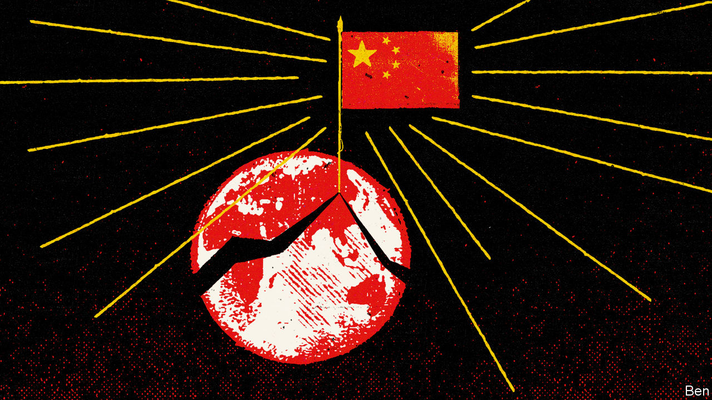

###### An uncertain future

# For Western democracies, the price of avoiding a clash with China is rising 

##### It is clear that hard choices loom 

 

> Oct 10th 2022 

TO CHINA’S RULERS, and many ordinary citizens, their country has never been so admirable. Hundreds of millions have escaped extreme poverty. Its trains run on time, and fast, along 40,000km of high-speed rail. Though costly, “zero covid” has, given the weakness of China’s health-care system, probably saved millions of lives. Provoking China—with its growing nuclear arsenal and a third aircraft-carrier—has never been so perilous.

Yet China faces ever-louder criticism from liberal democracies. Its leaders see no innocent explanation for surging Western suspicion. After all, their political system has not changed. The Communist Party declares certain goals as in China’s collective interest—order, national security and economic development among them—and chooses how to achieve them. The party pays no heed to dissenting individuals or unhappy minorities, any more than a helmsman (a title increasingly bestowed on Xi Jinping) debates with passengers the safest course through a storm.

China’s elites detect a plot to keep them down. America cannot handle a China that is “so different, so strong and rising so fast,” suggests Zhou Bo, a retired senior PLA colonel at the Centre for International Security and Strategy of Tsinghua University. “The natural response is a kind of panic, followed by overreaction.”

Chinese leaders are frustrated, says Zhu Feng of Nanjing University. They see Western powers as “blind to China’s great achievements” and “viciously” bent on stigmatising their country as authoritarian. That mood is shared by many educated Chinese who once admired the West, he adds. Once, the unipolar era dominated by America after the cold war seemed to some Chinese a benign hegemony. That now looks “delusional,” he says.

A European diplomat in Beijing makes a provocative comparison. He is dismayed to hear Chinese officials complain that “whatever China does, the West will never accept it”. That language is “the same as we heard from Japan in the 1920s and 1930s. There is this atmosphere of xenophobic resentment.”

Chinese officials are more willing to spell out the ways in which the current world order is intolerably unfair. Their complaints fall into two broad schools, one that is essentially confrontational, and a second which at least sounds more constructive. The confrontational school starts from the belief that winners make the rules. Its organising principle is that the West was for too long a rulemaking hegemon, and now stands exposed as sanctimonious and hypocritical. This school would welcome a “might is right” order, as long as China holds the whip hand.

This demand is disruptive for many, including Asian neighbours that must put economic interests above qualms about Chinese bullying. It is harder still for liberal democracies. Addressing French ambassadors in September, Emmanuel Macron called it “problematic” that China-US rivalry so dominates geopolitics, because it “incites” China to dismiss universal values as a tool of American power. For France, a defender of Enlightenment values which aims to keep some distance from America, China’s attacks on the West are clarifying. Choices must be made.

The second school seeks a form of bargain with the West. It wants China and the democratic world to focus on common interests while avoiding quarrels about values. Foreigners have a right to opinions about Xinjiang, says Jia Qingguo of Peking University. Some policies are “harsh and tough”, he concedes, though he claims they have ended years of terrorist violence. “But instead of taking a balanced view on this, the US and Western countries imposed sanctions.” American gun violence is “intolerable”, and Afghanistan suffered terribly under 20 years of American occupation, he says. But China does not think it has a right to impose sanctions on America. Mr Jia suggests that if China becomes a superpower, on some issues it will converge with the West. He cites China’s “split identity” over climate change. He sees his country defending its right to develop like the “poor and backward country” that it used to be, while worrying about global emissions like a developed nation.

He does not expect China to follow the Soviet Union down a path of autarky and confrontation with the West. Unlike the USSR, he explains, China is fully integrated into the world economy. He worries about those who take a darker view. “Domestically, we have people who exaggerate the external threat, and argue that China has to be self-sufficient in everything.” Externally, he sees “hostile forces from the West, especially from the US, trying to decouple with China.” Alas, he says, the hardliners on each side tend to boost one another.

Da Wei, director of Tsinghua University’s Centre for International Security and Strategy, does not accept that China and America are doomed to a “black and white” struggle between democracy and authoritarianism. “China does not have a clear and completely different vision. China has some dissatisfaction, some unhappiness in its interactions with neighbouring countries and the US,” he says. He worries about anger that he hears from Chinese officials and the public, and about oversimplified Western views, but still sees chances to avoid a spiral of confrontation.

The confrontational school is too chauvinist to have universal appeal. The contrast between this China-first world-view and the post-war order is instructive. For decades after 1945, American leadership involved magnanimity and idealism as well as self-interest. Importantly, openness to immigration meant outsiders could join Team USA, making American swagger more bearable.

Mr Xi’s China is an ethno-nationalist project, and increasingly inward-looking. As for magnanimity, consider a dinner Angela Merkel hosted for Mr Xi in Berlin in 2014. Germany’s chancellor observed to her guest, pointedly, that her country was obliged by its history to be generous to smaller neighbours, recalls an adviser. Mr Xi replied that China’s history teaches a different lesson, remembers the adviser: that when China was “a nice guy” neighbours and enemies took advantage, so it must never give ground.

A dilemma looms. Even seemingly measured, constructive Chinese complaints about the rules-based order are disruptive. In this scenario, coexistence with China would involve governments coldly weighing their national interests, like so many 19th-century statesmen, while stifling concerns about individual rights. But if a core of liberal democracies resists that bargain and defends universal rights, then China’s ambitions will divide the world.■

