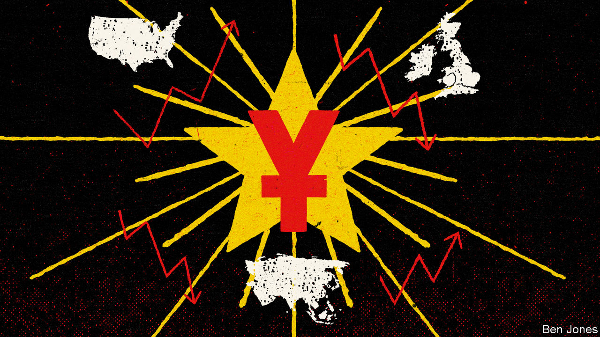

###### Soft-power play

# To show that it can follow global rules, China built its own multilateral institution 

##### But what is the point of the Asian Infrastructure Investment Bank? 

 

> Oct 10th 2022 

DUTY TO COUNTRY cut short Jin Liqun’s hoped-for career as a scholar of Western literature. Soon after China joined the World Bank in 1980, Mr Jin—who when toiling on a collective farm taught himself English with the help of the BBC—was recruited from academia and sent to Washington, DC. He was among the first Chinese at the World Bank and the IMF, twin pillars of an economic order designed by America and its allies after the second world war. After years in international institutions, he went home to be China’s vice-minister of finance.

Today, Mr Jin is in his seventh year as founding president of the Asian Infrastructure Investment Bank (AIIB), a multilateral bank hosted by China. He still uses literature to explain his country’s world view to outsiders. In an essay on economic governance, he quotes “The Leopard”, a study of Sicilian aristocratic decline, and its advice: “If we want things to stay as they are, things will have to change.”

The AIIB is a contradictory success story. It was launched in 2015 as China’s gift to the world. Officials talked of binding China, with its genius for building roads and railways and its hunger for food and natural resources, to resource-rich Eurasian neighbours that need infrastructure to access new markets. “China welcomes all countries to ride on its development,” said Xi Jinping at the bank’s inauguration. In another bonus, when the Obama administration asked allies to shun the AIIB, it failed as Britain, Germany and several other Western countries promptly signed up as members.

The AIIB has since followed international, not Chinese norms, for all the geopolitical dramas surrounding its birth. China’s vote share gives it a veto, and Mr Jin hopes that his successor will be Chinese. But the bank conducts environmental and social-impact assessments that Chinese state-owned lenders skip, and also works with other multinational banks on climate-friendly infrastructure and other worthy projects. Revealingly, it is a boutique bank by Chinese standards, investing $36.43bn in 190 projects to date. In comparison, between 2013 and 2018, a single state-owned lender, the China Development Bank, poured $190bn into more than 600 projects linked to the Belt and Road Initiative.

The AIIB’s sleek Beijing headquarters—complete with a cavernous atrium, the national flags of 105 members at its entrance and a video-linked “board chamber” worthy of a Bond film—is a Babel of different nationalities. It ”may be a victim of its own success,” that looks “an awful lot like a mini-World Bank, including a lot of World Bank staffers,” comments one international official. To mangle the wisdom of “The Leopard”, in order to show China can be trusted with change to the multilateral order, its first global institution resembles more of the same.

Mr Jin, an urbane, professorial sort, says many American friends ask why his bank exists, when China could simply have increased funding to established institutions. To reflect the distinctive development experiences of Asia and China, is his answer. That starts with practical differences: faraway lenders were slow to grasp how soon infrastructure projects would pay off in booming Asia, for instance.

Hints of paternalism can be heard. He mentions relatively low education levels in Asia, and the risks of delaying good projects if local non-governmental groups—which have a right to speak out, he adds—are “hijacked by a very small group of people who put their very narrow interests above the community’s interests.” China believes a market economy can co exist with a “strong, robust state”. Then again, he sees Western governments regulating economies more assertively to tackle the “excessive power of capital”.

Most of all, China wants outsiders to admire its development and the political system that has overseen it. If China is “a bit allergic to universal values”, he says, the problem is not the notion of all countries agreeing to basic principles. It is that some Western countries apply a “special connotation” to universal values and such terms as democracy, so as to criticise China and other developing countries. This makes China “very uncomfortable”, he says.

The AIIB’s boss calls it “quite normal” for China to want to fill senior posts in global institutions. Asked what China will do with such clout, he talks of giving it and formerly colonised Asian countries a voice. Then he describes an ambition that may explain the AIIB’s founding more than any other: for China to be accepted on its own terms. “What is important? It’s not simply representation. It’s recognition…Are you appreciated? That’s key.”■

