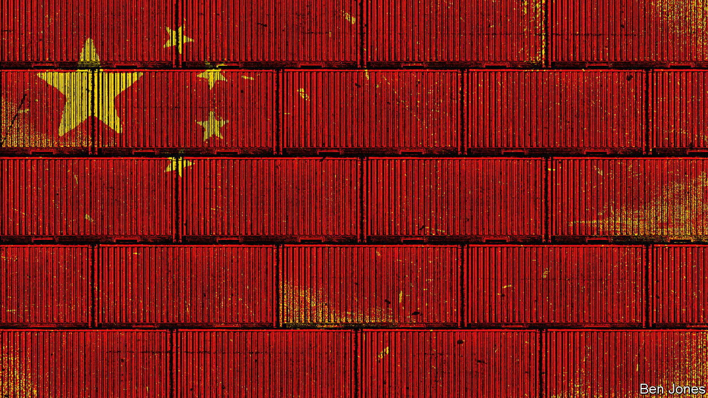

###### The deglobalisation danger

# Why America and Europe fret about China turning inwards 

##### China increasingly fears being overly dependent on the world 

 

> Oct 10th 2022 

AMONG POLITICAL and business leaders in America, China and the EU, the consensus is that globalisation is in danger of going into reverse, and that a big driver is China’s rise. However, those same blocs—the three largest economies on Earth—disagree profoundly about whether this is China’s fault. America’s secretary of state, Antony Blinken, says China has arguably benefited more than any other country from an open international order, but is now bent on reshaping it. The Biden administration charges China with pursuing “asymmetric decoupling”, as it seeks to dominate key technologies from electric-car batteries to quantum computing. Mr Blinken sees a selfish plan to make “China less dependent on the world and the world more dependent on China”.

Europeans are also anxious. In July, after Valdis Dombrovskis, the European Commission’s executive vice-president, held talks with Liu He, then China’s chief economic envoy and a deputy prime minister, an EU statement deplored China’s use of economic coercion to punish countries that displease it, as is happening to Lithuania after it was deemed too friendly towards Taiwan. The EU gave warning that a “growing politicisation” of China’s business environment is leading European companies to reconsider existing operations and planned investments.

As it happens, Chinese officials acknowledge that their country has prospered mightily from four decades of openness to foreign capital, technology and expert talent. But, they retort, if China now focuses on technological self-reliance and secure domestic supply chains, that is in self-defence. They point to tariffs and export bans imposed by the Trump administration and largely left in place by its successor. They grumble about EU mechanisms to screen Chinese investments, and fume about Western governments that have barred Huawei and other Chinese firms from building 5G telecoms networks.

If this spiral is not reversed, the destabilising consequences will extend beyond arcane trade laws. China says it is now the largest trade partner of more than 120 of the world’s countries. Multinational corporations grew dependent on China’s industrial clusters as the most reliable, predictable, efficient places to make everything from smartphones to antibiotic precursors. Yet there was nothing inevitable about communist-led China becoming a pillar of globalisation. Such a balancing act has rarely been tried. At the height of the cold war, America and the Soviet Union were ideological adversaries but barely traded with each other. For all America’s alarm over Japan’s industrial and commercial rise from the 1970s to the 1990s, the country was a military ally, not a strategic rival.


For a long time, Western leaders predicted that growing Chinese prosperity would lead to ideological convergence with the rich world, as a rising middle class demanded accountable government and individual rights. China’s accession to the World Trade Organisation (WTO) in 2001 was taken as a sign of an irreversible commitment to openness, and that boost to confidence triggered a generation-long boom in foreign investment. Seeing China as an indispensable engine of growth and profits, foreign business bosses were some of China’s loudest advocates in Western capitals, even if they grumbled privately about China being more willing to obey the letter of WTO commitments than their spirit. By this, they meant that, for all China’s warm words about openness, foreign firms still faced pressure to transfer technologies as the price of gaining market access, and then competition from subsidised state-owned rivals.

Tu Xinquan, dean of the China Institute for WTO Studies at the University of International Business and Economics (UIBE) in Beijing, explains how his country reacts to the charge that, since joining the WTO, it has flouted that body’s market-oriented spirit. “At least according to international law, rules are rules and spirits are spirits, they are different,” he says. “The US is always claiming that it is supporting a rules-based system. So let’s look at the rules. Don’t talk about spirits to us.”

President Xi Jinping says economic globalisation is under attack and protectionism on the rise, and pledges that China will stay open. But he also calls for a “dual circulation” strategy dominated by the domestic economy, with foreign trade as a useful adjunct. He does not hide his desire for more control of the economy, praising state-owned enterprises (SOEs) as “an important strength and pillar of the party in governing and rejuvenating the country”. In the face of Western export bans and investment curbs, Mr Xi calls for China to master “choke point” technologies. Relying on foreign countries for vital inputs is like “building our house on top of someone else’s walls,” he suggests. Even a beautiful structure “won’t remain standing during a storm”.

Justin Yifu Lin is dean of the Institute of New Structural Economics at Peking University. His forceful defences of China’s development model have earned him a hero’s following among Chinese technocrats. A Chicago-trained former chief economist at the World Bank, Mr Lin returned to China in 2012. He rejects Western criticism of Chinese state capitalism as both ignorant and hypocritical. He argues that, as long as China is catching up with America and other advanced economies, productivity growth is best secured by buying or licensing foreign technology, then upgrading from one promising industry to the next. Because it is for the state to support new industries with education and infrastructure, the inevitable work of picking new growth sectors falls to government. That is industrial policy, he concedes, but so is the basic research that underpins much rich-world innovation.

Mr Lin takes a dim view of American scolding. He credits China with realising that Western leaders talk about free trade and small government, as if channelling Thomas Jefferson, then turn around and practise the interventionist policies of Alexander Hamilton. After unmasking this secret of Western success, China wants to share it with other developing countries that have been “indoctrinated with limited government,” he says. For good measure, the professor questions how selfless America and other Western powers really were when they drafted rules for global trade and finance after 1945. Rich economies advocated free trade in industries where they enjoyed a competitive advantage, at least before the rise of China and other Asian tigers, he says. But they always shielded politically sensitive sectors like agriculture.

In his telling, China grew despite this Western rigging of the game, following WTO rules “quite well”. Even today China “if possible would like to see the system continue”. Alas, America and other rich countries now fear they are losing out, and want to “change the rules to maintain their dominance”.

China has not lost all hope in rules. In 2021 it applied to join an 11-nation trade pact suffused with free-market principles, the Comprehensive and Progressive Agreement for Trans-Pacific Partnership (CPTPP). That startled outside observers, because members must agree to limit subsidies for large SOEs, permit most cross-border flows of data and outlaw forced labour. It is no coincidence if China finds such conditions onerous. The pact is the orphaned offspring of an earlier agreement, the TPP, crafted by the Bush and Obama administrations to advance free trade in the Asia-Pacific and hedge against Chinese influence. In a stroke of luck for Beijing, Donald Trump abandoned the TPP on his first full day in office. With globalisation now under fire in Congress from both Republicans and Democrats, the Biden administration has not even tried to rebuild a domestic coalition to join the CPTPP.

China is not endorsing free-market norms. With Mr Xi stressing political control and national security, economic reformers no longer dare to call for a smaller state, merely a more efficient one. Their modest pitch is that joining pacts such as the CPTPP will increase foreign trade and impose useful market disciplines without undermining the party’s authority over the economy.

Liking rules if they like us

Wang Huiyao runs the Centre for China and Globalisation, a think-tank that champions CPTPP entry. He is close to the Chinese officials who negotiated WTO accession a generation ago. China’s economy has grown many times over since then, notes Mr Wang, who is something of a go-between for technocratic government ministries, Chinese entrepreneurs and foreign embassies in Beijing. “China is probably the largest beneficiary of the system of globalisation designed by the US and Western countries,” he acknowledges. Still, after 77 years the rules could do with an “upgrade”. He would like to see China invited to help build “Globalisation 2.0”. Asked to name rules that hurt China, Mr Wang says trade pacts typically frown on subsidies for SOEs. The rules reflect the legacy of Reagan- and Thatcher-era privatisations, he says, even though China’s state-run infrastructure puts America’s crumbling, private-sector utilities to shame. Perhaps, he suggests, pragmatism might lead to a compromise whereby China ends subsidies for SOEs operating in competitive markets abroad, in return for more tolerance for those supplying public services domestically. Mr Wang imagines other possible bargains pairing greater Chinese confidence with Western humility. Perhaps a self-assured China might loosen controls on cross-border data flows and grant more access to foreign internet firms, he suggests—as long as WTO digital standards ensure that companies like Huawei cannot be excluded from Western markets just for being Chinese.

The think-tank boss notes that China dislikes pressure from foreign trade partners to allow independent trade unions. Chinese officials recall how such organisations challenged communist regimes in Europe, he says. He concedes that China’s “government-assisted” trade unions reflect official positions, but maintains that they promote workers’ interests, such as higher minimum wages. Indeed, multinational firms are fans of China’s model of managed industrial relations, he enthuses, “because workers here are the most productive, the most effective and there are no strikes.” Activists might retort that large strikes are unknown because independent labour movements are crushed and their leaders jailed. Technocrats in Beijing hope that foreigners will focus on overall interests. “People are economically driven animals,” suggests Mr Wang. “If the economic benefits are large enough, they’ll overcome some values and ideological differences.”

Joerg Wuttke, president of the EU Chamber of Commerce in China, notes tensions created by the state’s double role as a regulator and business owner. Security laws oblige multinational firms to give the authorities access to sensitive data being transferred overseas, for instance. Some foreigners wonder if that information may be shared with Chinese state- owned competitors. If foreign firms respond by moving valuable research outside China, that is decoupling as a defence mechanism, says Mr Wuttke.

China’s government wants to be better represented in international bodies that set industrial and technical standards, determining everything from how the internet works to the steel used in railway tracks. This is understandable: China is an increasingly innovative place. Still, the country’s standard-setting ambitions alarm many foreign businesses and governments.

Rather than eliminating barriers to trade, many Chinese standard-setting campaigns increase the risks of decoupling. In the West, standards are a form of private-sector self-regulation. In China, the state is the guide. Sometimes Chinese firms seek to export their country’s domestic standards, via projects linked to the Belt and Road Initiative. Chinese-standard railways or natural-gas fields have been built everywhere from Nepal to Turkmenistan, making those markets harder for foreigners to enter. At other times, China’s government encourages its firms to set international standards for all countries. Increasingly, such efforts trigger ideological confrontations. Western governments and NGOs have pushed back when Chinese firms promote technical standards that risk embedding authoritarian norms. This is not a theoretical risk. Leaked government contracts show Chinese tech giants building facial-recognition systems that flag Uyghurs or other ethnic groups. In 2019 Chinese firms and officials tried and failed to promote “New IP”, a proposal that would have allowed greater state control of the internet. Tellingly, they launched the plan at one of the standard-setting bodies dominated by governments, the International Telecommunications Union.

Beyond rows about values, Western governments and business lobbies accuse China of using standards as sneaky barriers to trade. American analysts call for lawsuits at the WTO to force China to explain why some domestic standards diverge from global norms. Chinese experts retort that America has a nerve, noting that the Trump administration paralysed WTO arbitration by blocking the appointment of judges, an “America First” gambit that the Biden administration has only partly reversed.

Especially since the financial crisis, which Chinese officials call a moment of awakening about the West’s incompetence, China has grumbled about the “hegemony” of the dollar, as foreign countries endure the consequences of American monetary policy. China cheered in 2016 when the yuan was included in a currency basket used by the IMF as a global reserve asset. China promotes international trade in the yuan. However, such moves face “brutal limits”, says an international official, as long as China maintains exchange and capital controls. As of mid-2022, the yuan’s share of global payments by value was just over 2%.

Yuan seen nothin’ yet

To China, the mighty dollar threatens its national security. American administrations have become keen on denying adversaries access to the American financial system, a potent sanction. In 2012 pressure from America and the EU led to Iranian banks losing their access to SWIFT, an inter bank messaging network that underpins most international payments. Soon afterwards the People’s Bank of China began developing the Cross-Border Interbank Payment System (CIPS), a network that could one day replace SWIFT for Chinese financial institutions. China is working on a digital yuan that could further reduce its vulnerability to sanctions.

For now, evidence of wholesale decoupling is hard to find. China’s dominance as the largest producer of manufactured goods grew between 2019 and 2021. Yet trouble looms. The most lucrative business sectors are often politically sensitive. Many high-value technologies, from cloud computing to internet-enabled medical devices, make no sense in the absence of deep trust between sellers and buyers. National security concerns are intruding: because autonomous cars bristle with sensors and cameras, China has banned Teslas from many government and military sites.

Increasingly, world-views collide. Western governments believe they have a duty to protect consumers from buying the products of forced labour in Xinjiang, a region China runs with an iron fist. So they pass laws they see as defensive: America’s Uyghur Forced Labour Prevention Act and a forthcoming EU Corporate Sustainability Reporting Directive. By contrast, China sees an attack on its sovereignty, so obstructs access to Xinjiang for outside auditors, who could exonerate some supply chains.

Deglobalisation is a danger, says Mr Tu of UIBE. But it may not lead to two cleanly divided blocs. It seems to him possible that multinationals and a hybrid economic model could co exist within Chinese borders, subject to a tangle of national, regional and global trade rules. Nor does he think a decisive power shift towards China would lead to more clarity. “If China leads globalisation, it will not make another set of rules like the US did after the second world war,” he suggests. A messy, fragmented trade order might be brutal for small, open economies. But if rulers in Beijing thought it would give them leverage and security, they might take it.■

