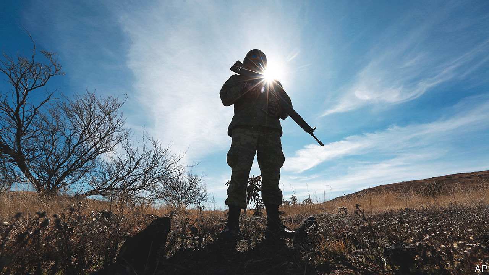

###### Guns and AMLO

# Mexico’s president gives power and money to the armed forces 

##### Andrés Manuel López Obrador risks making the army a political player 

 

> Oct 13th 2022 

Democracies that give their armed forces too much power may become less democratic. Under President Andrés Manuel López Obrador, Mexico, which never had a military dictatorship, may be taking that risk. In September Congress voted to transfer control of the National Guard, created in 2019 to replace the federal police, from the security ministry to the defence ministry, which is led by a general. This month Congress’s upper house agreed to extend from 2024 until 2028 the army’s role in enforcing law and order.

Mr López Obrador, president since 2018, once argued that soldiers should return to their barracks. Now he has given them more power than has any predecessor. He wagers that they will act more quickly than bureaucrats and be less corrupt. The army is popular; its ranks are drawn from the  (ordinary people); many Mexicans applaud its role in fighting narcos. 

But the armed forces carry out their new tasks badly. Although there is little prospect that generals will seize political power, their growing influence is dangerous. Mr López Obrador, often known as AMLO, is empowering an institution that is difficult to control and has interests that may clash with those of the electorate.

The army’s role has expanded most in fighting crime. In 2006 the then-president, Felipe Calderón, deployed the armed forces to fight drug gangs, supposedly as a temporary measure. They have been doing it to a greater degree under Mr López Obrador. In September nearly 200,000 soldiers, including National Guard members, of an active force of 240,000 were spread across the country. That is nearly four times the maximum average reached under previous presidents. The new laws, which will be challenged in courts as unconstitutional, could make permanent the militarisation of law enforcement. The eradication of the federal police force means that the civilian branches of government are “washing [their] hands of what is arguably a government’s main role—to provide security to its citizens”, says Luis Carlos Ugalde of Integralia, a consulting group.

As worrying is the army’s new role in the economy, which brings it huge transfers of cash. Mr López Obrador has handed the armed forces some 70 civilian functions, according to Mexico United Against Crime, an NGO. They include running ports, building a tourist railway, helping to run social programmes and clearing sargassum—invasive algae—from beaches. 

In 2006 the budgeted spending of the ministry of defence, which oversees the army and air force but not the navy, was the ninth-biggest among ministries. By 2021 that had risen to fifth-biggest. Mr López Obrador has given the armed forces ways to generate their own income, too. They will, for example, receive some proceeds from the train and airports they run, including a new air facility they built in Mexico City.

Some generals are encouraging this. Among documents obtained by Guacamaya, a group of hackers, was a proposal drawn up by the army’s legal-affairs unit for the president offering two legislative paths by which it could take control of the National Guard (one of which was later used). The hack also revealed that the armed forces plan to run a commercial airline, mainly to unserved destinations. It would use the presidential jet that Mr López Obrador tried, and failed, to sell.

It makes sense for the army to fight gangs, which have military-grade weapons. “It’s not realistic to expect the municipal police to fight organised crime,” says Lilian Chapa Koloffon of the World Justice Project, a think-tank in Washington. But abolishing the federal police has drawn the defence ministry into dealing with lower-level crime, which is a mistake, she says. 

Spending on the army’s crime-fighting role diverts money from other security spending, for example on civilian police forces and on forensic experts, and comes at the expense of other vital services. The government has cut the education budget as a share of GDP, even though children need to catch up on schooling they missed during the pandemic.

The army’s growing wealth and influence strengthen the executive branch of government but could also weaken its civilian leaders, including the president. That poses a risk to Mexico’s young democracy. The country held its first free elections in 2000, after 70 years of authoritarian rule by the Institutional Revolutionary Party (in which Mr López Obrador began his career). The army, answerable to a defence minister who is a serving officer, can invoke national security to avoid scrutiny. It is unfit for many of the duties it has newly taken on, says Ms Chapa Koloffon.

Mexico has become more violent since 2006. Some crimes, like extortion, have rocketed. So have complaints that the army is committing human-rights abuses. Infrastructure projects have run late and cost much more than planned. 

Some lawmakers are trying to temper the consequences of the army’s growing clout. The upper house has modified the bill that extends the army’s term on the streets, restoring funding for state and municipal police forces that legislators had earlier cut, but the sums are likely to be small. It voted to give Congress oversight of the army’s public-security work, but it will probably be weak. The law now has to return to the lower house for approval. 

Mr López Obrador apparently has no fear of military muscle. But the president who once wanted an army in its barracks risks creating one that will demand a bigger say in the corridors of power. ■

