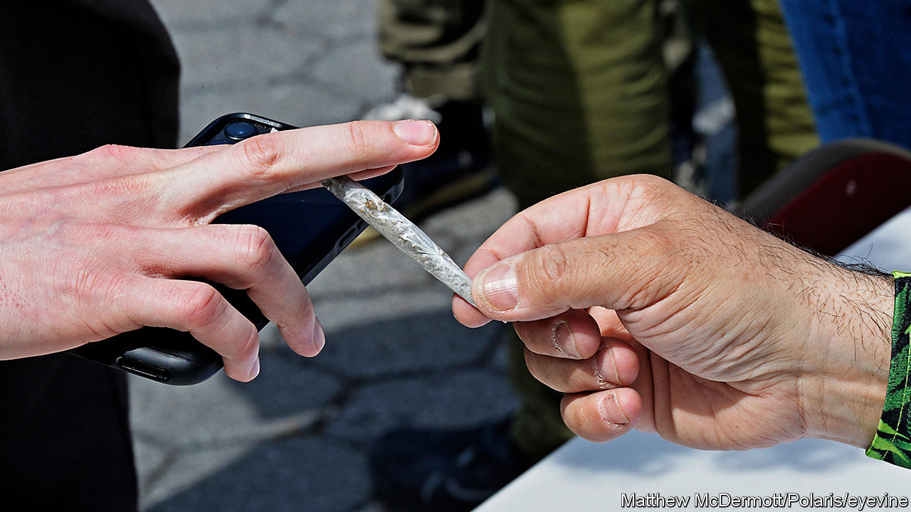

###### The Economist explains

# Why did Joe Biden pardon people convicted of federal marijuana offences? 

##### The White House wants to reclassify the drug’s legal status 

 

> Oct 7th 2022 

ON OCTOBER 6TH President Joe Biden made good on a campaign promise to pardon people convicted of marijuana possession by the federal government. The move was part of a broader executive order directing his administration to review the way that the drug is classified, and therefore regulated. It was cheered by those who see such convictions as a shameful legacy of the war on drugs, and out of step with a country where 37 states have legalised medical or . What implications will Mr Biden’s order have for America’s cannabis culture and industry?

The moral panics over cannabis that gripped America at various points in the 20th century seem quaint today, as pot shops pop up around the country. But Mr Biden’s decision is more a symbol of the administration’s commitment to decriminalising cannabis use than a sweeping policy change. Relatively few people are convicted of marijuana possession under federal law. One senior administration official said the pardons will affect some 6,500 people convicted between 1992 and 2021, and perhaps thousands more in Washington, DC. The vast majority of cannabis-related arrests and convictions are made in local jurisdictions. “​​In so many areas, the federal government is big, and states, cities and counties are small. But in law enforcement, it’s absolutely the other way around,” says Keith Humphreys, an addiction expert at Stanford University who advised the Biden campaign on drugs policy in 2020. 

The wonkier, but perhaps more wide-reaching, part of Mr Biden’s executive order concerns the way cannabis is regulated. The Controlled Substances Act of 1970 categorised drugs into different “schedules” based on their medical use and potential for abuse. The scale goes from Schedule I drugs, such as heroin, to Schedule V, which includes some pain relievers and cough medicines. Because there was so little research on cannabis, it joined heroin and LSD as a Schedule I drug, meaning it had no known medical use at the time. Mr Biden has asked the Department of Justice and the Department of Health and Human Services to review this strict classification. 

Rescheduling, or unscheduling, cannabis could have massive implications for America’s pot industry. Medical marijuana currently exists in a grey space. It is legal in most states but not regulated by the Food and Drug Administration (FDA) because, officially, it has no medical use. That may change if the drug is rescheduled, subjecting the industry to a mountain of rules it has so far avoided. Unsubstantiated claims that cannabis can help treat cancer or opioid addiction would carry legal weight, and companies would have to be more honest in their advertising. Pot producers will have to show evidence of safety and efficacy. “They will be quaking in their boots,” says Mr Humphreys. 

Because FDA oversight could blunt their budding industry, businesses may hope that cannabis is unscheduled altogether, paving the way for widespread recreational use. But treating cannabis like alcohol or cigarettes may be a step too far for the Biden administration. The president favours decriminalising the use of the drug over legalising the entire industry. ■


