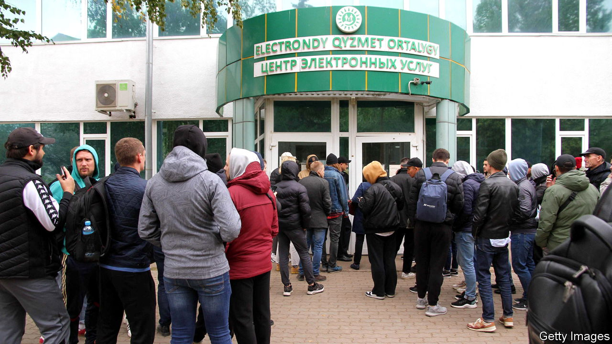

###### The Economist explains

# Why the exodus of Russians to Central Asia matters 

##### Draft-dodgers will test housing and job markets—and cause geopolitical jitters 

 

> Oct 12th 2022 

SINCE SEPTEMBER 21st, when Vladimir Putin, Russia’s president, announced a  to bolster his , hundreds of thousands of Russian men have fled to escape the draft. A large share headed south to the “Stans”—five post-Soviet countries that have remained, broadly speaking, allied with Russia. Kazakhstan, and to a lesser extent Kyrgyzstan and Uzbekistan, seem to be the most popular destinations in the region. What might the influx of Russians mean for them?

After Mr Putin issued his mobilisation order, tens of thousands of Russian citizens queued for days on the 7,600km border with Kazakhstan. Russian ID cards gave them the right to cross without a visa or even a passport. Thanks to Russia’s membership of the Eurasian Economic Union, a free-trade zone, its citizens also have the right to work in Kazakhstan, and neighbouring Kyrgyzstan, with minimal red tape—provided that they find a job within three months. Language is a further draw: Russian is widely spoken in the Stans, a legacy of their history as Russian colonies.

It is not clear how many of the new arrivals plan to stay in Kazakhstan. Some have already continued south to other Central Asian countries, especially Kyrgyzstan and Uzbekistan, which are easiest for Russians to enter. Turkmenistan and Tajikistan will be less popular: the former is an isolated dictatorship; the latter has a small capital with few draws. Some draft-dodgers will head further afield, to Europe or South Asia. Around 200,000 Russians entered Kazakhstan between September 21st and October 4th, but 147,000 left, according to the government. In the same period, 70,000 Russian citizens received Kazakh government-issued ID numbers, allowing them to open bank accounts and apply for jobs, a possible indication that they plan to stay. And although there are no data on the number of Russian citizens entering other Central Asian countries, the figures are likely to run to tens of thousands. On October 9th Kyrgyzstan blamed an 8km queue at its border with Kazakhstan on Russian migrants.

The Stans were ill-prepared for a flood of incomers. Kazakhstan has borne the brunt of it: at one point the city of Oral, near the Russian border, was so overwhelmed that new arrivals had to be housed in a cinema. The cost of rental properties has risen by as much as a third in parts of the country that border Russia, and there has been an outcry over landlords evicting locals to profit from the surge in demand. The influx could strain the job market, too. These Russian newcomers join a first wave who arrived in Central Asia after the invasion of Ukraine in February. But many who came earlier were members of , who had creative or tech jobs they could do remotely. The recent arrivals are more likely to compete with locals for work.

Beyond the practicalities, the inflow of Russians poses a geopolitical conundrum for Central Asian countries. Moscow is already irked by the  for its war from its supposed allies in the region. Tajikistan and Turkmenistan have been silent on the issue. Kazakhstan and Uzbekistan have said they respect Ukraine’s territorial integrity—and Kyrgyzstan has taken a similar position, albeit in more muted terms. The governments of Kazakhstan and Kyrgyzstan have said they will refuse to extradite draft-dodgers to Russia. Kassym-Zhomart Tokayev, the Kazakh president, is sympathetic to Russians fleeing a “hopeless situation”, as he has put it. But offering safe haven to those unwilling to sacrifice their lives for Mr Putin’s war will not endear the Stans to their bellicose neighbour. ■


