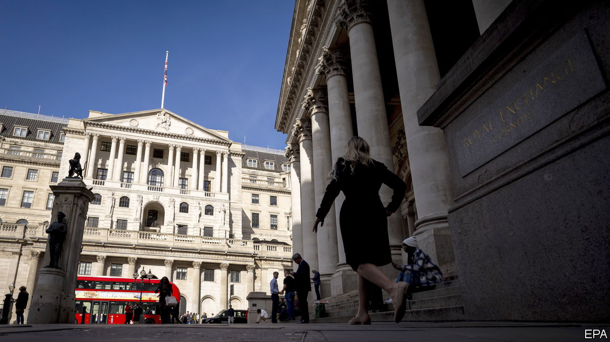
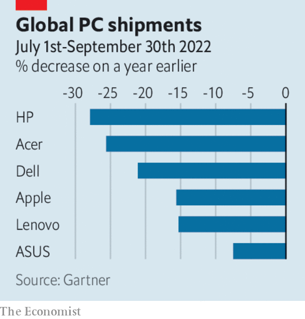

###### The world this week

# Business 

#####  

 

> Oct 13th 2022 

The Bank of England acted again to stabilise  and increased its maximum daily purchases of long-dated gilts. The central bank is buying the bonds through a temporary programme it created after markets took fright at the government’s plans for unfunded tax cuts. The programme is supposed to end on October 14th. British pension funds want it to be extended. They are taking a hit from collateral calls on derivatives linked to bond prices, leaving them with a short-term financing problem. 

Dire straits

The turmoil pushed up the costs of financing Britain’s , with the interest rate on ten-year bonds climbing back to levels that prompted the Bank of England’s first emergency intervention in September. In an attempt to regain credibility in the markets, Kwasi Kwarteng, the chancellor of the exchequer, brought forward the date of his “fiscal plan”, which will explain how his tax cuts are to be paid for, to October 31st. 

With markets expecting the Federal Reserve to continue raising interest rates, the yield on American government bonds has also increased. That has pushed up  in America, which are linked to the yield. The rate on a 30-year fixed-rate mortgage has climbed above 6.8%, the highest level since 2006, according to the Mortgage Bankers Association. 

Global inflation is expected to peak later this year but remain elevated in 2023, said the IMF in its latest outlook. Russia’s invasion of Ukraine continues to “destabilise the global economy”, said the fund, which shaved its forecast for global GDP growth next year to 2.7%. With the  “headed for stormy waters” the IMF thinks that investors will turn to safe assets, such as US Treasuries, pushing the dollar even higher. Kristalina Georgieva, the IMF’s managing director, predicted that the near future will be “more volatile, more fragile”.

General Motors launched a new business to help customers charge their electric cars and keep their power bills down.   energy-management system is similar to the one sold by Tesla. 

A consortium backed by private equity agreed to pay $7.9bn for , which provides nuclear services including nuclear fuel and maintenance to around half the reactors worldwide. The deal is seen as a big investment in the future of nuclear power. In order for the world to hit net-zero carbon goals, nuclear generation needs to double by 2050, according to the International Energy Agency. 

Billions of dollars were wiped off the stockmarket value of , after the Biden administration issued new  that severely curtail their access to American technology. The sell-off in shares soon extended to chipmakers in other countries. The new rules will make it much harder for Chinese companies to develop supercomputers and will slow their advance in artificial intelligence, a technology in which China claims to be a world leader. 

 


Global shipments of  fell by 19.5% in the third quarter, year on year, according to Gartner. It is the biggest decline in the consulting firm’s survey since it began tracking the market in the mid-1990s. Sales boomed during the pandemic, before inflation ate into spending budgets. Chipmakers are feeling the effects.  is reportedly planning to cut thousands of jobs as demand for its PC processors slows. 

Personal computers could become a thing of the past if  new virtual-reality headset takes off. Facebook’s parent company launched the Quest Pro this week, which is marketing itself to companies as a means of improving employees’ interaction. It is Meta’s first headset with inward-facing sensors, which can replicate a person’s smile, or even eye contact with someone. Meta also announced partnerships with Microsoft and Zoom, as it seeks to expand the metaverse to home working. 

The share prices of DoorDash, Lyft, Uber and other  fell sharply after America’s Labour Department proposed new guidelines to determine if workers at such firms are contractors or employees. As contractors, the workers do not receive many benefits. However, the terms of the government’s proposal are limited to issues over pay. 

Why worry

 reported a 28% rise in revenue for the first nine months of 2022, year on year. The return of the jet-setters after lockdown, and a weaker euro, boosted the luxury-goods company’s business in Europe. Sales highlights included the Tambour Twenty collector’s watch (as “embodied” by Bradley Cooper, an actor). “Despite everything going on in the global economy”, demand for LVMH’s wares remains “vigorous”, said its chief financial officer. 

