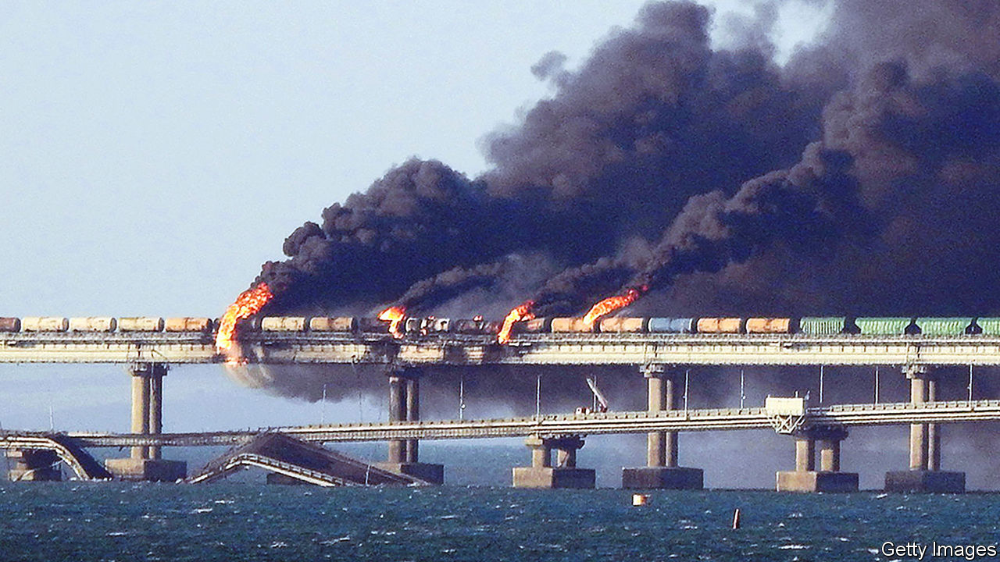
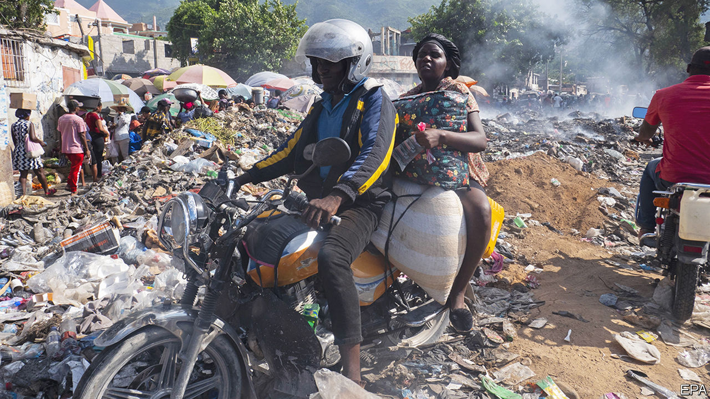

###### The world this week

# Politics 

#####  

 

> Oct 13th 2022 

A  badly damaged the Kerch road-and-rail bridge, which connects Russia with occupied  and is vital for resupplying Russian forces operating in the south of Ukraine. Although Ukraine neither confirmed nor denied that it had carried out the attack, many assumed that it had done so. Only very limited traffic is now able to use the bridge. It was unclear whether the explosion was caused by a lorry-bomb, an underwater drone or a missile.

Russia  by pounding cities across  with often-inaccurate cruise missiles and drone strikes. The centre of Kyiv was struck for the first time since the start of the war. Ukraine’s engineers sought to repair damage to infrastructure and its leaders argued that the attacks would feed the will to fight. In response, NATO countries vowed to speed up their deliveries of air-defence systems to Ukraine. So far, Mr Putin’s attacks appear to have accomplished little militarily. 

Alexander Lukashenko, the dictatorial president of , sent troops to join a Russian task-force that is assembling on the country’s border with Ukraine, possibly to launch another front in the war. Mr Lukashenko claimed the task-force was preparing for a Ukrainian attack on Belarus, for which there is no evidence. 

 Supreme Court heard arguments on whether there should be another Scottish independence referendum. The Scottish National Party’s leader, Nicola Sturgeon, claims that the issue has gone to court because the British government has no respect for Scottish democracy. If the court finds against the nationalists, Ms Sturgeon says she will use the vote in Scotland at the next general election as a de facto referendum on independence. The court will deliver its ruling in the coming months. 

The truth will set you free

A jury in Connecticut ordered , a conspiracy theorist, to pay $965m in damages to eight families who lost loved ones in the Sandy Hook school massacre in 2012. For years Mr Jones has peddled falsehoods across his media empire that the shooting was staged by the government. His lies caused great distress to the parents. He remains defiant. After the verdict he claimed to be “proud” of being attacked for his views. 

Joe Biden said there would be “consequences” for America’s relationship with Saudi Arabia following OPEC’s decision to cut in order to increase the commodity’s price. Some Democrats said OPEC was supporting Russia’s war (Russia also benefits from higher oil prices). Bob Menendez, the chairman of the Senate Foreign Relations Committee, promised to freeze arms sales to the Saudis.

Turbulence persisted in , nearly a month after it was sparked by the death of a young woman in the custody of the “morality” police for being “improperly” veiled. University students remained prominent in the nationwide protests. It was unclear how the army, as opposed to the hardline Islamic Revolutionary Guard Corps and the loyalist  militia, would respond.

Under American mediation,  and   on a maritime boundary that should allow each country to co-operate in the extraction of undersea gas. The deal may still need official approval in both countries.

 Epsilon-6 space rocket was sent a self-destruct command less than seven minutes into its launch. The rocket and the commercial satellites it was carrying fell into the sea east of the Philippines. The aborted launch was Japan’s first rocket failure in nearly two decades. 

Kim Jong Un,  dictator, oversaw the launch of two long-range cruise missiles. State media said the objective was to test the reliability of nuclear-capable weapons. The launch follows two weeks of tactical nuclear exercises by the dictatorship in response to joint naval drills by South Korea and America.

Local elections in  resulted in a tilt to the right, as big cities elected conservative mayors. This may indicate a turn away from the governing Labour Party led by Jacinda Ardern. 

 faced severe disruption from torrential rain and landslides, which have killed at least 33 people. The country’s western region is the worst affected, with more than 18 people still missing and hundreds of houses flooded. 

An outbreak of  in Uganda has killed 19 people, including four health workers. A total of 54 people are known to have been infected in the current outbreak by the virus, which usually kills about half the people who catch it.

Mahamat Idriss Déby, who declared himself president of  18 months ago after a coup, extended his rule by another two years. This came shortly before a mid-October deadline for holding elections and handing power to a civilian government. 

Revolution for Prosperity, a political party set up just six months ago by a tycoon, won 56 of 120 seats in parliamentary elections in  The shift away from established parties is part of a broader trend across Africa, where growing numbers of voters are backing a new style of candidate. In  , an outsider, took an early lead in polls as campaigning started for presidential elections in February.

Please send help

 


 prime minister, Ariel Henry, asked for intervention by a foreign armed force to avert a “major humanitarian crisis”. Gangs have been blocking deliveries from the main fuel terminal since September and have seized control of motorways, forcing businesses and hospitals to close and causing shortages of food and bottled water. A woman was killed in clashes between police and protesters. An outbreak was reported of cholera, a disease that has killed 10,000 Haitians in recent years. 

At least 43 people died and more than 50 were missing in landslides in . Heavy rains caused by La Niña, a weather pattern that cools the Pacific Ocean near South America, caused the landslides, in Las Tejerias, 67km south of Caracas, Venezuela’s capital. 

 has agreed to accept unauthorised  expelled by . Until now most have been allowed to remain in the United States. At the same time, the United States agreed to take in for two years 24,000 Venezuelans who fly directly from their country. Some 6m have fled poverty, violence and repression in Venezuela over the past five years, mostly to other Latin American countries.

