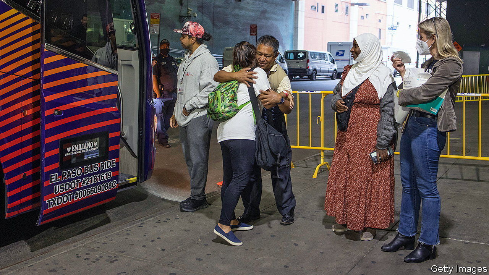

###### Masses huddled

# 20,000 asylum seekers are putting New York values to the test 

##### And more are on the way 

 

> Oct 13th 2022 

For months Greg Abbott, Texas’s Republican governor, and El Paso’s Democratic mayor, have been shipping asylum seekers by bus to New York, a political scheme to share the burden of migrants with so-called sanctuary cities, which often refuse to work with federal immigration police. About 20,000 asylum seekers have arrived so far. Nearly 2,000 arrived by bus last weekend alone.

Well before those buses carrying migrants, including children and some women who gave birth days before, often without co-ordination or notice, New York was an immigration hub. Immigrants make up nearly 40% of the city’s population and 44% of the labour force. But what’s different about this moment, says Murad Awawdeh of the New York Immigration Coalition, is that in the past people had a family or community connection in New York. “They were able to crash with folks, their family, their friends.” 

New York’s “right to shelter” law means that anyone without a roof over their heads is entitled to one through the city’s homeless shelter system. This right is being tested by the new arrivals, so much so that Eric Adams, the mayor, has declared a state of emergency. More than 61,000 are in the system, including new asylum seekers and the existing homeless. Since early September five to six buses have arrived daily. At the current pace, the city could soon see 100,000 seeking shelter. 

Asylum seekers cannot legally work until 180 days after their paperwork has been filed. Supporting them, therefore, “is burning through our city’s budget,” said Mr Adams. He expects to spend at least $1bn by the end of the fiscal year helping migrants. So far the city has set up 42 hotels as emergency shelters. More than 5,500 children have been enrolled in local schools. The city is helping provide legal information and transit fares. Tents are being put up to temporarily house 500 people on Randall’s Island. The city is also in talks with several cruise lines to lease a cruise ship. 

Mr Adams, understandably, wants emergency federal financial relief. He also wants legislation that would allow migrants to work legally. He wants a strategy to slow the arrival of migrants at the border and co-ordination to house migrants all over the country. He has asked New Yorkers to host migrants in their homes. On October 13th the Biden administration announced a deal with Mexico whereby up to 24,000 Venezuelans would be accepted at airports but those crossing the border illegally would be returned to Mexico.

Without the help of organisations like the nyic, Catholic Charities, non-profits, churches and ordinary New Yorkers volunteering, the city would be in even more of a mess. St Paul &amp; St Andrew, a Methodist Church, is sheltering five recent arrivals. “It is virtually impossible from our standpoint not to absolutely fall in love with them, and try to help them,” says Reverend Lea Matthews. The church arranged for a couple without proof they were married to get a marriage licence, so they could be sheltered together. They had travelled from Venezuela, through jungle, desert and across a river. Their 15-month-old grandchild was separated from them at the Southern border. Reverend Matthews and her team of volunteers managed to reunite the baby with the family. There are many less happy stories.■


