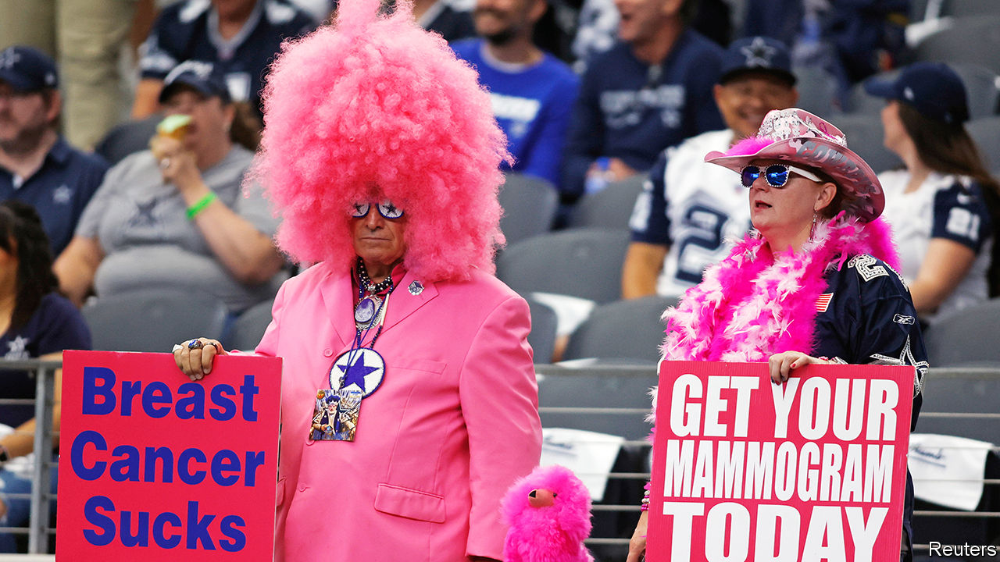

###### Nipped in the bud

# Breast cancer has become less lethal in America 

##### Not all public-health news is doom and gloom 

 

> Oct 13th 2022 

October is breast cancer awareness month, and thankfully it seems quite a few Americans are aware of it. Mortality from breast cancer has dropped by 43% over the past 30 years, according to a new report by the American Cancer Society (acs). This is largely thanks to earlier detection and better treatments. All told, the improvement adds up to 460,000 lives saved over the past three decades.

Most public-health news from America is gloomy. About 100,000 people die each year from drug overdoses. Life expectancy, which used to creep steadily up year after year, has gone into reverse: America is unusual among rich countries in that life expectancy has fallen back to a level it was last at in the mid-1990s. Within that overall picture though, there have been improvements. Breast cancer joins lung cancer, the most prevalent cause of death from cancer, colorectal, and prostate cancer in becoming less lethal over the past three decades. Since deaths avoided tend to be rather neglected relative to deaths caused, it is worth considering what has gone right.

According to the Centres for Disease Control and Prevention, about 264,000 cases of breast cancer are diagnosed among American women each year, and about 42,000 women die. Men are susceptible too, though male breast cancer is very rare: each year about 2,400 men are diagnosed with breast cancer and 500 die. Early diagnosis is key to survival. Today someone diagnosed with breast cancer that has not spread to any other body part has a 99% chance of living for at least five more years. That compares with 29% for breast cancer that has spread throughout the body. 

How has this improvement come about? Three-quarters of women with health insurance have regular mammograms, which result in earlier detection. Treatments have also become more targeted. Doctors are now able to divide breast cancer diagnoses into subtypes based on whether the cancer contains oestrogen and progesterone receptors, which means they are sensitive to hormones, and whether they have high levels of her2 protein, which stimulates cell growth. These classifications allow for more specific, and therefore effective, treatment.

While mortality rates have decreased, the prevalence of breast cancer has risen in the past 40 years—and not just because more people are being screened. The increase is probably due to high obesity rates and declining fertility among women, says Rebecca Siegel, an author of the acs report. Breast cancer and obesity are linked because fat cells synthesise oestrogen production in post-menopausal women, and higher oestrogen levels are associated with breast cancer. As for fertility, having children at a later age and not having children at all is associated with increased risk of breast cancer. “It’s not fully understood why, but it’s thought to be related to exposure to oestrogen,” says Ms Siegel.

Still, the news is mostly good. As ever there are racial gaps in outcomes, and people without health insurance are much less likely to get a mammogram. But with the exception of Native Americans, all racial groups have seen mortality rates from breast cancer decline.■


