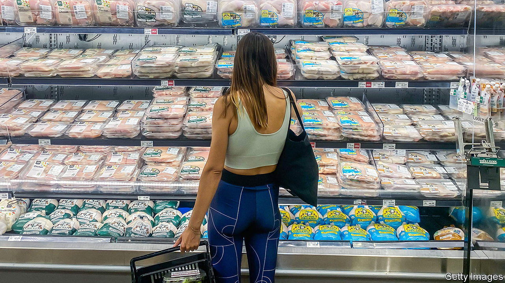

###### A stimulating debate

# California’s inflation-relief payouts are a bad idea 

##### But not for the obvious reason 

 

> Oct 12th 2022 

It sounds like a bad joke. In 2020 and 2021 the American government sent out pandemic-relief payments to tens of millions of households, worth thousands of dollars per person. This largesse led to a surge in consumer spending, which in turn fed into the  now racking the country. So California is trying to help its residents—by sending out inflation-relief payments to millions of households, worth up to a thousand dollars. If the first set of payments contributed to inflation, can the second set of payments somehow minimise it?

The short answer is simple: extra infusions of cash risk aggravating the very problem they are attempting to solve. Families in California who make less than $150,000 annually started receiving one-off direct deposits of up to $1,050 in their bank accounts on October 7th. The Middle Class Tax Refund, as it is officially called, is expected to reach up to 23m Californians, nearly 60% of the state’s population. The government wants to make it easier for people to afford necessities such as petrol and groceries. The problem is that if everyone splurges on consumer goods at about the same time, they may drive prices up. Multiple studies have found, for example, that the intended savings from gas-tax cuts often end up being swallowed up by higher prices at the pump as demand increases and petrol stations charge more.

The longer answer is a bit more complicated. Scale matters. If every state were doing the same thing as California, the upward pressure on inflation would be substantial. If, however, it were just California, the effects would be less worrisome: as spending increases in California, goods from other states can flow there to meet the extra demand. This is closer to what is happening. Nearly 20 other states have given  to residents, but most are providing less than California. And the Californian hand-out by itself will not move the national price needle: it adds up to $9.5bn, or just 0.3% of state GDP.

Timing matters, too. Part of the reason that the federal government’s stimulus payments during the pandemic fuelled rising prices is that the production of goods was so constrained at the time: companies responded to increased demand more by raising prices rather than by increasing output. A steady improvement in supply chains over the past year should make it easier to absorb any sudden increases in demand. The upshot is that the Californian handouts will probably have a negligible impact on inflation, while providing some help to their recipients.

The more serious criticism is what the payment says about the budgeting judgment of , California’s governor. The state announced in May that it had a record surplus of $97.5bn, thanks to higher-than-expected tax revenues. California is handcuffed by its own laws about how it can deploy surpluses: rebates to taxpayers are one standard option. Yet the government could also have boosted spending on infrastructure, including housing, while initially adding more to the state’s budget reserves—only prudent given the downshift in the economy. But politically that would have been rather dull. When Mr Newsom released his budget, his office published a list of ten things Californians needed to know about it. The first? “Cha-ching! You just received a deposit.” ■


