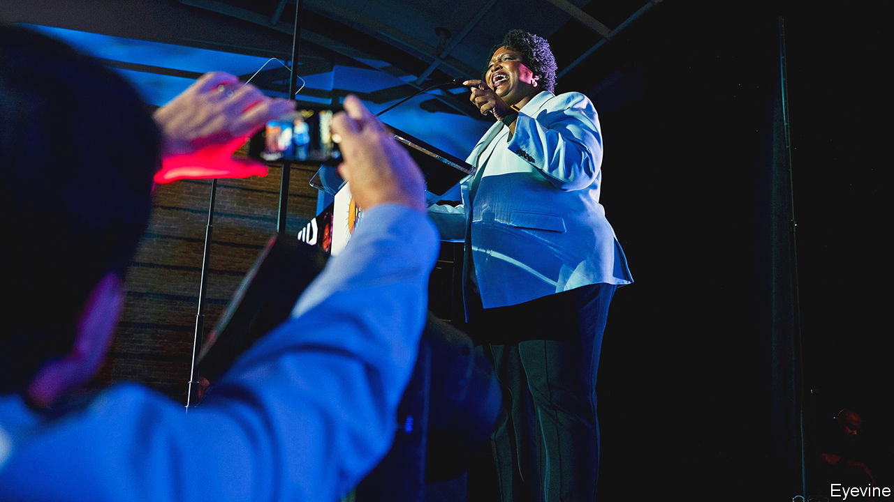

###### Heisman shuffles

# Georgia’s races suggest good candidates can beat partisan reflexes 

##### Why Raphael Warnock has a much rosier chance than Stacey Abrams 

 

> Oct 13th 2022 


Few people have weathered defeat as well as Stacey Abrams. In 2018 when she lost the governor’s race in Georgia, previously a solidly Republican state, by a mere two percentage points, she rocketed to national prominence and became a progressive icon. Her claim that Brian Kemp, then the secretary of state in charge of elections, had robbed her of victory by aggressive voter suppression spurred a movement among Democrats. A grudge rematch with Mr Kemp in 2022 was all but preordained. For that reason, it is the closest watched of the 36 gubernatorial elections held this year. In the past four years, Ms Abrams has been feted and adored. The  ran a fawning profile of her accompanied by a photo in a superwoman cape. She openly courted being Joe Biden’s running mate in 2020. Earlier this year, Star Trek promoted her to president of United Earth in a cameo appearance (also becaped).

There is one problem with Ms Abrams’s irresistible rise, though. She might lose to Mr Kemp once again—by a larger margin than four years ago. As of October 12th the prediction from FiveThirtyEight, an election-prognostication outfit, is that Ms Abrams will lose by six points and has only a 1-in-7 chance of victory. That might surprise those who recall Georgia turning blue only two years later (and one political eon ago). In 2020 the state narrowly gave its presidential vote to Mr Biden. Two Democrats won run-off elections for the Senate held on January 5th 2021—giving the president’s party unified control of Congress one day before supporters of Donald Trump stormed the Capitol.

A lot has changed since Ms Abrams’s first run. The national environment is less auspicious for Democrats due to Mr Biden’s unpopularity and discontent over inflation. The governor has a record of economic growth to run on and has been touting increased expenditures on schooling and policing. And Mr Kemp has been transformed, too, by refusing to overturn the election results in his state at Mr Trump’s urging. Few Republicans have clashed so loudly with the former president and lived to tell the tale. Mr Kemp’s easy trouncing of the Trumpian-avenger candidate in a primary election held in May has cemented his position as something of an independent force, rather than the arch-conservative character he played in 2018.

To Ms Abrams, this credit is excessive. “He simply didn’t commit treason. We should not lionise someone for not being an arsonist. You’re not supposed to burn the house down,” she says. “My deep concern is that his failure to commit treason once has obfuscated his very intentional and long-standing voter suppression.” Ms Abrams refused to concede her election loss in 2018. Some have drawn unflattering comparisons to Mr Trump’s extreme actions in 2021, and the awkwardness has necessitated something of a clean-up job. “I’ve never disputed the outcome. But what I’ve always questioned is the access,” Ms Abrams says. In other interviews, however, Ms Abrams had said “I won”, and described the contest as, among other things, “not a free or fair election”, “rigged” and “stolen”. 


The voter-suppression debate has been continuously relitigated. Lawsuits filed by Ms Abrams and her affiliated organisations against Mr Kemp over the 2018 election have dragged on for years. On October 3rd—of this year—a federal judge appointed by Barack Obama decisively rejected the outstanding claims that Mr Kemp’s management of voter rolls (labelled “purging”) and “exact match” rule for signatures on absentee ballots had violated either Georgia law or the constitution. “Voter suppression was fake to begin with, at least in our case,” says Cody Hall, a spokesman for Mr Kemp’s campaign. And the charge “has now lost its potency because we had record turnout in 2020 and 2021. The media was sold a bill of goods.” Almost every political observer in Georgia expects another record year for turnout, in spite of the passage of SB 202, a Republican election bill passed in 2021 over considerable Democratic outcry.

The problem this time may be more quotidian: not enough votes. Ms Abrams has faced troubling polls showing not only a sizeable lead for Mr Kemp, but unexpectedly low levels of support among African-American voters, who are the bedrock of the Democratic coalition. A recent poll conducted by the University of Georgia, showing her down by ten points, found that 81% of black voters were planning to support Ms Abrams, 8% were planning to vote for Mr Kemp and 10% were still undecided. “I am doing as well with black votes as I was in 2018,” she says flatly. 

This debate is at the core of Ms Abrams’ theory of change. The formidable turnout machine that she built, which Republicans only belatedly appreciated the power of, has been credited with turning Georgia blue. Progressives often argue that victory can be achieved through attracting young Americans and non-white voters who respond to bold policy ideas and frequent engagement. As successful as Ms Abrams was, increased non-white turnout cannot fully explain the gradual Democratic tilt of the state. Official data suggest that the black share of the electorate was 27.6% in 2016—when Hillary Clinton lost by 5.2 points—and 27.3% in 2020 when Mr Biden won by just 0.24 points. Growing Democratic appeal in the suburbs also contributed. Look at the state’s three counties outside Atlanta—Gwinnett, Cobb and DeKalb. Democrats captured 62% of major-party votes there in 2016, 65% in the contest for governor in 2018 and 67% in the Senate run-off in 2021.

Partisanship sets the basic floor of support for candidates, which they can try to exceed by clever campaign strategy and policy pitches. A comparison with the other marquee race in the state, that for senator, makes this clearer. , the sitting Democrat, has a much rosier chance than Ms Abrams. There are two reasons for this. His share of the African-American vote, per the University of Georgia poll, is eight points higher, at 89%. And split-ticket voting, thought to be dying, remains a potent enough force. Sometimes this reflects a preference for incumbents. More often it reflects the strengths and weaknesses of individual candidates.

Herschel Walker, a former American football legend at the University of Georgia who won the Heisman Trophy for player of the year, has run the most disastrous campaign of the year. Aside from a shaky grasp of policy that borders on absurdism (“our good air decided to float over to China’s bad air” is an apt summary of his understanding of pollution), Mr Walker has been beset by one scandal after another. The latest is an allegation that he paid for an abortion more than a decade ago, despite his stated opposition to abortion even in cases of rape and incest.

Mr Walker’s denials have been rather feeble. His own son said shortly after the story was published that his father was “lying and making a mockery of us”. The tirade continued: “You’re not a ‘family man’ when you left us to bang a bunch of women, threatened to kill us, and had us move over 6 times in 6 months running from your violence,” he wrote on Twitter.

As a result, the two races may result in an unexpected split decision. Charles Bullock, a political scientist, says that a sizeable share of Republicans—between 6% and 10%—are telling pollsters they will vote for Mr Kemp but not Mr Walker. But the party has shown no appetite for abandoning him, despite Republicans’ occasional fretting over the decline of family values. “Herschel Walker’s Republican support is not about supporting Herschel Walker. They’re supporting partisanship. They’re supporting the idea of anybody but a Democrat,” says Leo Smith, a Republican consultant in Atlanta. That point was put even more finely by Dana Loesch, a right-wing radio host. “I don’t care if Herschel Walker paid to abort endangered baby eagles. I want control of the Senate.” 

Polls put him in line for a close finish, even though the contrast with Mr Warnock, a reverend and gifted orator, is damning. If no candidate wins an absolute majority of the vote, the winner would be decided in a run-off election on December 6th. Given the tight Senate elections in other states, control of the chamber could once again depend on the outcome of a quirky run-off in Georgia. A state already deluged in political advertising—predicted already to amount to $575m—would then have to endure a few weeks more.■


