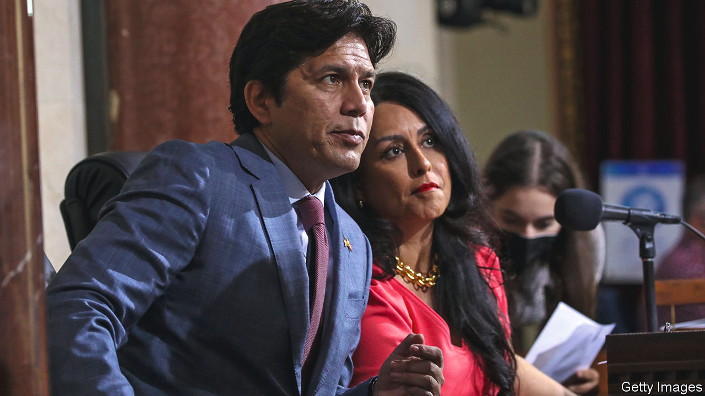

###### Black and blue

# Leaked audio from LA’s city council holds a warning for Democrats 

##### A crude discussion recalls the history of fraught racial politics in the city 

 

> Oct 13th 2022 

IT IS ONE thing to think that politicians probably behave differently behind closed doors. It is quite another to hear the crude strategy deployed by America’s power brokers to get what they want. Sound from one such smoke-filled room was unearthed this week. A leaked recording revealed three Hispanic Los Angeles City Council members and a labour leader making racist and disparaging remarks about African-Americans, Jews, Armenians and indigenous people as they discussed local redistricting efforts. Nury Martinez, who was City Council president at the time, was the ringleader. At one point she refers to the black son of a fellow council member as a “changuito”, or little monkey. 

The backlash has been swift. Ron Herrera has already resigned as president of the Los Angeles County Federation of Labour, which wields immense political power. Southern California’s political elite want more heads to roll. Alex Padilla, the state’s junior senator, Eric Garcetti, the mayor of Los Angeles and even President Joe Biden have called for the resignations of the three council members. Only one, Ms Martinez, had acquiesced by the time  went to press (after trying, and failing, to placate Angelenos with a leave of absence). Protesters swarmed recent council meetings, shouting at Kevin de León and Gil Cedillo, the other two politicians on the tape, to quit. 

The conversation between the four Democratic Latino leaders was taped in October of last year, as the city’s redistricting commission was proposing new maps for the 15-member council. Their crude discussion of the lengths they would go to hold and expand power recalls the history of fraught racial politics, and racial gerrymandering, in Los Angeles. The tape also reveals how the city is changing. Nearly half of Angelenos are now Hispanic. Their growth has fed competition between black and Latino politicians to increase their representation on the council, and to boost the wealth of their districts. It’s not just about our seats, Mr de León says on the tape, it’s about Latino strength for the foreseeable future. 

The recording may shock those who view Los Angeles as a bastion of progressivism. But it is telling that the tape may spell the end of the political careers of those involved. Republican politicians, on the other hand, have different taboos on racist speech. At a recent rally Tommy Tuberville, a Republican senator for Alabama, suggested that the descendants of slaves are all criminals. He was applauded. 

There may be other consequences in la. Karen Bass and Rick Caruso, who are battling to become  of Los Angeles, will now try to portray themselves as the candidate who can unite Los Angeles and rid City Hall of its foul stench. More broadly, the growth of the Latino population has turned Los Angeles into a majority-minority city, as in there are now more non-white Angelenos than white ones. America is set to reach that milestone in 2045. Perhaps Los Angeles’s paroxysms can serve as an example of how not to handle it. In the meantime it is a reminder for Democrats of how race-based identity politics can divide the party’s coalition.■


