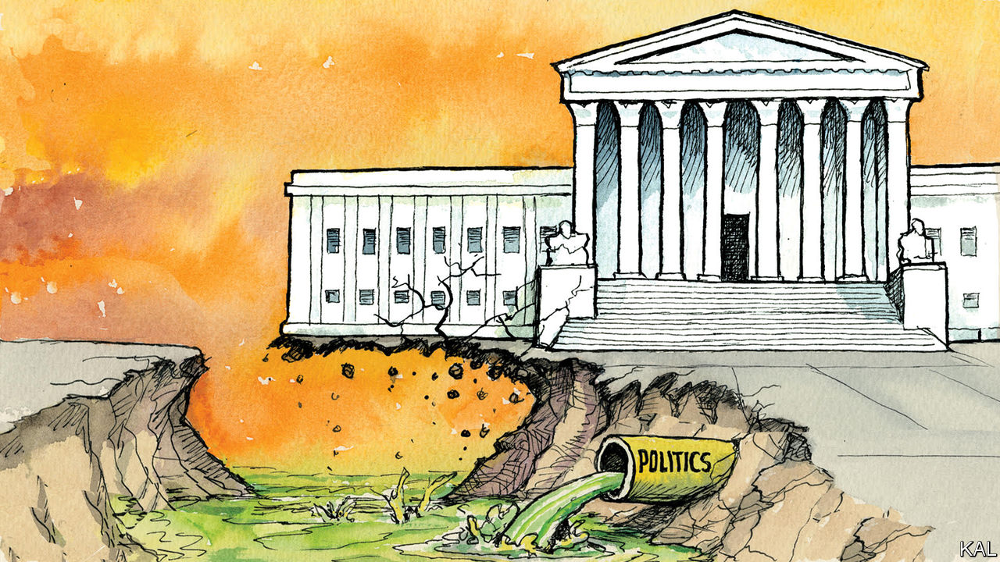

###### Lexington

# Of course the Supreme Court has been politicised 

##### Public bickering among the justices is the least of the reasons why 

 

> Oct 13th 2022 

Someone sure is getting on Sam Alito’s nerves. Mr Alito, of the six-member conservative majority on the Supreme Court, recently huffed to the  that while people are free (“it goes without saying”, he said) to criticise the justices’ reasoning, “saying or implying” the court is becoming illegitimate “crosses an important line”. 

It would be wrong to criticise Mr Alito for not specifying where that line lies. He is probably America’s most famously reluctant specifier of lines, having scorned the Supreme Court’s own efforts to do so in his withering decision, , that in June struck down the right to abortion as established almost 50 years ago by . His predecessors who supported never had “cogent” or “principled” arguments for the lines they drew between the rights of a pregnant woman and those of an unborn child, he wrote. 

Good for Justice Alito for being consistent. Still, he puts everyone else in a pickle. How can anyone know when they might be crossing the line from permissible criticism to impermissible implication? A churlish person might venture that calling “egregiously wrong,” as Mr Alito did, might itself cross that line, implying as it does that the 15 jurists who decided and upheld it against repeated challenges were either ideologues or morons. 

That same troublemaker might point to Mr Alito’s contemptuous dissent to the 2015 decision extending marriage rights to gay Americans. It would affect the court’s “ability to uphold the rule of law”, he wrote, and showed “that decades of attempts to restrain this court’s abuse of its authority have failed”. Legitimacy, anyone?

Mr Alito made his comment to the as part of a public spat that has broken out as the justices begin their fall term. The person most getting under his skin appears to be Elena Kagan, one of three justices in the court’s liberal minority. In recent appearances, Ms Kagan has suggested the court has risked its legitimacy when judges have “reflected one party’s or one ideology’s set of views”, as she said at Salve Regina University on September 19th. Previously, at Northwestern University, she called respect for precedent “a doctrine of humility,” adding, without naming anyone, that “individual judges shouldn’t come in and just think that they know everything.” Chief Justice John Roberts has voiced concern, saying in September, “Simply because people disagree with an opinion is not a basis for questioning the legitimacy of the court”.

It is all a bit passive-aggressive. It is also somewhat insulting to the intelligence of Americans who feel they are past the stage when the parents must spell out to each other the words they hope will not be understood. What the judges are talking about, when they talk about the court’s legitimacy, is whether the court is acting like just another political branch of government. And everyone knows the answer: of course it is. 

When Mitch McConnell, then Senate majority leader, refused for 294 days to grant even a hearing to President Barack Obama’s last pick for the court, calculating that doing so might help elect a Republican who would choose someone else, he did not protect anyone’s legitimacy. He advanced ideas of jurisprudence that, by happy coincidence, matched his political objectives. He got what he wanted—not just once, as it turned out, but three times, locking in the conservative majority. Can Americans really be expected to pretend that was not a political act, with a political outcome?

Mr McConnell’s gambit has resulted in a court that, during a period when the Democrats control both the White House and Congress, has been able to make Republican policy the law of the land, from environmental regulation to gun control. This dissonance has not escaped public notice. At the end of September Gallup reported that a minority of 47% of Americans trusted the Supreme Court, the lowest level since it began tracking this attitude in 1972. Trust had dropped 20 percentage points in just two years; it is increasingly dividing along party lines. 

Each party pillows its judicial nominees in high-minded claims about their legal philosophy. But anyone with common sense recognises that none of this is on the level. Mr McConnell has been particularly cynical and effective at the game, and his gambit has set a new baseline. In the future, it would be surprising if either party, while in the Senate majority, would confirm a justice chosen by a president of the other party. The present, dismal logic of American politics suggests they would be suckers to do so.

Poor John Roberts

Republicans are right that, from the 1950s to the 1980s, the court often served liberal aims under Chief Justices Earl Warren and Warren Burger. But the politics of the era sustained trust in the institution. Warren and Burger were appointed by Republican presidents and confirmed with bipartisan majorities, as was the author of , Harry Blackmun. Now, with the filibuster eliminated by Democrats for court appointees, they squeak through with a majority of the president’s party. Rather than criticism that crosses some notional line, it is that context, compounded by the conservative majority’s activism, that is eroding the court’s reputation for standing outside politics.

Most matters the court takes up have modest political implications, or at least not sharply partisan ones, including cases it is considering on copyright law and pork production. But this court is picking hot-button cases it would be wise to avoid, and then upending state and federal policy and politics. 

As Chief Justice Roberts wrote in his concurring opinion in , the majority chose to go further than it needed to—further than the plaintiff had originally asked—in throwing out the precedent of . He warned it was discarding a “fundamental principle of judicial restraint”. You might expect conservatives to honour such principles. Until they do, they should spare the rest of us lectures about not questioning their Olympian detachment. ■


