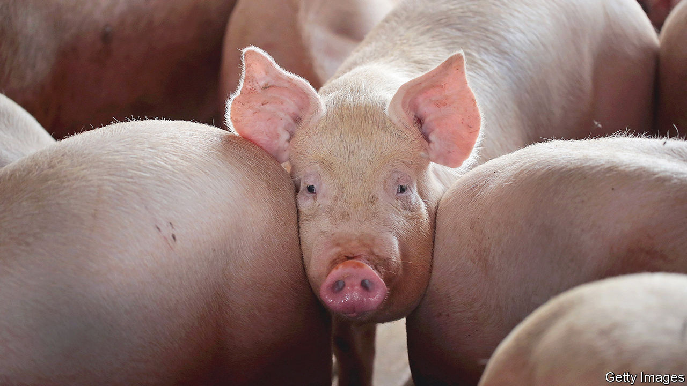

###### Sow confusing

# The Supreme Court ponders animal welfare 

##### A case that features lighthouses, horsemeat and bacon has the justices stumped 

 

> Oct 13th 2022 

“Miserable, laborious and short”, is how one character describes the life of a pig in George Orwell’s “Animal Farm”. Nearly two-thirds of California’s voters approved a ballot initiative, Proposition 12, in 2018 in an attempt to fix the miserable part. Yet America is supposed to be an integrated market, for pork and everything else. So what looks like an example of a state going its own way in fact requires the justices of the Supreme Court to weigh the “dormant” commerce clause, a constitutional wrinkle that is supposed to prevent states from indulging in protectionism, and whose origins stretch all the way back to a debate about how states might fund lighthouses in the 18th century.

On October 11th, the Supreme Court considered whether the California law unfairly burdens the rest of America and imposes “significant market dislocation and price impacts” beyond its borders. Proposition 12 requires more humane standards for confining veal calves, egg-laying hens and breeding pigs—the subject of . Sows are typically held in tight quarters. Prop 12 gives Californian breeding pigs at least 24 square feet, enough room to stand up and turn around freely. It also bans the sale of uncooked pork from animals housed in cramped conditions no matter where they were raised: in California or out-of-state.

Californians aren’t just fans of avocados and : they consume 13% of the pork eaten in America. Yet more than 99% of America’s pork comes from other states, with Iowa and North Carolina among the top producers. Industry groups gripe that Prop 12 “disrupts a national market” and dictates “how hogs are raised in…every pig-producing state, regardless of their local laws”. Building larger pens and overcoming the “productivity loss” would cost farmers, the plaintiffs reckon, $300m.

Timothy Bishop, the lawyer arguing against California’s law, told the justices that the “territorial autonomy of sister states” is at stake. He said Prop 12 is an “extraterritorial regulation” and violates the “dormant” commerce clause—the Supreme Court’s long-standing reading of Article I, section 8, clause 3 of the constitution that bars states from enacting regulations that impede interstate commerce.

Liberal and conservative justices alike probed the reach of Mr Bishop’s position. New York bans the import of firewood that has not been treated with a pesticide, Justice Elena Kagan noted. Is that all right? (No, he said.) Could California require inhumanely raised pork to be labelled as such, Justice Ketanji Brown Jackson asked, even if it cannot ban its sale? (Yes.) Justice Amy Coney Barrett brought up emissions standards. All three teamed up to ask Edwin Kneedler, a Biden administration lawyer, arguing against California, about bans on the sale of horse meat.

Justices Samuel Alito and Neil Gorsuch seemed unhappy with the conclusion that America’s “horizontal federalist system” precludes states from acting on voters’ moral principles when choosing regulations. Isn’t it all right for Californians, Justice Gorsuch asked, to decide they “don’t wish to...be complicit, even indirectly, in livestock practices that they find abhorrent”? Many laws are based on moral considerations, Mr Kneedler replied, but America would become badly Balkanised if states could impose those principles on the national marketplace.

The reply set the stage for a series of tough questions for Michael Mongan, California’s lawyer. Justice Alito noted the spectre of states banning the import of almonds grown using irrigation (as they are in drought-addled California). Justice Kagan worried that battling out “policy disputes” via interstate regulation would further polarise America. What if California required imports to be made by unionised workers, or Texas trafficked only in non-union-produced goods? “Do we want to live in a world where we’re constantly at each other’s throats “, Justice Kagan asked, where “Texas is at war with California and California at war with Texas?”

With the justices penned in by the unsavoury implications of ruling either for or against California, Justice Kagan asked about an off ramp.  reached the justices before a trial could take place to investigate the validity of the pork producers’ claims. Shouldn’t a lower court undertake the task of “balancing these incommensurable things”—costs to out-of-state pig farmers and Californians’ moral considerations?

In his rebuttal, Mr Bishop seemed to accept such a compromise. “I have a dozen pork farmers in the court today”, he said, “who would testify at trial that they are being forced…to comply with Prop 12 in a way that they think kills pigs, that harms their workers” and complicates their ability to operate their farms. In June, justices made aggressive moves in several big cases. When it comes to , they seem less keen to hog the limelight.■


