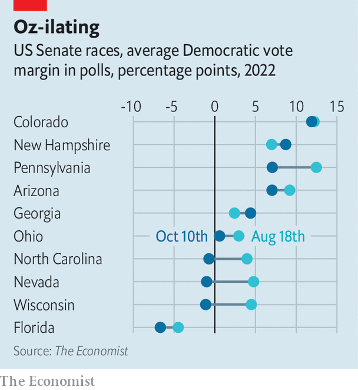

###### Midterm maths

# Why Republicans are gaining ground in midterm polls 

##### It would take a big polling miss, but it would no longer be a shock if they won the Senate 

 

> Oct 11th 2022 


Poll watchers can learn a lot from physicists. Take, for instance, the pendulum in a grandfather clock. It swings to and fro thanks to two mechanisms. The weights suspended from the head of the clock convert the force of the Earth’s gravity into energy that drives the clock’s gears. To ensure the weight does not plunge to the ground, turning all the gears at once and producing a clock that travels through time, a claw-like mechanism allows only one tooth of the gear to turn. 

The pendulum—the second mechanism—is fixed to this claw and regulates the speed at which additional teeth are allowed to turn. Starting from a high point on the left, gravity pulls the pendulum down and inertia carries it to the right. The claw releases a tooth and allows the gear to move, producing an audible and grandfatherly “tick” from the clock. The pendulum will then naturally move down and to the left, allowing the gear to turn another tooth. The clock issues a “tock”. 

Opinion polls also work like this (sort of). That is due in part to random variation in individual polls, which can usually be attributed to differences in the demographic and political characteristics of the people whom a pollster interviews. But polls often revert towards the longer-term average over time. Look no further than the 2016 and 2020 elections, when Democratic leads in the summer gave way to quick surges in Republican support in autumn.

 


Thus a midsummer “tick” in the Democrats’ favour has duly been answered by a Republican “tock”. According to ’s poll of polls for elections to the Senate, Republican candidates have gained ground in eight of the ten most competitive battleground states (see chart). 

The Republican advance has been particularly striking in , where Catherine Cortez Masto, the incumbent Democratic senator, is defending her seat against Adam Laxalt, a Republican and the state’s former attorney general. Something similar has happened in Pennsylvania, where , the state’s Democratic lieutenant-governor, is facing Mehmet Oz, a former doctor and talk-show host. Our poll of polls, which adjusts surveys both for the historical bias of each pollster and for whether a poll was conducted by a partisan firm, finds that the Democrats’ margin has also fallen by over five percentage points in .

Our polling averages currently show Democrats trailing Republicans by around one point each in Nevada, North Carolina and Wisconsin. In Ohio they are leading by almost one point. Democrats lead by four points in Georgia and by seven in both Pennsylvania and Arizona. That gives the Democrats a net gain of one Senate seat if the polls are 100% accurate (spoiler alert: they will not be). These numbers also come with a large health warning. One month before election day, Senate polls are on average out by six points compared with the actual results on the night.


But there is still time for Republicans to make inroads before November 8th, and polls in recent elections have been significantly biased towards Democrats. Republican candidates are in reach of every close seat, even Pennsylvania and Arizona, according to the range of errors in our historical averages of Senate polls. Though it would take a big polling miss, the recent gains the party has made in key states mean it would no longer be a shock for Republicans to win a Senate majority.■


